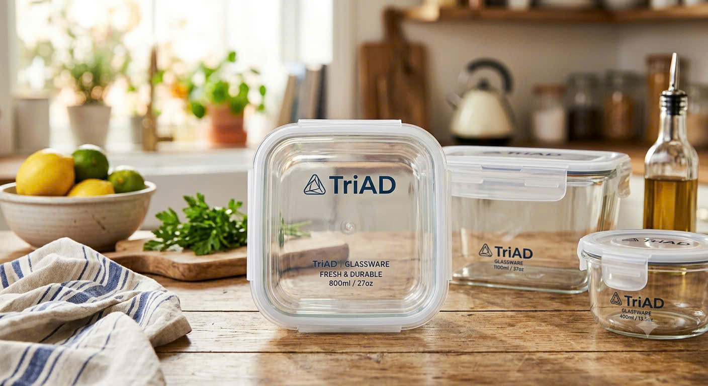
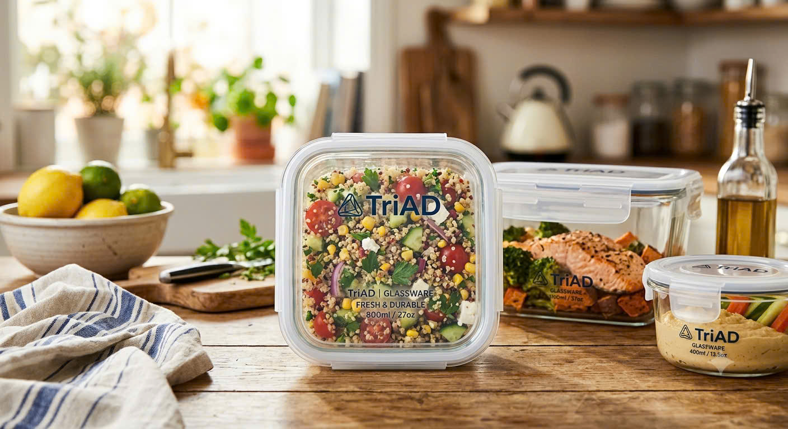
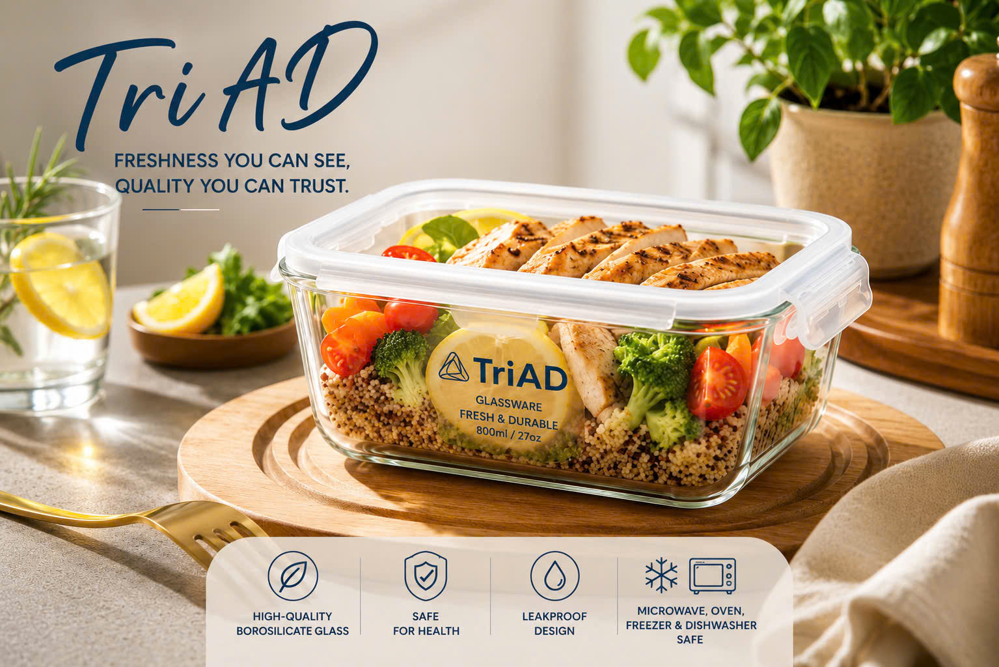

# 📁 PROJECT EXPORT FOR LLMs

## 📊 Project Information

- **Project Name**: `Duong`
- **Generated On**: 2026-08-02 10:29:59 (Asia/Saigon / GMT+07:00)
- **Total Files Processed**: 81
- **Export Tool**: Easy Whole Project to Single Text File for LLMs v1.1.0
- **Tool Author**: Jota / José Guilherme Pandolfi

### ⚙️ Export Configuration

| Setting | Value |
|---------|-------|
| Language | `en` |
| Max File Size | `1 MB` |
| Include Hidden Files | `false` |
| Output Format | `both` |

## 🌳 Project Structure

```
├── 📁 images/
│   ├── 📄 11.jpg (382.8 KB)
│   ├── 📄 12.jpg (260.68 KB)
│   ├── 📄 13.jpg (211.14 KB)
│   ├── 📄 21.jpg (83.03 KB)
│   ├── 📄 22.jpg (90.37 KB)
│   ├── 📄 23.jpg (84.63 KB)
│   ├── 📄 24.jpg (73.9 KB)
│   ├── 📄 25.jpg (124 KB)
│   ├── 📄 Banner.png (1.45 MB)
│   ├── 📄 coccoc_screenshot_thang4869.github.io_desktop.jpg (705.98 KB)
│   ├── 📄 coccoc_screenshot_thang4869.github.io_phone.jpg (551.99 KB)
│   ├── 📄 coccoc_screenshot_thang4869.github.io_tablet.jpg (630.93 KB)
│   ├── 📄 gif_demo.gif (2.35 MB)
│   └── 📄 Logo.png (745.4 KB)
├── 📁 pages/
│   ├── 📄 about.html (3.56 KB)
│   ├── 📄 cart-drawer.html (1.5 KB)
│   ├── 📄 checkout-modal.html (5.33 KB)
│   ├── 📄 features.html (1.68 KB)
│   ├── 📄 footer.html (2.64 KB)
│   ├── 📄 header.html (3.76 KB)
│   ├── 📄 hero.html (3.46 KB)
│   ├── 📄 product-modal.html (5.42 KB)
│   ├── 📄 products.html (2.68 KB)
│   └── 📄 success-modal.html (872 B)
├── 📁 src/
│   ├── 📁 app/
│   │   ├── 📄 app.js (8.58 KB)
│   │   ├── 📄 bootstrap.js (1.57 KB)
│   │   ├── 📄 header.service.js (2.11 KB)
│   │   └── 📄 scroll-reveal.service.js (3.08 KB)
│   ├── 📁 config/
│   │   ├── 📄 products.config.js (1.1 KB)
│   │   └── 📄 settings.config.js (772 B)
│   ├── 📁 modules/
│   │   ├── 📁 cart/
│   │   │   ├── 📄 cart.controller.js (4 KB)
│   │   │   ├── 📄 cart.renderer.js (4.27 KB)
│   │   │   ├── 📄 cart.repository.js (1.26 KB)
│   │   │   ├── 📄 cart.service.js (3.4 KB)
│   │   │   └── 📄 index.js (212 B)
│   │   ├── 📁 checkout/
│   │   │   ├── 📄 checkout.controller.js (7.75 KB)
│   │   │   ├── 📄 checkout.service.js (2.18 KB)
│   │   │   ├── 📄 checkout.validator.js (1.88 KB)
│   │   │   └── 📄 index.js (182 B)
│   │   ├── 📁 fly-to-cart/
│   │   │   └── 📄 index.js (5.46 KB)
│   │   ├── 📁 modal/
│   │   │   ├── 📄 index.js (108 B)
│   │   │   ├── 📄 modal.controller.js (5.89 KB)
│   │   │   └── 📄 modal.service.js (1.37 KB)
│   │   ├── 📁 products/
│   │   │   ├── 📄 index.js (244 B)
│   │   │   ├── 📄 products.controller.js (7.43 KB)
│   │   │   ├── 📄 products.renderer.js (5.6 KB)
│   │   │   ├── 📄 products.repository.js (1.66 KB)
│   │   │   └── 📄 products.service.js (3.87 KB)
│   │   └── 📁 toast/
│   │       ├── 📄 index.js (104 B)
│   │       ├── 📄 toast.renderer.js (3.42 KB)
│   │       └── 📄 toast.service.js (2.41 KB)
│   ├── 📁 shared/
│   │   ├── 📁 constants/
│   │   │   └── 📄 events.constants.js (1000 B)
│   │   ├── 📁 models/
│   │   │   ├── 📄 cart-item.model.js (1.6 KB)
│   │   │   ├── 📄 index.js (138 B)
│   │   │   ├── 📄 order.model.js (1.87 KB)
│   │   │   └── 📄 product.model.js (1.8 KB)
│   │   ├── 📁 repositories/
│   │   │   └── 📄 base.repository.js (1.02 KB)
│   │   ├── 📁 services/
│   │   │   ├── 📄 api.service.js (1.83 KB)
│   │   │   ├── 📄 event-bus.service.js (3.22 KB)
│   │   │   └── 📄 storage.service.js (4.22 KB)
│   │   └── 📁 utils/
│   │       ├── 📄 dom.utils.js (1.52 KB)
│   │       ├── 📄 helpers.utils.js (824 B)
│   │       ├── 📄 loader.utils.js (2.3 KB)
│   │       └── 📄 validators.utils.js (866 B)
│   ├── 📁 styles/
│   │   ├── 📁 animations/
│   │   │   └── 📄 fly-to-cart.css (605 B)
│   │   ├── 📁 base/
│   │   │   ├── 📄 reset.css (927 B)
│   │   │   └── 📄 variables.css (830 B)
│   │   ├── 📁 components/
│   │   │   ├── 📄 accordion.css (324 B)
│   │   │   ├── 📄 cart.css (445 B)
│   │   │   ├── 📄 checkout.css (1.11 KB)
│   │   │   ├── 📄 header.css (1.62 KB)
│   │   │   ├── 📄 hero.css (116 B)
│   │   │   ├── 📄 product-card.css (819 B)
│   │   │   └── 📄 toast.css (2.35 KB)
│   │   ├── 📁 utilities/
│   │   │   ├── 📄 shimmer.css (335 B)
│   │   │   └── 📄 slider.css (952 B)
│   │   └── 📄 main.css (1.25 KB)
│   ├── 📁 ui/
│   │   └── 📁 components/
│   │       └── 📄 product-card.component.js (2.65 KB)
│   └── 📄 index.js (883 B)
├── 📄 index.html (2.73 KB)
└── 📄 README.md (33.75 KB)
```

## 📑 Table of Contents

**Project Files:**

- [📄 pages/about.html](#📄-pages-about-html)
- [📄 pages/cart-drawer.html](#📄-pages-cart-drawer-html)
- [📄 pages/checkout-modal.html](#📄-pages-checkout-modal-html)
- [📄 pages/features.html](#📄-pages-features-html)
- [📄 pages/footer.html](#📄-pages-footer-html)
- [📄 pages/header.html](#📄-pages-header-html)
- [📄 pages/hero.html](#📄-pages-hero-html)
- [📄 pages/product-modal.html](#📄-pages-product-modal-html)
- [📄 pages/products.html](#📄-pages-products-html)
- [📄 pages/success-modal.html](#📄-pages-success-modal-html)
- [📄 src/app/app.js](#📄-src-app-app-js)
- [📄 src/app/bootstrap.js](#📄-src-app-bootstrap-js)
- [📄 src/app/header.service.js](#📄-src-app-header-service-js)
- [📄 src/app/scroll-reveal.service.js](#📄-src-app-scroll-reveal-service-js)
- [📄 src/config/products.config.js](#📄-src-config-products-config-js)
- [📄 src/config/settings.config.js](#📄-src-config-settings-config-js)
- [📄 src/modules/cart/cart.controller.js](#📄-src-modules-cart-cart-controller-js)
- [📄 src/modules/cart/cart.renderer.js](#📄-src-modules-cart-cart-renderer-js)
- [📄 src/modules/cart/cart.repository.js](#📄-src-modules-cart-cart-repository-js)
- [📄 src/modules/cart/cart.service.js](#📄-src-modules-cart-cart-service-js)
- [📄 src/modules/cart/index.js](#📄-src-modules-cart-index-js)
- [📄 src/modules/checkout/checkout.controller.js](#📄-src-modules-checkout-checkout-controller-js)
- [📄 src/modules/checkout/checkout.service.js](#📄-src-modules-checkout-checkout-service-js)
- [📄 src/modules/checkout/checkout.validator.js](#📄-src-modules-checkout-checkout-validator-js)
- [📄 src/modules/checkout/index.js](#📄-src-modules-checkout-index-js)
- [📄 src/modules/fly-to-cart/index.js](#📄-src-modules-fly-to-cart-index-js)
- [📄 src/modules/modal/index.js](#📄-src-modules-modal-index-js)
- [📄 src/modules/modal/modal.controller.js](#📄-src-modules-modal-modal-controller-js)
- [📄 src/modules/modal/modal.service.js](#📄-src-modules-modal-modal-service-js)
- [📄 src/modules/products/index.js](#📄-src-modules-products-index-js)
- [📄 src/modules/products/products.controller.js](#📄-src-modules-products-products-controller-js)
- [📄 src/modules/products/products.renderer.js](#📄-src-modules-products-products-renderer-js)
- [📄 src/modules/products/products.repository.js](#📄-src-modules-products-products-repository-js)
- [📄 src/modules/products/products.service.js](#📄-src-modules-products-products-service-js)
- [📄 src/modules/toast/index.js](#📄-src-modules-toast-index-js)
- [📄 src/modules/toast/toast.renderer.js](#📄-src-modules-toast-toast-renderer-js)
- [📄 src/modules/toast/toast.service.js](#📄-src-modules-toast-toast-service-js)
- [📄 src/shared/constants/events.constants.js](#📄-src-shared-constants-events-constants-js)
- [📄 src/shared/models/cart-item.model.js](#📄-src-shared-models-cart-item-model-js)
- [📄 src/shared/models/index.js](#📄-src-shared-models-index-js)
- [📄 src/shared/models/order.model.js](#📄-src-shared-models-order-model-js)
- [📄 src/shared/models/product.model.js](#📄-src-shared-models-product-model-js)
- [📄 src/shared/repositories/base.repository.js](#📄-src-shared-repositories-base-repository-js)
- [📄 src/shared/services/api.service.js](#📄-src-shared-services-api-service-js)
- [📄 src/shared/services/event-bus.service.js](#📄-src-shared-services-event-bus-service-js)
- [📄 src/shared/services/storage.service.js](#📄-src-shared-services-storage-service-js)
- [📄 src/shared/utils/dom.utils.js](#📄-src-shared-utils-dom-utils-js)
- [📄 src/shared/utils/helpers.utils.js](#📄-src-shared-utils-helpers-utils-js)
- [📄 src/shared/utils/loader.utils.js](#📄-src-shared-utils-loader-utils-js)
- [📄 src/shared/utils/validators.utils.js](#📄-src-shared-utils-validators-utils-js)
- [📄 src/styles/animations/fly-to-cart.css](#📄-src-styles-animations-fly-to-cart-css)
- [📄 src/styles/base/reset.css](#📄-src-styles-base-reset-css)
- [📄 src/styles/base/variables.css](#📄-src-styles-base-variables-css)
- [📄 src/styles/components/accordion.css](#📄-src-styles-components-accordion-css)
- [📄 src/styles/components/cart.css](#📄-src-styles-components-cart-css)
- [📄 src/styles/components/checkout.css](#📄-src-styles-components-checkout-css)
- [📄 src/styles/components/header.css](#📄-src-styles-components-header-css)
- [📄 src/styles/components/hero.css](#📄-src-styles-components-hero-css)
- [📄 src/styles/components/product-card.css](#📄-src-styles-components-product-card-css)
- [📄 src/styles/components/toast.css](#📄-src-styles-components-toast-css)
- [📄 src/styles/utilities/shimmer.css](#📄-src-styles-utilities-shimmer-css)
- [📄 src/styles/utilities/slider.css](#📄-src-styles-utilities-slider-css)
- [📄 src/styles/main.css](#📄-src-styles-main-css)
- [📄 src/ui/components/product-card.component.js](#📄-src-ui-components-product-card-component-js)
- [📄 src/index.js](#📄-src-index-js)
- [📄 index.html](#📄-index-html)
- [📄 README.md](#📄-readme-md)

---

## 📈 Project Statistics

| Metric | Count |
|--------|-------|
| Total Files | 81 |
| Total Directories | 25 |
| Text Files | 67 |
| Binary Files | 14 |
| Total Size | 7.83 MB |

### 📄 File Types Distribution

| Extension | Count |
|-----------|-------|
| `.js` | 42 |
| `.css` | 13 |
| `.jpg` | 11 |
| `.html` | 11 |
| `.png` | 2 |
| `.gif` | 1 |
| `.md` | 1 |

## 💻 File Code Contents

## 🚫 Binary/Excluded Files

The following files were not included in the text content:

- `images/11.jpg`
- `images/12.jpg`
- `images/13.jpg`
- `images/21.jpg`
- `images/22.jpg`
- `images/23.jpg`
- `images/24.jpg`
- `images/25.jpg`
- `images/Banner.png`
- `images/coccoc_screenshot_thang4869.github.io_desktop.jpg`
- `images/coccoc_screenshot_thang4869.github.io_phone.jpg`
- `images/coccoc_screenshot_thang4869.github.io_tablet.jpg`
- `images/gif_demo.gif`
- `images/Logo.png`

### <a id="📄-pages-about-html"></a>📄 `pages/about.html`

**File Info:**
- **Size**: 3.56 KB
- **Extension**: `.html`
- **Language**: `html`
- **Location**: `pages/about.html`
- **Relative Path**: `pages`
- **Created**: 2026-07-30 11:51:04 (Asia/Saigon / GMT+07:00)
- **Modified**: 2026-08-02 09:33:42 (Asia/Saigon / GMT+07:00)
- **MD5**: `a1b150d6479a4500fc4aa89741966cc9`
- **SHA256**: `5c69d9fffbea212fe57db38f041c7ce8d8c699c4d035d377b23e686fd645462d`
- **Encoding**: UTF-8

**File code content:**

```html
<section id="about" class="py-12 bg-white">
    <div class="max-w-7xl mx-auto px-4 sm:px-6 lg:px-8">
        <div class="text-center mb-6">
            <h2 class="text-1xl font-bold tracking-widest text-brand-gray uppercase">Built on Winter Wonderland</h2>
            <h3 class="text-2xl font-bold uppercase tracking-wider">ABOUT US | TriAD</h3>
        </div>
        <!-- grid-cols-12 -->
        <div class="grid grid-cols-1 md:grid-cols-12 gap-6 items-center">
            <!-- Cột nội dung - chiếm 5/12 -->
            <div class="md:col-span-5 pr-4 md:pr-8">
                <h4 class="text-2xl font-bold mb-4">Our Story</h4>
                <div class="space-y-1 text-brand-gray leading-relaxed text-sm text-justify">
                    <div>
                        <h5 class="text-base font-bold text-gray-900">Who We Are</h5>
                        <p>At TriAD Kitchenware, we believe that safe, sustainable food storage should be effortless and accessible to every household. We are passionate about creating practical kitchen solutions that combine quality, functionality, and modern design to support healthier everyday living.</p>
                    </div>
                    <div>
                        <h5 class="text-base font-bold text-gray-900">What We Offer</h5>
                        <p>Our collection features premium borosilicate glass food containers designed for durability, convenience, and versatility. Leak-proof and resistant to extreme temperatures, our containers are safe for use in microwaves, ovens, freezers, and dishwashers, making meal preparation and food storage simple and reliable.</p>
                    </div>
                    <div>
                        <h5 class="text-base font-bold text-gray-900">Our Mission</h5>
                        <p>Our mission is to inspire healthier lifestyles while contributing to a greener future. By providing reusable, eco-friendly kitchenware, we help families reduce single-use plastic waste without compromising on convenience or performance.</p>
                    </div>
                    <div>
                        <h5 class="text-base font-bold text-gray-900">Our Commitment</h5>
                        <p>Quality and customer satisfaction are at the heart of everything we do. We are committed to delivering reliable products, exceptional service, and innovative designs that simplify everyday food storage and stand the test of time.</p>
                    </div>
                    <div>
                        <h5 class="text-base font-bold text-gray-900">Our Vision</h5>
                        <p>We aspire to become a trusted kitchenware brand recognized for quality, sustainability, and innovation. Our vision is to help every customer enjoy fresher food, better organization, and safer storage solutions in every kitchen.</p>
                    </div>
                </div>
            </div>
            
            <!-- Cột hình ảnh - 7/12 -->
            <div class="md:col-span-7 relative bg-[#7ec8d4]/20 rounded-3xl p-8 flex items-end justify-end h-[420px] overflow-hidden">
                
                
            </div>
        </div>
    </div>
</section>
```

---

### <a id="📄-pages-cart-drawer-html"></a>📄 `pages/cart-drawer.html`

**File Info:**
- **Size**: 1.5 KB
- **Extension**: `.html`
- **Language**: `html`
- **Location**: `pages/cart-drawer.html`
- **Relative Path**: `pages`
- **Created**: 2026-07-29 07:36:33 (Asia/Saigon / GMT+07:00)
- **Modified**: 2026-07-30 08:20:22 (Asia/Saigon / GMT+07:00)
- **MD5**: `83c716f94a2ebd70c057ea4cf053b7ae`
- **SHA256**: `43e5e0218ded03316591e6109ddb0919747a05d0aa754462bd82aa9e2320f867`
- **Encoding**: UTF-8

**File code content:**

```html
<div id="cart-drawer" class="fixed top-0 right-0 h-full w-full max-w-[400px] bg-white z-[70] transform translate-x-full transition-transform duration-300 flex flex-col shadow-2xl">
    <div class="flex justify-between items-center p-6 border-b border-gray-100 bg-gray-50/50">
        <h2 class="text-xl font-medium tracking-wide">Shopping cart</h2>
        <button id="close-cart-btn" class="text-gray-400 hover:text-black transition-colors">
            <i class="ph ph-x text-2xl"></i>
        </button>
    </div>
    
    <div class="flex-1 overflow-y-auto p-6 cart-scroll"></div>
    
    <div class="p-6 bg-white border-t border-gray-100 space-y-4">
        <button class="flex items-center text-brand-orange text-sm font-medium gap-2 mb-4 hover:underline">
            <i class="ph ph-tag text-lg"></i> Enter Discount Code
        </button>
        <div class="flex justify-between text-lg font-medium">
            <p>Total</p>
            <p id="cart-total">0 ₫</p>
        </div>
        <p class="text-xs text-gray-500 mb-4">Taxes and shipping fees are calculated at checkout.</p>
        <button id="checkout-btn" class="w-full bg-brand-orange text-white py-4 font-medium rounded hover:bg-orange-600 transition-colors tracking-wide text-lg">
            Checkout
        </button>
        <button class="w-full bg-white text-brand-orange border border-brand-orange py-4 font-medium rounded hover:bg-orange-50 transition-colors tracking-wide">
            View cart
        </button>
    </div>
</div>
```

---

### <a id="📄-pages-checkout-modal-html"></a>📄 `pages/checkout-modal.html`

**File Info:**
- **Size**: 5.33 KB
- **Extension**: `.html`
- **Language**: `html`
- **Location**: `pages/checkout-modal.html`
- **Relative Path**: `pages`
- **Created**: 2026-07-29 07:36:43 (Asia/Saigon / GMT+07:00)
- **Modified**: 2026-07-29 08:45:52 (Asia/Saigon / GMT+07:00)
- **MD5**: `e2120bc5e18dd4b6f33962635ea38f54`
- **SHA256**: `5e393d246ca56ecafe9d7466783eb4d26e8d5435b50905350fa717833a6099f0`
- **Encoding**: ASCII

**File code content:**

```html
<div id="checkout-modal" class="fixed inset-0 bg-black/60 z-[90] hidden opacity-0 transition-opacity duration-300 flex items-center justify-center p-4">
    <div class="bg-white w-full max-w-2xl max-h-[90vh] overflow-y-auto rounded-xl shadow-2xl p-8 transform scale-95 transition-transform duration-300">
        <div class="flex justify-between items-center mb-6">
            <h2 class="text-2xl font-bold">Checkout</h2>
            <button id="close-checkout-btn" class="text-gray-400 hover:text-black">
                <i class="ph ph-x text-2xl"></i>
            </button>
        </div>
        
        <form id="checkout-form" class="space-y-6">
            <div class="bg-gray-50 p-4 rounded-lg">
                <h3 class="font-semibold mb-3">Order Summary</h3>
                <div id="checkout-items" class="space-y-2 max-h-40 overflow-y-auto"></div>
                <div class="border-t border-gray-200 mt-3 pt-3 flex justify-between font-bold">
                    <span>Total:</span>
                    <span id="checkout-total">0 ₫</span>
                </div>
            </div>
            
            <div class="grid grid-cols-2 gap-4">
                <div>
                    <label class="block text-sm font-medium text-gray-700 mb-1">First Name *</label>
                    <input type="text" id="first-name" required 
                           class="w-full p-3 border border-gray-300 rounded focus:outline-none focus:border-black">
                </div>
                <div>
                    <label class="block text-sm font-medium text-gray-700 mb-1">Last Name *</label>
                    <input type="text" id="last-name" required
                           class="w-full p-3 border border-gray-300 rounded focus:outline-none focus:border-black">
                </div>
            </div>
            
            <div>
                <label class="block text-sm font-medium text-gray-700 mb-1">Email *</label>
                <input type="email" id="email" required
                       class="w-full p-3 border border-gray-300 rounded focus:outline-none focus:border-black">
            </div>
            
            <div>
                <label class="block text-sm font-medium text-gray-700 mb-1">Phone *</label>
                <input type="tel" id="phone" required
                       class="w-full p-3 border border-gray-300 rounded focus:outline-none focus:border-black">
            </div>
            
            <div>
                <label class="block text-sm font-medium text-gray-700 mb-1">Address *</label>
                <input type="text" id="address" required
                       class="w-full p-3 border border-gray-300 rounded focus:outline-none focus:border-black">
            </div>
            
            <div>
                <label class="block text-sm font-medium text-gray-700 mb-2">Payment Method *</label>
                <div class="space-y-2">
                    <label class="flex items-center p-3 border rounded cursor-pointer hover:bg-gray-50">
                        <input type="radio" name="payment" value="cod" checked class="mr-3">
                        <span>Cash on Delivery (COD)</span>
                    </label>
                    <label class="flex items-center p-3 border rounded cursor-pointer hover:bg-gray-50">
                        <input type="radio" name="payment" value="card" class="mr-3">
                        <span>Credit / Debit Card</span>
                    </label>
                    <label class="flex items-center p-3 border rounded cursor-pointer hover:bg-gray-50">
                        <input type="radio" name="payment" value="banking" class="mr-3">
                        <span>Bank Transfer</span>
                    </label>
                </div>
            </div>
            
            <div id="card-details" class="hidden space-y-4 border-t border-gray-200 pt-4">
                <h3 class="font-semibold">Card Details</h3>
                <div>
                    <label class="block text-sm font-medium text-gray-700 mb-1">Card Number</label>
                    <input type="text" id="card-number" placeholder="1234 5678 9012 3456"
                           class="w-full p-3 border border-gray-300 rounded focus:outline-none focus:border-black">
                </div>
                <div class="grid grid-cols-2 gap-4">
                    <div>
                        <label class="block text-sm font-medium text-gray-700 mb-1">Expiry Date</label>
                        <input type="text" id="card-expiry" placeholder="MM/YY"
                               class="w-full p-3 border border-gray-300 rounded focus:outline-none focus:border-black">
                    </div>
                    <div>
                        <label class="block text-sm font-medium text-gray-700 mb-1">CVV</label>
                        <input type="text" id="card-cvv" placeholder="123"
                               class="w-full p-3 border border-gray-300 rounded focus:outline-none focus:border-black">
                    </div>
                </div>
            </div>
            
            <button type="submit" class="w-full bg-black text-white py-4 font-medium rounded hover:bg-gray-800 transition-colors text-lg">
                Place Order
            </button>
        </form>
    </div>
</div>
```

---

### <a id="📄-pages-features-html"></a>📄 `pages/features.html`

**File Info:**
- **Size**: 1.68 KB
- **Extension**: `.html`
- **Language**: `html`
- **Location**: `pages/features.html`
- **Relative Path**: `pages`
- **Created**: 2026-07-29 07:36:23 (Asia/Saigon / GMT+07:00)
- **Modified**: 2026-07-30 08:30:54 (Asia/Saigon / GMT+07:00)
- **MD5**: `0c2becede97a6a2cb84aa655963a81fc`
- **SHA256**: `d004fe9961a99a29b16f64c60c192a86a66965cbeddc94b10dfbb7a271d54688`
- **Encoding**: ASCII

**File code content:**

```html
<section class="py-20 bg-white">
    <div class="max-w-7xl mx-auto px-4 sm:px-6 lg:px-8">
        <h2 class="text-3xl font-bold mb-12 text-center">Outstanding advantages</h2>
        <div class="grid grid-cols-1 md:grid-cols-4 gap-8 text-center mb-20">
            <div class="p-6">
                <i class="ph-light ph-thermometer text-4xl text-brand-accent mb-4"></i>
                <h4 class="text-lg font-bold mb-3">Perfect Heat Retention</h4>
                <p class="text-sm text-brand-gray">Double-layer vacuum helps keep drinks hot for up to 12 hours and cold for 24 hours.</p>
            </div>
            <div class="p-6">
                <i class="ph-light ph-squares-four text-4xl text-brand-accent mb-4"></i>
                <h4 class="text-lg font-bold mb-3">Smart Compartmentalization</h4>
                <p class="text-sm text-brand-gray">Multi-tier design with removable sections effectively prevents food odors from mixing.</p>
            </div>
            <div class="p-6">
                <i class="ph-light ph-shield-check text-4xl text-brand-accent mb-4"></i>
                <h4 class="text-lg font-bold mb-3">Safe Materials</h4>
                <p class="text-sm text-brand-gray">The container body is made of high-quality borosilicate glass, BPA-free, and safe for food contact.</p>
            </div>
            <div class="p-6">
                <i class="ph-light ph-drop-slash text-4xl text-brand-accent mb-4"></i>
                <h4 class="text-lg font-bold mb-3">Leak-Proof</h4>
                <p class="text-sm text-brand-gray">Solid silicon gasket effectively prevents spills and liquid leaks.</p>
            </div>
        </div>
    </div>
</section>
```

---

### <a id="📄-pages-footer-html"></a>📄 `pages/footer.html`

**File Info:**
- **Size**: 2.64 KB
- **Extension**: `.html`
- **Language**: `html`
- **Location**: `pages/footer.html`
- **Relative Path**: `pages`
- **Created**: 2026-07-29 07:36:28 (Asia/Saigon / GMT+07:00)
- **Modified**: 2026-07-30 08:22:10 (Asia/Saigon / GMT+07:00)
- **MD5**: `d02a42b3fcbbe4f2c3758fda2f72b791`
- **SHA256**: `0096de57aeb0abc65d8ef1393421d6d1594fc9bd456507875b409d6c75801dd9`
- **Encoding**: ASCII

**File code content:**

```html
<footer id="contact" class="bg-gray-50 border-t border-gray-200 pt-16 pb-8">
    <div class="max-w-7xl mx-auto px-4 sm:px-6 lg:px-8">
        <div class="flex flex-col md:flex-row justify-between items-center md:items-start gap-8 mb-12 text-center md:text-left">
            <div>
                <h3 class="font-bold text-lg mb-4 tracking-widest uppercase">CONTACT</h3>
                <ul class="space-y-3 text-sm text-brand-gray">
                    <li class="flex items-center justify-center md:justify-start gap-2">
                        <i class="ph ph-envelope-simple text-lg text-black"></i> TriAD@shop.vn
                    </li>
                    <li class="flex items-center justify-center md:justify-start gap-2">
                        <i class="ph ph-phone text-lg text-black"></i> +84 90 123 4567
                    </li>
                    <li class="flex items-center justify-center md:justify-start gap-2">
                        <i class="ph ph-map-pin text-lg text-black"></i> Ho Chi Minh City, Vietnam
                    </li>
                </ul>
            </div>
            <div>
                <h3 class="font-bold text-lg mb-4 tracking-widest uppercase">CONNECT</h3>
                <div class="flex space-x-4 justify-center md:justify-start">
                    <a href="#" class="w-10 h-10 rounded-full border border-gray-300 flex items-center justify-center text-gray-600 hover:bg-black hover:text-white transition-all">
                        <i class="ph-fill ph-facebook-logo text-xl"></i>
                    </a>
                    <a href="#" class="w-10 h-10 rounded-full border border-gray-300 flex items-center justify-center text-gray-600 hover:bg-black hover:text-white transition-all">
                        <i class="ph-fill ph-instagram-logo text-xl"></i>
                    </a>
                    <a href="#" class="w-10 h-10 rounded-full border border-gray-300 flex items-center justify-center text-gray-600 hover:bg-black hover:text-white transition-all">
                        <i class="ph-fill ph-twitter-logo text-xl"></i>
                    </a>
                </div>
            </div>
        </div>
        <div class="border-t border-gray-200 pt-8 text-center text-sm text-gray-400 flex flex-col md:flex-row justify-between items-center gap-4">
            <p>&copy; 2026 TriAd. All Rights Reserved.</p>
            <div class="flex gap-4">
                <a href="#" class="hover:text-black transition-colors">Privacy Policy</a>
                <a href="#" class="hover:text-black transition-colors">Terms of Service</a>
            </div>
        </div>
    </div>
</footer>
```

---

### <a id="📄-pages-header-html"></a>📄 `pages/header.html`

**File Info:**
- **Size**: 3.76 KB
- **Extension**: `.html`
- **Language**: `html`
- **Location**: `pages/header.html`
- **Relative Path**: `pages`
- **Created**: 2026-07-29 07:36:03 (Asia/Saigon / GMT+07:00)
- **Modified**: 2026-08-02 09:26:58 (Asia/Saigon / GMT+07:00)
- **MD5**: `372fde8c9fa525ff63f1ee4b7b4193c3`
- **SHA256**: `663528d2318db03dcb95fb5c8aeca6561ff6d5431417ccab6957161c65eaa7af`
- **Encoding**: ASCII

**File code content:**

```html
<!-- pages/header.html -->
<header id="main-header" class="sticky top-0 w-full bg-white/95 backdrop-blur-md z-40 border-b border-brand-border transition-all duration-300">
    <div class="max-w-7xl mx-auto px-4 sm:px-6 lg:px-8">
        <div class="flex justify-between items-center h-20 transition-all duration-300">
            <!-- Logo -->
            <a href="#home" class="flex-shrink-0 flex items-center">
                <span class="font-bold text-2xl tracking-widest uppercase transition-all duration-300">TriAD</span>
            </a>
            
            <!-- Desktop Menu -->
            <nav class="hidden md:flex space-x-6 lg:space-x-10">
                <a href="#home" class="text-sm font-medium hover:text-brand-accent transition-colors relative group">HOME</a>
                <a href="#about" class="text-sm font-medium hover:text-brand-accent transition-colors relative group">ABOUT US</a>
                <a href="#products" class="text-sm font-medium hover:text-brand-accent transition-colors relative group">ALL PRODUCTS</a>
                <a href="#contact" class="text-sm font-medium hover:text-brand-accent transition-colors relative group">CONTACT</a>
            </nav>
            
            <!-- Icons -->
            <div class="hidden md:flex items-center space-x-6">
                <div class="relative">
                    <input id="search-input" type="text" placeholder="Search product..." 
                           class="border rounded-full px-5 py-2 w-48 md:w-56 lg:w-72 focus:outline-none focus:border-brand-accent transition-all duration-300">
                    <div id="search-suggestion" class="absolute left-0 top-full mt-2 bg-white rounded-xl shadow-lg w-full hidden max-h-60 overflow-y-auto"></div>
                </div>
                <button class="hidden lg:inline-block hover:text-brand-accent transition-colors relative" title="Thông báo">
                    <i class="ph ph-bell text-xl"></i>
                    <span class="absolute top-0 right-0 w-2 h-2 bg-red-500 rounded-full"></span>
                </button>
                <button id="cart-icon-btn" class="hover:text-brand-accent transition-colors relative" title="Giỏ hàng">
                    <i class="ph ph-shopping-bag text-xl"></i>
                    <span id="cart-badge" class="absolute -top-1 -right-2 bg-black text-white text-[10px] w-4 h-4 rounded-full flex items-center justify-center">0</span>
                </button>
            </div>
            
            <!-- Mobile -->
            <div class="md:hidden flex items-center gap-4">
                <button id="mobile-cart-btn" class="relative">
                    <i class="ph ph-shopping-bag text-xl"></i>
                    <span class="absolute -top-1 -right-2 bg-black text-white text-[10px] w-4 h-4 rounded-full flex items-center justify-center">0</span>
                </button>
                <button id="mobile-menu-btn" class="focus:outline-none">
                    <i class="ph ph-list text-2xl"></i>
                </button>
            </div>
        </div>
    </div>
    
    <!-- Mobile Menu -->
    <div id="mobile-menu" class="hidden md:hidden bg-white border-t border-gray-100 shadow-lg">
        <div class="px-4 py-4 space-y-3">
            <a href="#home" class="block text-sm font-medium hover:text-brand-accent transition-colors py-2">HOME</a>
            <a href="#about" class="block text-sm font-medium hover:text-brand-accent transition-colors py-2">ABOUT US</a>
            <a href="#products" class="block text-sm font-medium hover:text-brand-accent transition-colors py-2">ALL PRODUCTS</a>
            <a href="#contact" class="block text-sm font-medium hover:text-brand-accent transition-colors py-2">CONTACT</a>
        </div>
    </div>
</header>
```

---

### <a id="📄-pages-hero-html"></a>📄 `pages/hero.html`

**File Info:**
- **Size**: 3.46 KB
- **Extension**: `.html`
- **Language**: `html`
- **Location**: `pages/hero.html`
- **Relative Path**: `pages`
- **Created**: 2026-07-30 11:51:04 (Asia/Saigon / GMT+07:00)
- **Modified**: 2026-07-30 13:45:46 (Asia/Saigon / GMT+07:00)
- **MD5**: `6d204008f462c355adf22e4a0e76aadd`
- **SHA256**: `2ebf675acb3bd1859f541abb955983fa11be4cb8407c5f5a483397f3818f5264`
- **Encoding**: UTF-8

**File code content:**

```html
<section id="home" class="hero-gradient relative pt-16 pb-20 lg:pt-24 lg:pb-28 overflow-hidden">
    <div class="max-w-7xl mx-auto px-4 sm:px-6 lg:px-8 relative z-10">
        <div class="grid grid-cols-1 lg:grid-cols-5 gap-8 items-center">
            <!-- Cột chữ - 2/5 -->
            <div class="lg:col-span-2 text-center lg:text-left order-2 lg:order-1">
                <h1 class="text-4xl lg:text-5xl font-bold tracking-tight mb-4 text-brand-dark leading-tight">
                    TriAD <br/> <span class="text-2xl lg:text-4xl font-bold tracking-wide">Freshness you can see, quality you can trust.</span>
                </h1>
                <p class="text-base text-brand-gray mb-6 text-justify max-w-lg mx-auto lg:mx-0">
                    Featuring a smart design and advanced vacuum insulation, this product ensures you can enjoy hot, delicious homemade meals on the go.
                </p>
                <a href="#products" class="inline-block px-10 py-4 bg-black text-white font-medium hover:bg-gray-800 transition-colors rounded-sm tracking-wide">
                    Buy now
                </a>
            </div>
            
            <!-- Cột ảnh - 3/5 -->
            <div class="lg:col-span-3 order-1 lg:order-2 relative flex justify-center">
                <!-- Background glow effects -->
                <div class="absolute inset-0 bg-orange-100/50 rounded-full filter blur-3xl transform scale-90"></div>
                <div class="absolute -inset-4 bg-gradient-to-r from-orange-200/30 via-pink-200/30 to-purple-200/30 rounded-full filter blur-2xl transform scale-110"></div>
                
                <!-- Container cho ảnh với hiệu ứng -->
                <div class="relative group">
                    <!-- Shadow layer -->
                    <div class="absolute -inset-6 bg-gradient-to-r from-orange-400/20 via-amber-400/20 to-yellow-400/20 rounded-3xl blur-2xl group-hover:blur-3xl transition-all duration-500"></div>
                    
                    <div class="absolute -inset-4 rounded-3xl bg-gradient-to-br from-orange-300/40 via-amber-300/40 to-yellow-300/40 blur-xl"></div>
                    
                    <!-- Khung ảnh chính -->
                    <div class="relative rounded-2xl overflow-hidden shadow-2xl shadow-orange-200/50 border-4 border-white/80">

                        <div class="absolute inset-0 rounded-2xl p-[3px] bg-gradient-to-br from-orange-400 via-amber-400 to-yellow-400 opacity-0 group-hover:opacity-100 transition-opacity duration-500"></div>
                        
                        
                        
                        <div class="absolute inset-0 bg-gradient-to-tr from-transparent via-white/5 to-white/20 rounded-2xl pointer-events-none"></div>
                    </div>
                    
                    <div class="absolute -top-2 -right-2 w-24 h-24 bg-gradient-to-br from-orange-300/30 to-transparent rounded-full blur-2xl"></div>
                    <div class="absolute -bottom-2 -left-2 w-20 h-20 bg-gradient-to-tr from-amber-300/20 to-transparent rounded-full blur-2xl"></div>
                </div>
            </div>
        </div>
    </div>
</section>
```

---

### <a id="📄-pages-product-modal-html"></a>📄 `pages/product-modal.html`

**File Info:**
- **Size**: 5.42 KB
- **Extension**: `.html`
- **Language**: `html`
- **Location**: `pages/product-modal.html`
- **Relative Path**: `pages`
- **Created**: 2026-07-29 07:36:38 (Asia/Saigon / GMT+07:00)
- **Modified**: 2026-07-30 08:11:46 (Asia/Saigon / GMT+07:00)
- **MD5**: `c01a2cef800bfb247969a14c885e878f`
- **SHA256**: `5881d6ed9a07c6e8c7eddd4977a9dad8c635443a2aba7126d3a2c8b3035f4085`
- **Encoding**: ASCII

**File code content:**

```html
<div id="product-modal-overlay" class="fixed inset-0 bg-black/60 z-[80] hidden opacity-0 transition-opacity duration-300 flex items-center justify-center p-4">
    <div id="product-modal-content" class="bg-white w-full max-w-4xl max-h-[90vh] overflow-y-auto rounded-xl shadow-2xl flex flex-col md:flex-row transform scale-95 transition-transform duration-300 relative">
        <button id="close-modal-btn" class="absolute top-4 right-4 z-10 w-8 h-8 flex items-center justify-center bg-gray-100 rounded-full hover:bg-gray-200 transition-colors">
            <i class="ph ph-x text-lg"></i>
        </button>
        
        <div class="w-full md:w-1/2 bg-[#f8f8f8] p-8 flex items-center justify-center min-h-[300px]">
            
        </div>
        
        <div class="w-full md:w-1/2 p-8 md:p-12 flex flex-col">
            <h2 id="modal-title" class="text-3xl font-bold mb-2">TriAD</h2>
            <p id="modal-price" class="text-xl text-gray-600 font-medium mb-8">98.000 ₫</p>
            
            <div class="mb-6">
                <label class="block text-sm font-medium text-gray-700 mb-2">Quantity</label>
                <div class="flex items-center border border-gray-300 w-max rounded-sm">
                    <button id="qty-minus" class="px-4 py-2 hover:bg-gray-100 transition-colors text-lg">-</button>
                    <span id="modal-quantity" class="px-6 py-2 border-x border-gray-300 font-medium">1</span>
                    <button id="qty-plus" class="px-4 py-2 hover:bg-gray-100 transition-colors text-lg">+</button>
                </div>
            </div>
            
            <button id="add-cart-btn" class="w-full bg-black text-white py-4 font-medium hover:bg-gray-800 transition-colors tracking-wide mb-3 rounded-sm text-lg">
                Add to cart
            </button>
            <button id="modal-buy-now-btn" class="w-full bg-brand-orange text-white py-4 font-medium hover:bg-orange-600 transition-colors tracking-wide mb-8 rounded-sm text-lg">
                Buy now
            </button>
            
            <p class="text-sm text-gray-600 leading-relaxed mb-6">
                Enjoy authentic flavors on the go with the TriAD, engineered for the dynamic modern professional.
            </p>
            
            <div class="border-t border-gray-200">
                <div class="accordion-item border-b border-gray-200">
                    <button class="w-full py-4 flex justify-between items-center text-left font-medium focus:outline-none" onclick="this.parentElement.classList.toggle('accordion-active')">
                        Information
                        <i class="ph ph-plus transition-transform duration-300"></i>
                    </button>
                    <div class="accordion-content text-sm text-gray-600">
                        <ul class="list-disc pl-5 space-y-1">
                            <li>Premium borosilicate glass.</li>
                            <li>Leak-proof locking lid with silicone seal.</li>
                            <li>BPA-free & food-safe materials.</li>
                            <li>Microwave (without lid), freezer & dishwasher safe.</li>
                            <li>Clear design for easy food visibility.</li>
                            <li>Multiple sizes for everyday storage.</li>
                        </ul>
                    </div>
                </div>
                <div class="accordion-item border-b border-gray-200">
                    <button class="w-full py-4 flex justify-between items-center text-left font-medium focus:outline-none" onclick="this.parentElement.classList.toggle('accordion-active')">
                        Return & Refund Policy
                        <i class="ph ph-plus transition-transform duration-300"></i>
                    </button>
                    <div class="accordion-content text-sm text-gray-600">
                        <ul class="list-disc pl-5 space-y-1">
                            <li>7-day replacement for manufacturer defects.</li>
                            <li>Item must be unused with original packaging.</li>
                            <li>No returns for accidental damage or misuse.</li>
                            <li>Refund processed after inspection.</li>
                        </ul>
                    </div>
                </div>
                <div class="accordion-item border-b border-gray-200">
                    <button class="w-full py-4 flex justify-between items-center text-left font-medium focus:outline-none" onclick="this.parentElement.classList.toggle('accordion-active')">
                        Shipping Policy
                        <i class="ph ph-plus transition-transform duration-300"></i>
                    </button>
                    <div class="accordion-content text-sm text-gray-600">
                        <ul class="list-disc pl-5 space-y-1">
                            <li>Nationwide delivery in 2–5 business days.</li>
                            <li>Protective packaging for safe transportation.</li>
                            <li>Free shipping on eligible orders.</li>
                            <li>Inspect package before accepting delivery.</li>
                        </ul>
                    </div>
                </div>
            </div>
        </div>
    </div>
</div>
```

---

### <a id="📄-pages-products-html"></a>📄 `pages/products.html`

**File Info:**
- **Size**: 2.68 KB
- **Extension**: `.html`
- **Language**: `html`
- **Location**: `pages/products.html`
- **Relative Path**: `pages`
- **Created**: 2026-07-29 07:36:18 (Asia/Saigon / GMT+07:00)
- **Modified**: 2026-07-30 08:16:04 (Asia/Saigon / GMT+07:00)
- **MD5**: `4883b82758a9d2662febc9fc2e1f1d62`
- **SHA256**: `e792749e88cec562cb656b0d6d2c6d1a65ca1ec05841e61cb3a17ef0ce16a2d0`
- **Encoding**: UTF-8

**File code content:**

```html
<section id="products" class="py-20 bg-gray-50 border-t border-gray-100">
    <div class="max-w-7xl mx-auto px-4 sm:px-6 lg:px-8">
        <div class="mb-12">
            <h2 class="text-3xl font-bold">All products</h2>
            <p id="product-count" class="text-sm text-brand-gray mt-2">Loading...</p>
        </div>
        <div class="flex flex-col lg:flex-row gap-10">
            <!-- Sidebar Filter -->
            <div class="w-full lg:w-64 shrink-0">
                <div class="mb-8">
                    <label class="block text-sm font-semibold mb-4">Sort by</label>
                    <select id="sort-select" class="w-full p-3 border border-gray-200 rounded text-sm focus:outline-none focus:border-black bg-white">
                        <option value="default">Featured</option>
                        <option value="price-asc">Price ↑</option>
                        <option value="price-desc">Price ↓</option>
                        <option value="name-asc">Name A-Z</option>
                        <option value="name-desc">Name Z-A</option>
                    </select>
                </div>
                
                <div class="mb-8">
                    <div class="flex justify-between items-center mb-4">
                        <label class="block text-sm font-semibold">Price</label>
                        <button class="text-gray-400 hover:text-black"><i class="ph ph-minus"></i></button>
                    </div>
                    <div class="relative pt-1 pb-4">
                        <input id="price-slider" type="range" min="399000" max="499000" value="499000" class="w-full">
                        <div class="flex justify-between text-sm mt-4 font-medium">
                            <p id="price-value">499.000 ₫</p>
                        </div>
                    </div>
                    <button id="reset-filter" class="mt-2 px-4 py-2 bg-black text-white rounded hover:bg-gray-800 transition-colors text-sm">
                        <i class="ph ph-arrow-counter-clockwise"></i> Reset
                    </button>
                </div>
                
                <div id="active-filters" class="flex flex-wrap gap-2 mt-4"></div>
            </div>
            
            <!-- Product Grid -->
            <div id="product-grid" class="flex-1 grid grid-cols-1 sm:grid-cols-2 lg:grid-cols-3 gap-6"></div>
        </div>
        <div id="load-more-container" class="text-center mt-12 hidden">
            <button id="load-more-btn" class="px-8 py-3 bg-white border border-gray-300 rounded-full hover:bg-gray-50 transition-colors">
                Load more
            </button>
        </div>
    </div>
</section>
```

---

### <a id="📄-pages-success-modal-html"></a>📄 `pages/success-modal.html`

**File Info:**
- **Size**: 872 B
- **Extension**: `.html`
- **Language**: `html`
- **Location**: `pages/success-modal.html`
- **Relative Path**: `pages`
- **Created**: 2026-07-29 07:36:49 (Asia/Saigon / GMT+07:00)
- **Modified**: 2026-07-29 07:39:30 (Asia/Saigon / GMT+07:00)
- **MD5**: `fb4aa513a0f60acb2598e811f8dacba7`
- **SHA256**: `a96ed945d26a1677ac687a61e951103e393cada79dd1563fba83e1e11f8297a7`
- **Encoding**: ASCII

**File code content:**

```html
<div id="success-modal" class="fixed inset-0 bg-black/60 z-[100] hidden opacity-0 transition-opacity duration-300 flex items-center justify-center p-4">
    <div class="bg-white w-full max-w-md rounded-xl shadow-2xl p-8 text-center transform scale-95 transition-transform duration-300">
        <div class="w-20 h-20 bg-green-100 rounded-full flex items-center justify-center mx-auto mb-4">
            <i class="ph-fill ph-check-circle text-4xl text-green-500"></i>
        </div>
        <h2 class="text-2xl font-bold mb-2">Order Placed Successfully!</h2>
        <p class="text-gray-500 mb-6">Thank you for your purchase. We'll send you a confirmation email shortly.</p>
        <button id="success-close-btn" class="px-8 py-3 bg-black text-white rounded hover:bg-gray-800 transition-colors">
            Continue Shopping
        </button>
    </div>
</div>
```

---

### <a id="📄-src-app-app-js"></a>📄 `src/app/app.js`

**File Info:**
- **Size**: 8.58 KB
- **Extension**: `.js`
- **Language**: `javascript`
- **Location**: `src/app/app.js`
- **Relative Path**: `src/app`
- **Created**: 2026-08-02 03:45:07 (Asia/Saigon / GMT+07:00)
- **Modified**: 2026-08-02 06:43:13 (Asia/Saigon / GMT+07:00)
- **MD5**: `f25202c3e0d6bf8844515b871b5d3d4a`
- **SHA256**: `9b6b7e46cd3547696e793419abcff1446a1c8d99b585ce82636e1f4bcab13c2a`
- **Encoding**: ASCII

**File code content:**

```javascript
/**
 * Application - Main application orchestrator
 * 
 * Single Responsibility: Initialize and coordinate all modules
 */
import { CartController } from '../modules/cart/index.js';
import { ProductsController } from '../modules/products/index.js';
import { ModalController } from '../modules/modal/index.js';
import { CheckoutController } from '../modules/checkout/index.js';
import { toast } from '../modules/toast/toast.service.js';
import { flyToCart } from '../modules/fly-to-cart/index.js';
import { initHeaderScroll } from './header.service.js';
import { initScrollReveal } from './scroll-reveal.service.js';
import { eventBus } from '../shared/services/event-bus.service.js';
import { EVENTS } from '../shared/constants/events.constants.js';
import { debounce } from '../shared/utils/dom.utils.js';

export class App {
    constructor() {
        this.controllers = {};
        this.initialized = false;
    }
    
    /**
     * Initialize application
     */
    async init() {
        if (this.initialized) return;
        
        console.log('🚀 Initializing TriAD Application...');
        
        try {
            // Initialize controllers
            this.initControllers();
            
            // Setup global references
            this.setupGlobalReferences();
            
            // Setup UI events
            this.setupUIEvents();
            
            // Setup keyboard shortcuts
            this.setupKeyboardShortcuts();
            
            // Setup error handling
            this.setupErrorHandling();
            
            // Start header and scroll reveal
            this.initUIComponents();
            
            this.initialized = true;
            
            // Notify ready
            eventBus.emit(EVENTS.APP_READY);
            
            // Show welcome
            setTimeout(() => {
                toast.info('Welcome!', 'Start exploring our premium thermal lunch boxes.');
            }, 1000);
            
            console.log('✅ Application ready!');
            
        } catch (error) {
            console.error('❌ Failed to initialize app:', error);
            toast.error('Error', 'Failed to initialize application. Please refresh.');
        }
    }
    
    /**
     * Initialize all controllers
     */
    initControllers() {
        this.controllers.cart = new CartController();
        this.controllers.products = new ProductsController();
        this.controllers.modal = new ModalController();
        this.controllers.checkout = new CheckoutController();
    }
    
    /**
     * Setup global references
     */
    setupGlobalReferences() {
        window.cartController = this.controllers.cart;
        window.productsController = this.controllers.products;
        window.modalController = this.controllers.modal;
        window.checkoutController = this.controllers.checkout;
        window.toast = toast;
        window.flyToCart = flyToCart;
    }
    
    /**
     * Setup UI event listeners
     */
    setupUIEvents() {
        // Mobile menu
        this.setupMobileMenu();
        
        // Cart drawer
        this.setupCartDrawer();
        
        // Search suggestions blur
        const suggestion = document.getElementById('search-suggestion');
        if (suggestion) {
            document.addEventListener('click', (e) => {
                if (!suggestion.contains(e.target) && e.target.id !== 'search-input') {
                    suggestion.classList.add('hidden');
                }
            });
        }
        
        // Accordion: open first by default
        const firstAccordion = document.querySelector('.accordion-item');
        if (firstAccordion) {
            firstAccordion.classList.add('accordion-active');
        }
    }
    
    /**
     * Setup mobile menu
     */
    setupMobileMenu() {
        const btn = document.getElementById('mobile-menu-btn');
        const menu = document.getElementById('mobile-menu');
        let isOpen = false;
        
        if (btn && menu) {
            btn.addEventListener('click', () => {
                isOpen = !isOpen;
                if (isOpen) {
                    menu.classList.remove('hidden');
                    btn.innerHTML = '<i class="ph ph-x text-2xl"></i>';
                } else {
                    menu.classList.add('hidden');
                    btn.innerHTML = '<i class="ph ph-list text-2xl"></i>';
                }
            });
            
            menu.querySelectorAll('a').forEach(link => {
                link.addEventListener('click', () => {
                    isOpen = false;
                    menu.classList.add('hidden');
                    btn.innerHTML = '<i class="ph ph-list text-2xl"></i>';
                });
            });
        }
    }
    
    /**
     * Setup cart drawer
     */
    setupCartDrawer() {
        const overlay = document.getElementById('cart-overlay');
        const closeBtn = document.getElementById('close-cart-btn');
        const cartIcon = document.getElementById('cart-icon-btn');
        const mobileCart = document.getElementById('mobile-cart-btn');
        
        if (cartIcon) {
            cartIcon.addEventListener('click', () => {
                this.controllers.cart.openDrawer();
            });
        }
        
        if (mobileCart) {
            mobileCart.addEventListener('click', () => {
                this.controllers.cart.openDrawer();
            });
        }
        
        if (closeBtn) {
            closeBtn.addEventListener('click', () => {
                this.controllers.cart.closeDrawer();
            });
        }
        
        if (overlay) {
            overlay.addEventListener('click', () => {
                this.controllers.cart.closeDrawer();
            });
        }
    }
    
    /**
     * Setup keyboard shortcuts
     */
    setupKeyboardShortcuts() {
        document.addEventListener('keydown', (e) => {
            // Escape key - close modals
            if (e.key === 'Escape') {
                // Close modal
                if (this.controllers.modal?.service?.isOpen) {
                    this.controllers.modal.close();
                    return;
                }
                
                // Close checkout
                const checkoutModal = document.getElementById('checkout-modal');
                if (checkoutModal && !checkoutModal.classList.contains('hidden')) {
                    this.controllers.checkout.closeCheckout();
                    return;
                }
                
                // Close success
                const successModal = document.getElementById('success-modal');
                if (successModal && !successModal.classList.contains('hidden')) {
                    this.controllers.checkout.closeSuccess();
                    return;
                }
                
                // Close cart
                if (this.controllers.cart?.isDrawerOpen) {
                    this.controllers.cart.closeDrawer();
                    return;
                }
            }
            
            // Ctrl/Cmd + K - Focus search
            if ((e.ctrlKey || e.metaKey) && e.key === 'k') {
                e.preventDefault();
                const search = document.getElementById('search-input');
                if (search) search.focus();
            }
        });
    }
    
    /**
     * Setup error handling
     */
    setupErrorHandling() {
        window.addEventListener('error', (e) => {
            console.error('Uncaught error:', e.error || e.message);
            toast.error('Something went wrong', 'Please try again or refresh the page.');
            eventBus.emit(EVENTS.APP_ERROR, { error: e.error || e.message });
        });
        
        window.addEventListener('unhandledrejection', (e) => {
            console.error('Unhandled rejection:', e.reason);
            toast.error('Error', 'An unexpected error occurred.');
            eventBus.emit(EVENTS.APP_ERROR, { error: e.reason });
        });
    }
    
    /**
     * Initialize UI components
     */
    initUIComponents() {
        // Header - after DOM is ready
        setTimeout(() => {
            if (typeof initHeaderScroll === 'function') {
                initHeaderScroll();
            }
        }, 100);
        
        // Scroll reveal - after products are loaded
        setTimeout(() => {
            if (typeof initScrollReveal === 'function') {
                initScrollReveal();
            }
        }, 400);
    }
}
```

---

### <a id="📄-src-app-bootstrap-js"></a>📄 `src/app/bootstrap.js`

**File Info:**
- **Size**: 1.57 KB
- **Extension**: `.js`
- **Language**: `javascript`
- **Location**: `src/app/bootstrap.js`
- **Relative Path**: `src/app`
- **Created**: 2026-08-02 03:45:13 (Asia/Saigon / GMT+07:00)
- **Modified**: 2026-08-02 03:45:30 (Asia/Saigon / GMT+07:00)
- **MD5**: `66418a4ddab115cd6597cc7a1d8a6d69`
- **SHA256**: `76520052a4166c9909f5f22b9f8c44eb5d0fc319ffe9da123ca3a25b903e62a6`
- **Encoding**: UTF-8

**File code content:**

```javascript
/**
 * Bootstrap - Application entry point
 * 
 * Responsible for loading HTML components and starting the app
 */
import { loadComponents } from '../shared/utils/loader.utils.js';
import { App } from './app.js';

export async function bootstrap() {
    console.log('📦 Bootstrapping TriAD Application...');
    
    try {
        // 1. Load HTML components
        await loadComponents([
            { elementId: 'header-container', filePath: './pages/header.html' },
            { elementId: 'hero-container', filePath: './pages/hero.html' },
            { elementId: 'about-container', filePath: './pages/about.html' },
            { elementId: 'products-container', filePath: './pages/products.html' },
            { elementId: 'features-container', filePath: './pages/features.html' },
            { elementId: 'footer-container', filePath: './pages/footer.html' },
            { elementId: 'cart-drawer-container', filePath: './pages/cart-drawer.html' },
            { elementId: 'product-modal-container', filePath: './pages/product-modal.html' },
            { elementId: 'checkout-modal-container', filePath: './pages/checkout-modal.html' },
            { elementId: 'success-modal-container', filePath: './pages/success-modal.html' }
        ]);
        
        console.log('✅ All components loaded!');
        
        // 2. Initialize application
        const app = new App();
        await app.init();
        
        console.log('🚀 Bootstrap complete!');
        
    } catch (error) {
        console.error('❌ Bootstrap failed:', error);
    }
}
```

---

### <a id="📄-src-app-header-service-js"></a>📄 `src/app/header.service.js`

**File Info:**
- **Size**: 2.11 KB
- **Extension**: `.js`
- **Language**: `javascript`
- **Location**: `src/app/header.service.js`
- **Relative Path**: `src/app`
- **Created**: 2026-08-02 03:47:14 (Asia/Saigon / GMT+07:00)
- **Modified**: 2026-08-02 03:47:19 (Asia/Saigon / GMT+07:00)
- **MD5**: `2bb1e75bfaf7eb3c674781f28df5754d`
- **SHA256**: `35ad97a0fd50ed48b1ff073db3f6fabeac5850a103b1fcc65b347d9df1d8e843`
- **Encoding**: UTF-8

**File code content:**

```javascript
/**
 * Header Service - Header scroll and navigation
 */
export function initHeaderScroll() {
    const header = document.getElementById('main-header');
    if (!header) {
        console.warn('Header not found!');
        return;
    }
    
    console.log('📌 Initializing Header...');
    
    let ticking = false;
    
    function handleScroll() {
        const currentScroll = window.pageYOffset || document.documentElement.scrollTop;
        
        // Shrink header
        if (currentScroll > 60) {
            header.classList.add('header-shrink');
        } else {
            header.classList.remove('header-shrink');
        }
        
        // Update active menu
        updateActiveMenu(currentScroll);
        
        ticking = false;
    }
    
    function updateActiveMenu(scrollY) {
        const sections = ['home', 'about', 'products', 'contact'];
        const navLinks = document.querySelectorAll('nav a, #mobile-menu a');
        let currentSection = 'home';
        const viewportHeight = window.innerHeight;
        
        sections.forEach(id => {
            const section = document.getElementById(id);
            if (section) {
                const rect = section.getBoundingClientRect();
                if (rect.top <= viewportHeight / 2 && rect.bottom >= viewportHeight / 2) {
                    currentSection = id;
                }
            }
        });
        
        navLinks.forEach(link => {
            const href = link.getAttribute('href');
            if (href === `#${currentSection}`) {
                link.classList.add('active');
            } else {
                link.classList.remove('active');
            }
        });
    }
    
    // Optimized scroll
    window.addEventListener('scroll', () => {
        if (!ticking) {
            window.requestAnimationFrame(() => {
                handleScroll();
                ticking = false;
            });
            ticking = true;
        }
    });
    
    // Initial check
    setTimeout(() => handleScroll(), 100);
    
    console.log('✅ Header initialized!');
}
```

---

### <a id="📄-src-app-scroll-reveal-service-js"></a>📄 `src/app/scroll-reveal.service.js`

**File Info:**
- **Size**: 3.08 KB
- **Extension**: `.js`
- **Language**: `javascript`
- **Location**: `src/app/scroll-reveal.service.js`
- **Relative Path**: `src/app`
- **Created**: 2026-08-02 03:47:28 (Asia/Saigon / GMT+07:00)
- **Modified**: 2026-08-02 03:47:31 (Asia/Saigon / GMT+07:00)
- **MD5**: `e8d2d45c0ff5da0d086a22972f2cede5`
- **SHA256**: `05085a92f02385c78503a5fe75d1dcf201daeeb92e4697eb0ff5e4054cff9bd4`
- **Encoding**: UTF-8

**File code content:**

```javascript
/**
 * Scroll Reveal Service - Reveal elements on scroll
 */
export function initScrollReveal() {
    console.log('📌 Initializing Scroll Reveal...');
    
    // Hero
    const hero = document.querySelector('#home');
    if (hero) {
        hero.style.opacity = '0';
        hero.style.transform = 'translateY(30px)';
        hero.style.transition = 'all 1s cubic-bezier(0.4, 0, 0.2, 1)';
        setTimeout(() => {
            hero.style.opacity = '1';
            hero.style.transform = 'translateY(0)';
        }, 400);
    }
    
    // Sections (excluding hero)
    const sections = document.querySelectorAll('section:not(#home)');
    sections.forEach((section, index) => {
        section.style.opacity = '0';
        section.style.transform = 'translateY(50px)';
        section.style.transition = `all 0.8s cubic-bezier(0.4, 0, 0.2, 1)`;
        section.style.transitionDelay = `${index * 0.1}s`;
        section.classList.add('scroll-reveal');
    });
    
    // Intersection Observer for sections
    const sectionObserver = new IntersectionObserver((entries) => {
        entries.forEach((entry) => {
            if (entry.isIntersecting) {
                entry.target.style.opacity = '1';
                entry.target.style.transform = 'translateY(0)';
            }
        });
    }, {
        threshold: 0.15,
        rootMargin: '0px 0px -50px 0px'
    });
    
    sections.forEach(section => {
        sectionObserver.observe(section);
    });
    
    // Product cards
    const grid = document.getElementById('product-grid');
    if (grid) {
        // Observer for dynamic cards
        const mutationObserver = new MutationObserver(() => {
            observeProductCards();
        });
        mutationObserver.observe(grid, { childList: true, subtree: false });
        
        function observeProductCards() {
            const cards = grid.querySelectorAll('.product-card:not(.observed)');
            cards.forEach((card, index) => {
                card.classList.add('observed');
                card.style.opacity = '0';
                card.style.transform = 'translateY(30px) scale(0.97)';
                card.style.transition = `all 0.6s cubic-bezier(0.4, 0, 0.2, 1)`;
                card.style.transitionDelay = `${(index % 6) * 80}ms`;
                
                const cardObserver = new IntersectionObserver((entries) => {
                    entries.forEach((entry) => {
                        if (entry.isIntersecting) {
                            entry.target.style.opacity = '1';
                            entry.target.style.transform = 'translateY(0) scale(1)';
                            cardObserver.unobserve(entry.target);
                        }
                    });
                }, {
                    threshold: 0.1,
                    rootMargin: '0px 0px -30px 0px'
                });
                
                cardObserver.observe(card);
            });
        }
        
        setTimeout(observeProductCards, 200);
    }
    
    console.log('✅ Scroll Reveal initialized!');
}
```

---

### <a id="📄-src-config-products-config-js"></a>📄 `src/config/products.config.js`

**File Info:**
- **Size**: 1.1 KB
- **Extension**: `.js`
- **Language**: `javascript`
- **Location**: `src/config/products.config.js`
- **Relative Path**: `src/config`
- **Created**: 2026-08-02 03:47:46 (Asia/Saigon / GMT+07:00)
- **Modified**: 2026-08-02 03:47:50 (Asia/Saigon / GMT+07:00)
- **MD5**: `d44113fa46cf9a11637e9060652dd4d6`
- **SHA256**: `3517eb5752ade0870d8b8a5f7fbe0954c16a2f92176621d1431a582f5abf550d`
- **Encoding**: ASCII

**File code content:**

```javascript
/**
 * Products Configuration
 */
export const products = [
    {
        id: 1,
        name: "TriAD Storage Container (1000ml/37oz)",
        color: "White",
        price: 150000,
        image: "images/21.jpg",
        filter: ""
    },
    {
        id: 2,
        name: "TriAD Storage Container (400ml/13.5oz)",
        color: "White",
        price: 110000,
        image: "images/22.jpg",
        filter: ""
    },
    {
        id: 3,
        name: "TriAD Storage Container (800ml/27oz)",
        color: "White",
        price: 130000,
        image: "images/23.jpg",
        filter: ""
    },
    {
        id: 4,
        name: "TriAD Storage Container (400ml/13.5oz)",
        color: "White",
        price: 110000,
        image: "images/24.jpg",
        filter: ""
    },
    {
        id: 5,
        name: "TriAD Storage Container (Combo TriAD)",
        color: "White",
        price: 350000,
        image: "images/25.jpg",
        filter: ""
    }
];

// Expose for compatibility
window.products = products;

console.log(`📦 Loaded ${products.length} products`);
```

---

### <a id="📄-src-config-settings-config-js"></a>📄 `src/config/settings.config.js`

**File Info:**
- **Size**: 772 B
- **Extension**: `.js`
- **Language**: `javascript`
- **Location**: `src/config/settings.config.js`
- **Relative Path**: `src/config`
- **Created**: 2026-08-02 03:48:05 (Asia/Saigon / GMT+07:00)
- **Modified**: 2026-08-02 03:48:08 (Asia/Saigon / GMT+07:00)
- **MD5**: `0daa2bf5cf8d7591ec47e3a6912f7d6a`
- **SHA256**: `a7429571c25888c889ebcfd797881706d9761399271982e8efd6b2010d60f0c1`
- **Encoding**: ASCII

**File code content:**

```javascript
/**
 * Application Settings
 */
export const APP_CONFIG = {
    // Pagination
    ITEMS_PER_PAGE: 12,
    LOAD_MORE_INCREMENT: 12,
    
    // Toast
    TOAST_DURATION: 3000,
    MAX_TOASTS: 4,
    
    // Animation
    FLY_DURATION: 800,
    
    // Storage keys
    STORAGE_KEYS: {
        CART: 'aura_cart',
        FILTERS: 'aura_filters',
        CHECKOUT: 'aura_checkout'
    },
    
    // Checkout
    MIN_ORDER_AMOUNT: 0,
    SHIPPING_FEE: 30000,
    FREE_SHIPPING_THRESHOLD: 500000,
    
    // API (simulated)
    API_BASE_URL: '/api',
    
    // Product image placeholder
    PLACEHOLDER_IMAGE: 'https://via.placeholder.com/400x400/cccccc/ffffff?text=No+Image'
};

// Expose for compatibility
window.APP_CONFIG = APP_CONFIG;
```

---

### <a id="📄-src-modules-cart-cart-controller-js"></a>📄 `src/modules/cart/cart.controller.js`

**File Info:**
- **Size**: 4 KB
- **Extension**: `.js`
- **Language**: `javascript`
- **Location**: `src/modules/cart/cart.controller.js`
- **Relative Path**: `src/modules/cart`
- **Created**: 2026-08-01 19:23:39 (Asia/Saigon / GMT+07:00)
- **Modified**: 2026-08-01 19:23:53 (Asia/Saigon / GMT+07:00)
- **MD5**: `ae878ac71c631a2665c3adeaa14986fe`
- **SHA256**: `bf93f589bf2d895cb2a94da37e7748ba31516e30c0da0fcfec3c219f32c52c89`
- **Encoding**: ASCII

**File code content:**

```javascript
/**
 * Cart Controller - Orchestrates cart operations
 * 
 * Single Responsibility: Coordinate between service, renderer, and events
 * Dependencies: CartService, CartRenderer, EventBus
 */
import { CartService } from './cart.service.js';
import { CartRenderer } from './cart.renderer.js';
import { eventBus, EVENTS } from '../../shared/services/event-bus.service.js';

export class CartController {
    constructor() {
        this.service = new CartService();
        this.renderer = new CartRenderer();
        this.isDrawerOpen = false;
        
        this.setupEventListeners();
        this.service.load();
    }
    
    /**
     * Setup event listeners
     */
    setupEventListeners() {
        // Cart updates
        eventBus.on(EVENTS.CART_UPDATED, (data) => {
            this.renderer.render(data.items);
            this.renderer.updateBadge(data.count);
            this.renderer.setCheckoutEnabled(!data.isEmpty);
        });
        
        // Delegate events for cart items (event delegation)
        document.addEventListener('click', (e) => {
            const target = e.target.closest('[data-id]');
            if (!target) return;
            
            const id = Number(target.dataset.id);
            const action = target.dataset.action;
            
            if (action === 'remove') {
                this.removeItem(id);
            } else if (action === 'increase') {
                this.increaseItem(id);
            } else if (action === 'decrease') {
                this.decreaseItem(id);
            }
        });
    }
    
    /**
     * Add to cart
     */
    addToCart(product, quantity = 1, flyElement = null) {
        const result = this.service.add(product, quantity);
        
        // Trigger fly animation if provided
        if (flyElement && window.flyToCart) {
            window.flyToCart.fly(flyElement);
        }
        
        return result;
    }
    
    /**
     * Remove item
     */
    removeItem(id) {
        return this.service.remove(id);
    }
    
    /**
     * Increase quantity
     */
    increaseItem(id) {
        return this.service.increase(id);
    }
    
    /**
     * Decrease quantity
     */
    decreaseItem(id) {
        return this.service.decrease(id);
    }
    
    /**
     * Clear cart
     */
    clear() {
        return this.service.clear();
    }
    
    /**
     * Get cart items
     */
    getItems() {
        return this.service.items;
    }
    
    /**
     * Get cart total
     */
    getTotal() {
        return this.service.total;
    }
    
    /**
     * Get item count
     */
    getCount() {
        return this.service.count;
    }
    
    /**
     * Open cart drawer
     */
    openDrawer() {
        if (this.isDrawerOpen) return;
        
        const overlay = document.getElementById('cart-overlay');
        const drawer = document.getElementById('cart-drawer');
        
        if (!overlay || !drawer) return;
        
        overlay.classList.remove('hidden');
        requestAnimationFrame(() => {
            overlay.classList.remove('opacity-0');
            drawer.classList.remove('translate-x-full');
        });
        
        this.isDrawerOpen = true;
        document.body.style.overflow = 'hidden';
        eventBus.emit(EVENTS.DRAWER_OPENED);
    }
    
    /**
     * Close cart drawer
     */
    closeDrawer() {
        if (!this.isDrawerOpen) return;
        
        const overlay = document.getElementById('cart-overlay');
        const drawer = document.getElementById('cart-drawer');
        
        if (!overlay || !drawer) return;
        
        overlay.classList.add('opacity-0');
        drawer.classList.add('translate-x-full');
        
        setTimeout(() => {
            overlay.classList.add('hidden');
        }, 300);
        
        this.isDrawerOpen = false;
        document.body.style.overflow = '';
        eventBus.emit(EVENTS.DRAWER_CLOSED);
    }
}
```

---

### <a id="📄-src-modules-cart-cart-renderer-js"></a>📄 `src/modules/cart/cart.renderer.js`

**File Info:**
- **Size**: 4.27 KB
- **Extension**: `.js`
- **Language**: `javascript`
- **Location**: `src/modules/cart/cart.renderer.js`
- **Relative Path**: `src/modules/cart`
- **Created**: 2026-08-01 19:23:20 (Asia/Saigon / GMT+07:00)
- **Modified**: 2026-08-02 09:47:11 (Asia/Saigon / GMT+07:00)
- **MD5**: `2e444fb28b32a1dd4cf9b6e0f815fc93`
- **SHA256**: `013f37cb6d64a6e6004d793dd36a4da006e65b4e7d88abc7868827e1cdc5d6c7`
- **Encoding**: ASCII

**File code content:**

```javascript
/**
 * Cart Renderer - Handles cart UI rendering
 * 
 * Single Responsibility: Only renders cart UI
 * No business logic, only presentation
 */
import { formatPrice } from '../../shared/utils/helpers.utils.js';

export class CartRenderer {
    constructor() {
        this.container = document.querySelector('.cart-scroll');
        this.totalElement = document.getElementById('cart-total');
        this.badgeElement = document.getElementById('cart-badge');
        this.checkoutBtn = document.getElementById('checkout-btn');
    }
    
    /**
     * Render cart items
     */
    render(items) {
        if (!this.container) return;
        
        this.container.innerHTML = '';
        
        if (!items || items.length === 0) {
            this.renderEmpty();
            this.updateTotal(0);
            this.updateBadge(0);
            return;
        }
        
        items.forEach(item => {
            const element = this.createItemElement(item);
            this.container.appendChild(element);
        });
        
        const total = items.reduce((sum, item) => sum + item.subtotal, 0);
        this.updateTotal(total);
        this.updateBadge(items.reduce((sum, item) => sum + item.quantity, 0));
    }
    
    /**
     * Create cart item HTML
     */
    createItemElement(item) {
        const div = document.createElement('div');
        div.className = 'flex gap-4 border-b border-gray-100 pb-6';
        div.dataset.id = item.id;
        
        div.innerHTML = `
            <div class="w-20 h-24 bg-gray-50 rounded flex items-center justify-center overflow-hidden">
                
            </div>
            <div class="flex-1">
                <div class="flex justify-between">
                    <div>
                        <h3 class="text-sm font-medium">${item.name}</h3>
                        <p class="text-gray-500">${formatPrice(item.price)}</p>
                    </div>
                    <button class="text-gray-400 hover:text-red-500 transition-colors remove-btn"
                            data-action="remove" 
                            data-id="${item.id}">
                        <i class="ph ph-trash text-lg"></i>
                    </button>
                </div>
                <div class="flex justify-between mt-4 items-center">
                    <div class="flex items-center border rounded">
                        <button class="px-3 py-1 hover:bg-gray-100 transition-colors decrease-btn"
                                data-action="decrease" 
                                data-id="${item.id}">-</button>
                        <span class="px-4 min-w-[32px] text-center">${item.quantity}</span>
                        <button class="px-3 py-1 hover:bg-gray-100 transition-colors increase-btn"
                                data-action="increase" 
                                data-id="${item.id}">+</button>
                    </div>
                    <strong>${formatPrice(item.subtotal)}</strong>
                </div>
            </div>
        `;
        
        return div;
    }
    
    /**
     * Render empty cart
     */
    renderEmpty() {
        this.container.innerHTML = `
            <div class="text-center py-20">
                <i class="ph ph-shopping-cart text-6xl text-gray-300"></i>
                <p class="mt-4 text-gray-500">The shopping cart is empty.</p>
            </div>
        `;
    }
    
    /**
     * Update badge count
     */
    updateBadge(count) {
        if (this.badgeElement) {
            this.badgeElement.textContent = count;
            this.badgeElement.style.display = count > 0 ? 'flex' : 'none';
        }
    }
    
    /**
     * Update total
     */
    updateTotal(total) {
        if (this.totalElement) {
            this.totalElement.textContent = formatPrice(total);
        }
    }
    
    /**
     * Show/hide checkout button
     */
    setCheckoutEnabled(enabled) {
        if (this.checkoutBtn) {
            this.checkoutBtn.disabled = !enabled;
            this.checkoutBtn.style.opacity = enabled ? '1' : '0.5';
        }
    }
}
```

---

### <a id="📄-src-modules-cart-cart-repository-js"></a>📄 `src/modules/cart/cart.repository.js`

**File Info:**
- **Size**: 1.26 KB
- **Extension**: `.js`
- **Language**: `javascript`
- **Location**: `src/modules/cart/cart.repository.js`
- **Relative Path**: `src/modules/cart`
- **Created**: 2026-08-01 19:22:53 (Asia/Saigon / GMT+07:00)
- **Modified**: 2026-08-02 05:08:35 (Asia/Saigon / GMT+07:00)
- **MD5**: `e7698c4f3aa0657388a967d09347a6db`
- **SHA256**: `c42fbda88bbb150c31094c6ca642ed7919bcdee53e649d3dd6a5176e80cac15b`
- **Encoding**: ASCII

**File code content:**

```javascript
/**
 * Cart Repository - Data access layer for cart
 * 
 * Single Responsibility: Only handles data persistence
 */
import { BaseRepository } from '../../shared/repositories/base.repository.js';
import { storage } from '../../shared/services/storage.service.js';
import { CartItem } from '../../shared/models/cart-item.model.js';

const CART_KEY = 'cart';

export class CartRepository extends BaseRepository {
    constructor() {
        super(storage, CART_KEY);
        this.model = CartItem;
    }
    
    /**
     * Get all cart items
     */
    findAll() {
        const data = this.storage.get(CART_KEY, []);
        return data.map(item => this.model.fromJSON(item));
    }
    
    /**
     * Save cart items
     */
    save(items) {
        const data = items.map(item => item.toJSON());
        this.storage.set(CART_KEY, data);
    }
    
    /**
     * Clear cart
     */
    clear() {
        this.storage.remove(CART_KEY);
    }
    
    /**
     * Check if cart has items
     */
    isEmpty() {
        return this.findAll().length === 0;
    }
    
    /**
     * Get item count
     */
    getCount() {
        const items = this.findAll();
        return items.reduce((sum, item) => sum + item.quantity, 0);
    }
}
```

---

### <a id="📄-src-modules-cart-cart-service-js"></a>📄 `src/modules/cart/cart.service.js`

**File Info:**
- **Size**: 3.4 KB
- **Extension**: `.js`
- **Language**: `javascript`
- **Location**: `src/modules/cart/cart.service.js`
- **Relative Path**: `src/modules/cart`
- **Created**: 2026-08-01 19:23:05 (Asia/Saigon / GMT+07:00)
- **Modified**: 2026-08-01 19:23:07 (Asia/Saigon / GMT+07:00)
- **MD5**: `a1c7315a84259799e5c6c3dec75c395f`
- **SHA256**: `e98ff137843097810b70803538f10f44f712c5e061580179cf8d131cc9bc82e1`
- **Encoding**: ASCII

**File code content:**

```javascript
/**
 * Cart Service - Business logic for cart operations
 * 
 * Single Responsibility: Cart business logic
 * Dependencies: CartRepository for data access
 */
import { eventBus, EVENTS } from '../../shared/services/event-bus.service.js';
import { CartItem } from '../../shared/models/cart-item.model.js';
import { CartRepository } from './cart.repository.js';

export class CartService {
    constructor() {
        this.repository = new CartRepository();
        this.items = [];
        this.load();
    }
    
    /**
     * Load cart from repository
     */
    load() {
        this.items = this.repository.findAll();
        this.notify();
        return this.items;
    }
    
    /**
     * Add product to cart
     */
    add(product, quantity = 1) {
        const existing = this.items.find(item => item.id === product.id);
        
        if (existing) {
            // Update existing item
            const index = this.items.indexOf(existing);
            this.items[index] = existing.increment(quantity);
        } else {
            // Add new item
            this.items.push(new CartItem(product, quantity));
        }
        
        this.save();
        eventBus.emit(EVENTS.CART_ITEM_ADDED, { product, quantity });
        
        return this.items;
    }
    
    /**
     * Remove item from cart
     */
    remove(id) {
        this.items = this.items.filter(item => item.id !== id);
        this.save();
        eventBus.emit(EVENTS.CART_ITEM_REMOVED, { id });
        return this.items;
    }
    
    /**
     * Increase quantity
     */
    increase(id) {
        const index = this.items.findIndex(item => item.id === id);
        if (index === -1) return this.items;
        
        this.items[index] = this.items[index].increment();
        this.save();
        return this.items;
    }
    
    /**
     * Decrease quantity
     */
    decrease(id) {
        const index = this.items.findIndex(item => item.id === id);
        if (index === -1) return this.items;
        
        const newItem = this.items[index].decrement();
        if (newItem.quantity === 1 && this.items[index].quantity === 1) {
            // Remove if quantity becomes 0
            this.items.splice(index, 1);
        } else {
            this.items[index] = newItem;
        }
        
        this.save();
        return this.items;
    }
    
    /**
     * Clear cart
     */
    clear() {
        this.items = [];
        this.repository.clear();
        this.notify();
        eventBus.emit(EVENTS.CART_CLEARED);
        return this.items;
    }
    
    /**
     * Get total price
     */
    get total() {
        return this.items.reduce((sum, item) => sum + item.subtotal, 0);
    }
    
    /**
     * Get item count
     */
    get count() {
        return this.items.reduce((sum, item) => sum + item.quantity, 0);
    }
    
    /**
     * Check if cart is empty
     */
    get isEmpty() {
        return this.items.length === 0;
    }
    
    /**
     * Save to repository
     */
    save() {
        this.repository.save(this.items);
        this.notify();
    }
    
    /**
     * Notify subscribers
     */
    notify() {
        eventBus.emit(EVENTS.CART_UPDATED, {
            items: this.items,
            total: this.total,
            count: this.count,
            isEmpty: this.isEmpty
        });
    }
}
```

---

### <a id="📄-src-modules-cart-index-js"></a>📄 `src/modules/cart/index.js`

**File Info:**
- **Size**: 212 B
- **Extension**: `.js`
- **Language**: `javascript`
- **Location**: `src/modules/cart/index.js`
- **Relative Path**: `src/modules/cart`
- **Created**: 2026-08-02 04:13:16 (Asia/Saigon / GMT+07:00)
- **Modified**: 2026-08-02 04:13:20 (Asia/Saigon / GMT+07:00)
- **MD5**: `144318e0c1a17b5685f6472f66d3ed77`
- **SHA256**: `1dc0375783ae42914a2ad4392d33fd7d95ab01c556d27daf3772e9ee6be623c8`
- **Encoding**: ASCII

**File code content:**

```javascript
export { CartController } from './cart.controller.js';
export { CartService } from './cart.service.js';
export { CartRepository } from './cart.repository.js';
export { CartRenderer } from './cart.renderer.js';
```

---

### <a id="📄-src-modules-checkout-checkout-controller-js"></a>📄 `src/modules/checkout/checkout.controller.js`

**File Info:**
- **Size**: 7.75 KB
- **Extension**: `.js`
- **Language**: `javascript`
- **Location**: `src/modules/checkout/checkout.controller.js`
- **Relative Path**: `src/modules/checkout`
- **Created**: 2026-08-02 03:43:28 (Asia/Saigon / GMT+07:00)
- **Modified**: 2026-08-02 03:44:08 (Asia/Saigon / GMT+07:00)
- **MD5**: `59ba0cb77ddf293aee01c50296e2fdaf`
- **SHA256**: `eab8f19692efffac53ed05f0831c0899df005c67401ca40501e2e896965051f8`
- **Encoding**: ASCII

**File code content:**

```javascript
/**
 * Checkout Controller - Orchestrates checkout operations
 */
import { CheckoutService } from './checkout.service.js';
import { CheckoutValidator } from './checkout.validator.js';
import { formatPrice } from '../../shared/utils/helpers.utils.js';
import { eventBus, EVENTS } from '../../shared/services/event-bus.service.js';

export class CheckoutController {
    constructor() {
        this.service = new CheckoutService();
        this.validator = new CheckoutValidator();
        this.items = [];
        this.setupEventListeners();
    }
    
    /**
     * Setup event listeners
     */
    setupEventListeners() {
        // Checkout button
        document.getElementById('checkout-btn')?.addEventListener('click', () => {
            this.openCheckout();
        });
        
        // Close button
        document.getElementById('close-checkout-btn')?.addEventListener('click', () => {
            this.closeCheckout();
        });
        
        // Form submit
        document.getElementById('checkout-form')?.addEventListener('submit', (e) => {
            this.handleSubmit(e);
        });
        
        // Payment method change
        document.querySelectorAll('input[name="payment"]').forEach(radio => {
            radio.addEventListener('change', () => {
                this.toggleCardDetails();
            });
        });
        
        // Success modal
        document.getElementById('success-close-btn')?.addEventListener('click', () => {
            this.closeSuccess();
        });
    }
    
    /**
     * Open checkout modal
     */
    openCheckout() {
        const cartItems = window.cartController?.getItems() || [];
        if (cartItems.length === 0) {
            if (window.toast) {
                window.toast.warning('Empty Cart', 'Please add items to your cart first.');
            }
            return;
        }
        
        this.items = cartItems;
        
        const modal = document.getElementById('checkout-modal');
        const content = modal.querySelector('.bg-white');
        
        // Render order summary
        this.renderOrderSummary(cartItems);
        
        // Reset form
        document.getElementById('checkout-form').reset();
        document.getElementById('card-details').classList.add('hidden');
        
        // Show modal
        modal.classList.remove('hidden');
        requestAnimationFrame(() => {
            modal.classList.remove('opacity-0');
            content.classList.remove('scale-95');
        });
        
        document.body.style.overflow = 'hidden';
        eventBus.emit(EVENTS.CHECKOUT_STARTED);
    }
    
    /**
     * Close checkout modal
     */
    closeCheckout() {
        const modal = document.getElementById('checkout-modal');
        const content = modal.querySelector('.bg-white');
        
        modal.classList.add('opacity-0');
        content.classList.add('scale-95');
        
        setTimeout(() => {
            modal.classList.add('hidden');
        }, 300);
        
        document.body.style.overflow = '';
    }
    
    /**
     * Render order summary
     */
    renderOrderSummary(items) {
        const container = document.getElementById('checkout-items');
        const totalEl = document.getElementById('checkout-total');
        
        if (container) {
            container.innerHTML = items.map(item => `
                <div class="item-row flex justify-between text-sm py-1">
                    <span>${item.name} x${item.quantity}</span>
                    <span>${formatPrice(item.subtotal)}</span>
                </div>
            `).join('');
        }
        
        const total = items.reduce((sum, item) => sum + item.subtotal, 0);
        const shipping = total >= 500000 ? 0 : 30000;
        
        if (totalEl) {
            totalEl.textContent = formatPrice(total + shipping);
        }
    }
    
    /**
     * Handle form submission
     */
    handleSubmit(e) {
        e.preventDefault();
        
        // Collect form data
        const data = {
            firstName: document.getElementById('first-name').value.trim(),
            lastName: document.getElementById('last-name').value.trim(),
            email: document.getElementById('email').value.trim(),
            phone: document.getElementById('phone').value.trim(),
            address: document.getElementById('address').value.trim(),
            paymentMethod: document.querySelector('input[name="payment"]:checked')?.value || 'cod',
            cardNumber: document.getElementById('card-number')?.value.trim(),
            cardExpiry: document.getElementById('card-expiry')?.value.trim(),
            cardCvv: document.getElementById('card-cvv')?.value.trim()
        };
        
        // Validate
        const result = this.validator.validate(data);
        if (!result.isValid) {
            if (window.toast) {
                window.toast.error('Validation Error', result.errors.join(', '));
            }
            return;
        }
        
        // Process order
        if (window.toast) {
            window.toast.info('Processing', 'Please wait while we process your order...');
        }
        
        // Simulate API call
        setTimeout(() => {
            try {
                const order = this.service.processCheckout(data, this.items);
                
                // Clear cart
                if (window.cartController) {
                    window.cartController.clear();
                }
                
                // Close modals
                this.closeCheckout();
                if (window.cartController) {
                    window.cartController.closeDrawer();
                }
                
                // Show success
                this.showSuccess(order.id);
                
                if (window.toast) {
                    window.toast.success('Order Placed!', `Order #${order.id} confirmed.`);
                }
            } catch (error) {
                console.error('Checkout error:', error);
                if (window.toast) {
                    window.toast.error('Error', 'Failed to process order. Please try again.');
                }
            }
        }, 1500);
    }
    
    /**
     * Show success modal
     */
    showSuccess(orderId) {
        const modal = document.getElementById('success-modal');
        const content = modal.querySelector('.bg-white');
        
        modal.classList.remove('hidden');
        requestAnimationFrame(() => {
            modal.classList.remove('opacity-0');
            content.classList.remove('scale-95');
        });
        
        document.body.style.overflow = 'hidden';
    }
    
    /**
     * Close success modal
     */
    closeSuccess() {
        const modal = document.getElementById('success-modal');
        const content = modal.querySelector('.bg-white');
        
        modal.classList.add('opacity-0');
        content.classList.add('scale-95');
        
        setTimeout(() => {
            modal.classList.add('hidden');
        }, 300);
        
        document.body.style.overflow = '';
        
        // Refresh products
        if (window.productsController) {
            window.productsController.resetFilters();
        }
    }
    
    /**
     * Toggle card details visibility
     */
    toggleCardDetails() {
        const selected = document.querySelector('input[name="payment"]:checked');
        const cardDetails = document.getElementById('card-details');
        
        if (selected && selected.value === 'card') {
            cardDetails.classList.remove('hidden');
        } else {
            cardDetails.classList.add('hidden');
        }
    }
}
```

---

### <a id="📄-src-modules-checkout-checkout-service-js"></a>📄 `src/modules/checkout/checkout.service.js`

**File Info:**
- **Size**: 2.18 KB
- **Extension**: `.js`
- **Language**: `javascript`
- **Location**: `src/modules/checkout/checkout.service.js`
- **Relative Path**: `src/modules/checkout`
- **Created**: 2026-08-02 03:43:22 (Asia/Saigon / GMT+07:00)
- **Modified**: 2026-08-02 03:43:45 (Asia/Saigon / GMT+07:00)
- **MD5**: `de07ab2897e904d67070a93726f45cb9`
- **SHA256**: `c93bb5dc9eb214485b214a859b2161990f73dc15baad37738a463b019b832c37`
- **Encoding**: ASCII

**File code content:**

```javascript
/**
 * Checkout Service - Business logic for checkout
 * 
 * Single Responsibility: Order processing and management
 */
import { Order } from '../../shared/models/order.model.js';
import { storage } from '../../shared/services/storage.service.js';
import { eventBus, EVENTS } from '../../shared/services/event-bus.service.js';

const ORDERS_KEY = 'orders';

export class CheckoutService {
    constructor() {
        this.storage = storage;
        this.orders = [];
        this.loadOrders();
    }
    
    /**
     * Load orders from storage
     */
    loadOrders() {
        const data = this.storage.get(ORDERS_KEY, []);
        this.orders = data.map(order => Order.fromJSON(order));
        return this.orders;
    }
    
    /**
     * Get all orders
     */
    getOrders() {
        return [...this.orders];
    }
    
    /**
     * Create a new order
     */
    createOrder(orderData) {
        const order = new Order(orderData);
        this.orders.push(order);
        this.saveOrders();
        
        eventBus.emit(EVENTS.CHECKOUT_COMPLETED, { order });
        return order;
    }
    
    /**
     * Save orders to storage
     */
    saveOrders() {
        const data = this.orders.map(order => order.toJSON());
        this.storage.set(ORDERS_KEY, data);
    }
    
    /**
     * Get order by ID
     */
    getOrderById(id) {
        return this.orders.find(order => order.id === id) || null;
    }
    
    /**
     * Process checkout
     */
    processCheckout(formData, cartItems) {
        // Calculate shipping
        const total = cartItems.reduce((sum, item) => sum + item.subtotal, 0);
        const shipping = total >= 500000 ? 0 : 30000;
        
        const orderData = {
            items: cartItems,
            customer: {
                firstName: formData.firstName,
                lastName: formData.lastName,
                email: formData.email,
                phone: formData.phone,
                address: formData.address
            },
            paymentMethod: formData.paymentMethod,
            total: total + shipping
        };
        
        return this.createOrder(orderData);
    }
}
```

---

### <a id="📄-src-modules-checkout-checkout-validator-js"></a>📄 `src/modules/checkout/checkout.validator.js`

**File Info:**
- **Size**: 1.88 KB
- **Extension**: `.js`
- **Language**: `javascript`
- **Location**: `src/modules/checkout/checkout.validator.js`
- **Relative Path**: `src/modules/checkout`
- **Created**: 2026-08-02 03:43:17 (Asia/Saigon / GMT+07:00)
- **Modified**: 2026-08-02 03:43:39 (Asia/Saigon / GMT+07:00)
- **MD5**: `f7dc7acf1f9bfdbfac0eb71c50a5be54`
- **SHA256**: `b9faff3bc422d038fc5626353bb175116ccab604b9aaae53c879989f42b6366d`
- **Encoding**: ASCII

**File code content:**

```javascript
/**
 * Checkout Validator - Validates checkout form data
 * 
 * Single Responsibility: Form validation logic
 */
export class CheckoutValidator {
    /**
     * Validate all checkout data
     */
    validate(data) {
        const errors = [];
        
        // Required fields
        if (!data.firstName?.trim()) errors.push('First name is required');
        if (!data.lastName?.trim()) errors.push('Last name is required');
        if (!data.email?.trim()) errors.push('Email is required');
        if (!data.phone?.trim()) errors.push('Phone is required');
        if (!data.address?.trim()) errors.push('Address is required');
        
        // Email validation
        if (data.email && !this.isValidEmail(data.email)) {
            errors.push('Invalid email format');
        }
        
        // Phone validation
        if (data.phone && !this.isValidPhone(data.phone)) {
            errors.push('Invalid phone number (10-12 digits)');
        }
        
        // Card validation
        if (data.paymentMethod === 'card') {
            if (!data.cardNumber?.trim()) errors.push('Card number is required');
            if (!data.cardExpiry?.trim()) errors.push('Card expiry is required');
            if (!data.cardCvv?.trim()) errors.push('CVV is required');
            
            if (data.cardNumber && data.cardNumber.replace(/\s/g, '').length < 16) {
                errors.push('Invalid card number (must be 16 digits)');
            }
        }
        
        return {
            isValid: errors.length === 0,
            errors
        };
    }
    
    /**
     * Validate email format
     */
    isValidEmail(email) {
        return /^[^\s@]+@[^\s@]+\.[^\s@]+$/.test(email);
    }
    
    /**
     * Validate phone number
     */
    isValidPhone(phone) {
        return /^[0-9]{10,12}$/.test(phone.replace(/\s/g, ''));
    }
}
```

---

### <a id="📄-src-modules-checkout-index-js"></a>📄 `src/modules/checkout/index.js`

**File Info:**
- **Size**: 182 B
- **Extension**: `.js`
- **Language**: `javascript`
- **Location**: `src/modules/checkout/index.js`
- **Relative Path**: `src/modules/checkout`
- **Created**: 2026-08-02 03:43:33 (Asia/Saigon / GMT+07:00)
- **Modified**: 2026-08-02 03:44:13 (Asia/Saigon / GMT+07:00)
- **MD5**: `df11ac678636ded42146c9f74d615b0c`
- **SHA256**: `a09cc1c552d73ed97ce0bf58970593a955fda1d461fde9b719e5cd7ecc1fac97`
- **Encoding**: ASCII

**File code content:**

```javascript
export { CheckoutController } from './checkout.controller.js';
export { CheckoutService } from './checkout.service.js';
export { CheckoutValidator } from './checkout.validator.js';
```

---

### <a id="📄-src-modules-fly-to-cart-index-js"></a>📄 `src/modules/fly-to-cart/index.js`

**File Info:**
- **Size**: 5.46 KB
- **Extension**: `.js`
- **Language**: `javascript`
- **Location**: `src/modules/fly-to-cart/index.js`
- **Relative Path**: `src/modules/fly-to-cart`
- **Created**: 2026-08-02 03:44:42 (Asia/Saigon / GMT+07:00)
- **Modified**: 2026-08-02 04:27:38 (Asia/Saigon / GMT+07:00)
- **MD5**: `69deb4505f9d60c903ce4b8502c30331`
- **SHA256**: `9c68bcf1242a5a205ca4bd86cb0d973a5e3f6141225d5a6eaf42c11d50e6423d`
- **Encoding**: ASCII

**File code content:**

```javascript
/**
 * Fly-to-Cart - Animation for adding items to cart
 * 
 * Single Responsibility: Only handles fly animation
 */
import { APP_CONFIG } from '../../config/settings.config.js';

const { FLY_DURATION } = APP_CONFIG;

export class FlyToCart {
    constructor() {
        this.isFlying = false;
        this.cartBadge = this.findCartBadge();
        console.log('FlyToCart initialized');
    }
    
    /**
     * Find cart badge element
     */
    findCartBadge() {
        let badge = document.getElementById('cart-badge');
        if (!badge) {
            badge = document.querySelector('#cart-icon-btn') || 
                    document.querySelector('#mobile-cart-btn');
        }
        return badge;
    }
    
    /**
     * Fly element to cart
     */
    fly(element, callback = null) {
        if (this.isFlying) {
            console.log('Fly animation already in progress');
            if (callback) callback();
            return;
        }
        
        if (!element) {
            console.log('No element to fly');
            if (callback) callback();
            return;
        }
        
        // Get image source
        const imageSrc = this.getImageSrc(element);
        if (!imageSrc) {
            console.log('No image source found');
            if (callback) callback();
            return;
        }
        
        // Get target
        const targetRect = this.cartBadge?.getBoundingClientRect();
        if (!targetRect) {
            console.log('Cart target not found');
            this.cartBadge = this.findCartBadge();
            const retryRect = this.cartBadge?.getBoundingClientRect();
            if (!retryRect) {
                this.isFlying = false;
                if (callback) callback();
                return;
            }
            this.isFlying = false;
            if (callback) callback();
            return;
        }
        
        this.isFlying = true;
        
        // Get source position
        const sourceRect = element.getBoundingClientRect();
        
        // Create flying element
        const flyEl = this.createFlyElement(imageSrc, sourceRect);
        document.body.appendChild(flyEl);
        
        // Force reflow
        flyEl.offsetHeight;
        
        // Calculate end position
        const endX = targetRect.left + targetRect.width / 2 - sourceRect.width / 2;
        const endY = targetRect.top + targetRect.height / 2 - sourceRect.height / 2;
        
        // Animate
        this.animateFly(flyEl, sourceRect, { x: endX, y: endY }, () => {
            flyEl.remove();
            this.isFlying = false;
            
            // Pulse badge
            if (this.cartBadge) {
                this.cartBadge.classList.add('cart-badge-pulse');
                setTimeout(() => {
                    this.cartBadge?.classList.remove('cart-badge-pulse');
                }, 500);
            }
            
            if (callback) callback();
        });
    }
    
    /**
     * Get image source from element
     */
    getImageSrc(element) {
        if (element.tagName === 'IMG') {
            return element.src;
        }
        const img = element.querySelector('img');
        return img?.src || '';
    }
    
    /**
     * Create flying element
     */
    createFlyElement(imageSrc, sourceRect) {
        const el = document.createElement('img');
        el.src = imageSrc;
        el.className = 'fly-element';
        el.style.width = Math.min(sourceRect.width, 120) + 'px';
        el.style.height = Math.min(sourceRect.height, 120) + 'px';
        el.style.left = sourceRect.left + 'px';
        el.style.top = sourceRect.top + 'px';
        el.style.borderRadius = '12px';
        el.style.objectFit = 'contain';
        el.style.backgroundColor = '#f8f8f8';
        el.style.padding = '8px';
        el.style.boxShadow = '0 8px 30px rgba(0,0,0,0.3)';
        el.style.zIndex = '9999';
        el.style.pointerEvents = 'none';
        return el;
    }
    
    /**
     * Animate flying element
     */
    animateFly(element, start, end, callback) {
        const startTime = performance.now();
        const startX = start.left;
        const startY = start.top;
        const endX = end.x;
        const endY = end.y;
        
        function animate(time) {
            const progress = Math.min((time - startTime) / FLY_DURATION, 1);
            // Ease in-out cubic
            const ease = progress < 0.5 
                ? 4 * progress * progress * progress 
                : 1 - Math.pow(-2 * progress + 2, 3) / 2;
            
            const currentX = startX + (endX - startX) * ease;
            const currentY = startY + (endY - startY) * ease;
            const currentScale = 1 - ease * 0.7;
            const currentOpacity = 1 - ease * 0.3;
            const currentRotation = ease * 30;
            
            element.style.left = currentX + 'px';
            element.style.top = currentY + 'px';
            element.style.transform = `scale(${currentScale}) rotate(${currentRotation}deg)`;
            element.style.opacity = currentOpacity;
            
            if (progress < 1) {
                requestAnimationFrame(animate);
            } else {
                callback();
            }
        }
        
        requestAnimationFrame(animate);
    }
}

// Export singleton
export const flyToCart = new FlyToCart();
window.flyToCart = flyToCart;
```

---

### <a id="📄-src-modules-modal-index-js"></a>📄 `src/modules/modal/index.js`

**File Info:**
- **Size**: 108 B
- **Extension**: `.js`
- **Language**: `javascript`
- **Location**: `src/modules/modal/index.js`
- **Relative Path**: `src/modules/modal`
- **Created**: 2026-08-02 03:42:46 (Asia/Saigon / GMT+07:00)
- **Modified**: 2026-08-02 03:43:04 (Asia/Saigon / GMT+07:00)
- **MD5**: `d0f37101c281ecc1263a6ed9f9f48408`
- **SHA256**: `10b7c711ba287954becde4c6aa13d19c5564d63139c841e4e09d3d36710ac344`
- **Encoding**: ASCII

**File code content:**

```javascript
export { ModalController } from './modal.controller.js';
export { ModalService } from './modal.service.js';
```

---

### <a id="📄-src-modules-modal-modal-controller-js"></a>📄 `src/modules/modal/modal.controller.js`

**File Info:**
- **Size**: 5.89 KB
- **Extension**: `.js`
- **Language**: `javascript`
- **Location**: `src/modules/modal/modal.controller.js`
- **Relative Path**: `src/modules/modal`
- **Created**: 2026-08-02 03:42:41 (Asia/Saigon / GMT+07:00)
- **Modified**: 2026-08-02 03:42:57 (Asia/Saigon / GMT+07:00)
- **MD5**: `8e0ab13d6417cf5ec16224be45fb5ab6`
- **SHA256**: `8f6ed8bdcb373afa019bd51966d87bf0baed4bfede950a6d3f54a246b75525e8`
- **Encoding**: ASCII

**File code content:**

```javascript
/**
 * Modal Controller - Orchestrates modal operations
 */
import { ModalService } from './modal.service.js';
import { formatPrice } from '../../shared/utils/helpers.utils.js';
import { eventBus, EVENTS } from '../../shared/services/event-bus.service.js';

export class ModalController {
    constructor() {
        this.service = new ModalService();
        this.setupEventListeners();
        
        // DOM refs
        this.overlay = document.getElementById('product-modal-overlay');
        this.content = document.getElementById('product-modal-content');
        this.title = document.getElementById('modal-title');
        this.price = document.getElementById('modal-price');
        this.image = document.getElementById('modal-img');
        this.quantityEl = document.getElementById('modal-quantity');
    }
    
    /**
     * Setup event listeners
     */
    setupEventListeners() {
        // Open modal
        eventBus.on(EVENTS.MODAL_OPENED, (data) => {
            this.render(data.productId);
        });
        
        eventBus.on(EVENTS.MODAL_CLOSED, () => {
            this.close();
        });
        
        // Close button
        document.getElementById('close-modal-btn')?.addEventListener('click', () => {
            this.close();
        });
        
        // Overlay click
        this.overlay?.addEventListener('click', (e) => {
            if (e.target === this.overlay) this.close();
        });
        
        // Quantity buttons
        document.getElementById('qty-plus')?.addEventListener('click', () => {
            this.updateQuantity(1);
        });
        
        document.getElementById('qty-minus')?.addEventListener('click', () => {
            this.updateQuantity(-1);
        });
        
        // Action buttons
        document.getElementById('add-cart-btn')?.addEventListener('click', () => {
            this.handleAddToCart();
        });
        
        document.getElementById('modal-buy-now-btn')?.addEventListener('click', () => {
            this.handleBuyNow();
        });
        
        // Keyboard
        document.addEventListener('keydown', (e) => {
            if (e.key === 'Escape' && this.service.isOpen) {
                this.close();
            }
        });
    }
    
    /**
     * Render modal content
     */
    render(productId) {
        const product = window.productsController?.getProduct(productId);
        if (!product) {
            console.error('Product not found:', productId);
            return;
        }
        
        this.service.setProduct(productId);
        
        // Update DOM
        if (this.title) this.title.textContent = product.name;
        if (this.price) this.price.textContent = formatPrice(product.price);
        if (this.image) {
            this.image.src = product.image;
            this.image.className = `w-full max-w-sm h-auto object-contain transition-all duration-300 filter ${product.filter || ''}`;
        }
        if (this.quantityEl) this.quantityEl.textContent = 1;
        
        // Show modal
        this.show();
    }
    
    /**
     * Show modal with animation
     */
    show() {
        if (!this.overlay) return;
        
        this.overlay.classList.remove('hidden');
        requestAnimationFrame(() => {
            this.overlay.classList.remove('opacity-0');
            this.content?.classList.remove('scale-95');
        });
        
        document.body.style.overflow = 'hidden';
        this.service.isOpen = true;
    }
    
    /**
     * Close modal with animation
     */
    close() {
        if (!this.overlay) return;
        
        this.overlay.classList.add('opacity-0');
        this.content?.classList.add('scale-95');
        
        setTimeout(() => {
            this.overlay.classList.add('hidden');
        }, 300);
        
        document.body.style.overflow = '';
        this.service.reset();
    }
    
    /**
     * Update quantity
     */
    updateQuantity(delta) {
        const newQuantity = this.service.updateQuantity(delta);
        if (this.quantityEl) {
            this.quantityEl.textContent = newQuantity;
        }
    }
    
    /**
     * Handle add to cart
     */
    handleAddToCart() {
        const productId = this.service.getProductId();
        const quantity = this.service.getQuantity();
        const product = window.productsController?.getProduct(productId);
        
        if (!product) return;
        
        if (window.cartController) {
            const img = this.image;
            window.cartController.addToCart(product, quantity, img);
        }
        
        this.close();
        
        // Open cart after animation
        setTimeout(() => {
            if (window.cartController) {
                window.cartController.openDrawer();
            }
        }, 400);
    }
    
    /**
     * Handle buy now
     */
    handleBuyNow() {
        const productId = this.service.getProductId();
        const quantity = this.service.getQuantity();
        const product = window.productsController?.getProduct(productId);
        
        if (!product) return;
        
        if (window.cartController) {
            const img = this.image;
            window.cartController.addToCart(product, quantity, img);
        }
        
        this.close();
        
        // Open cart and scroll to checkout
        setTimeout(() => {
            if (window.cartController) {
                window.cartController.openDrawer();
                setTimeout(() => {
                    document.getElementById('checkout-btn')?.scrollIntoView({ 
                        behavior: 'smooth' 
                    });
                }, 300);
            }
        }, 400);
    }
    
    /**
     * Open modal (public API)
     */
    open(productId) {
        this.service.open(productId);
    }
}
```

---

### <a id="📄-src-modules-modal-modal-service-js"></a>📄 `src/modules/modal/modal.service.js`

**File Info:**
- **Size**: 1.37 KB
- **Extension**: `.js`
- **Language**: `javascript`
- **Location**: `src/modules/modal/modal.service.js`
- **Relative Path**: `src/modules/modal`
- **Created**: 2026-08-02 03:42:35 (Asia/Saigon / GMT+07:00)
- **Modified**: 2026-08-02 03:42:51 (Asia/Saigon / GMT+07:00)
- **MD5**: `6f0d78f9f96107a20f38ede0381d04e4`
- **SHA256**: `ff93d18bf389fcf62750406da1a74e899256fdfecb8502faade2570ad19fbe34`
- **Encoding**: ASCII

**File code content:**

```javascript
/**
 * Modal Service - Business logic for modal operations
 */
import { eventBus, EVENTS } from '../../shared/services/event-bus.service.js';

export class ModalService {
    constructor() {
        this.currentProductId = null;
        this.quantity = 1;
        this.isOpen = false;
    }
    
    /**
     * Set current product
     */
    setProduct(productId) {
        this.currentProductId = productId;
        this.quantity = 1;
    }
    
    /**
     * Get current product ID
     */
    getProductId() {
        return this.currentProductId;
    }
    
    /**
     * Update quantity
     */
    updateQuantity(delta) {
        this.quantity = Math.max(1, this.quantity + delta);
        return this.quantity;
    }
    
    /**
     * Get current quantity
     */
    getQuantity() {
        return this.quantity;
    }
    
    /**
     * Reset modal state
     */
    reset() {
        this.currentProductId = null;
        this.quantity = 1;
        this.isOpen = false;
    }
    
    /**
     * Open modal
     */
    open(productId) {
        this.setProduct(productId);
        this.isOpen = true;
        eventBus.emit(EVENTS.MODAL_OPENED, { productId });
    }
    
    /**
     * Close modal
     */
    close() {
        this.isOpen = false;
        eventBus.emit(EVENTS.MODAL_CLOSED);
        this.reset();
    }
}
```

---

### <a id="📄-src-modules-products-index-js"></a>📄 `src/modules/products/index.js`

**File Info:**
- **Size**: 244 B
- **Extension**: `.js`
- **Language**: `javascript`
- **Location**: `src/modules/products/index.js`
- **Relative Path**: `src/modules/products`
- **Created**: 2026-08-02 03:40:41 (Asia/Saigon / GMT+07:00)
- **Modified**: 2026-08-02 03:41:55 (Asia/Saigon / GMT+07:00)
- **MD5**: `23e9d93f220c14d2b910db55465b9ea8`
- **SHA256**: `324eac8406e4cc764ff08906e9c27e25c0b7efd7cf3b69cc1b004ffcde60a723`
- **Encoding**: ASCII

**File code content:**

```javascript
export { ProductsController } from './products.controller.js';
export { ProductsService } from './products.service.js';
export { ProductsRepository } from './products.repository.js';
export { ProductsRenderer } from './products.renderer.js';
```

---

### <a id="📄-src-modules-products-products-controller-js"></a>📄 `src/modules/products/products.controller.js`

**File Info:**
- **Size**: 7.43 KB
- **Extension**: `.js`
- **Language**: `javascript`
- **Location**: `src/modules/products/products.controller.js`
- **Relative Path**: `src/modules/products`
- **Created**: 2026-08-02 03:40:35 (Asia/Saigon / GMT+07:00)
- **Modified**: 2026-08-02 03:41:42 (Asia/Saigon / GMT+07:00)
- **MD5**: `34f85247daed596c7cbdb64651c1c61a`
- **SHA256**: `878f249d3f73af13f5d2c26ca90880d68f0a83a6495296f590d2fb801413c73e`
- **Encoding**: ASCII

**File code content:**

```javascript
/**
 * Products Controller - Orchestrates product operations
 * 
 * Single Responsibility: Coordinate between service, renderer, and events
 */
import { ProductsService } from './products.service.js';
import { ProductsRenderer } from './products.renderer.js';
import { eventBus, EVENTS } from '../../shared/services/event-bus.service.js';
import { debounce } from '../../shared/utils/dom.utils.js';

export class ProductsController {
    constructor() {
        this.service = new ProductsService();
        this.renderer = new ProductsRenderer();
        this.isLoading = false;
        
        this.setupEventListeners();
        this.service.load();
    }
    
    /**
     * Setup event listeners
     */
    setupEventListeners() {
        // Product events
        eventBus.on(EVENTS.PRODUCTS_FILTERED, (data) => {
            const items = this.service.getCurrentPage();
            this.renderer.render(items, data.total);
        });
        
        // Setup UI event listeners
        this.setupSearch();
        this.setupSort();
        this.setupPriceFilter();
        this.setupReset();
        this.setupLoadMore();
        this.setupProductActions();
    }
    
    /**
     * Setup search with debounce
     */
    setupSearch() {
        const input = this.renderer.searchInput;
        if (!input) return;
        
        const debouncedSearch = debounce((value) => {
            this.service.updateFilters({ keyword: value.trim() });
        }, 300);
        
        input.addEventListener('input', (e) => {
            debouncedSearch(e.target.value);
            this.renderSearchSuggestions(e.target.value);
        });
    }
    
    /**
     * Setup sort
     */
    setupSort() {
        const select = this.renderer.sortSelect;
        if (!select) return;
        
        select.addEventListener('change', (e) => {
            this.service.updateFilters({ sort: e.target.value });
        });
    }
    
    /**
     * Setup price filter
     */
    setupPriceFilter() {
        const slider = this.renderer.priceSlider;
        if (!slider) return;
        
        slider.addEventListener('input', (e) => {
            const value = Number(e.target.value);
            this.renderer.updatePriceDisplay(value);
            this.service.updateFilters({ maxPrice: value });
        });
    }
    
    /**
     * Setup reset button
     */
    setupReset() {
        const button = this.renderer.resetButton;
        if (!button) return;
        
        button.addEventListener('click', () => {
            this.resetFilters();
        });
    }
    
    /**
     * Setup load more
     */
    setupLoadMore() {
        const container = this.renderer.loadMoreContainer;
        if (!container) return;
        
        // Intersection Observer for infinite scroll
        if ('IntersectionObserver' in window) {
            const observer = new IntersectionObserver((entries) => {
                entries.forEach(entry => {
                    if (entry.isIntersecting && !container.classList.contains('hidden')) {
                        this.loadMore();
                    }
                });
            }, { threshold: 0.1 });
            observer.observe(container);
        }
        
        // Click fallback
        const button = container.querySelector('#load-more-btn');
        if (button) {
            button.addEventListener('click', () => this.loadMore());
        }
    }
    
    /**
     * Setup product actions (add to cart, open modal)
     */
    setupProductActions() {
        document.addEventListener('click', (e) => {
            const target = e.target.closest('[data-action]');
            if (!target) return;
            
            const action = target.dataset.action;
            const id = Number(target.dataset.id);
            
            if (action === 'add-to-cart') {
                e.stopPropagation();
                const product = this.service.getProductById(id);
                if (product && window.cartController) {
                    const img = target.closest('.product-card')?.querySelector('img');
                    window.cartController.addToCart(product, 1, img);
                }
            } else if (action === 'open-modal') {
                if (window.modalController) {
                    window.modalController.open(id);
                }
            }
        });
    }
    
    /**
     * Render search suggestions
     */
    renderSearchSuggestions(keyword) {
        const container = document.getElementById('search-suggestion');
        if (!container) return;
        
        if (!keyword || keyword.length < 1) {
            container.classList.add('hidden');
            container.innerHTML = '';
            return;
        }
        
        const results = this.service.products
            .filter(p => p.matchesKeyword(keyword))
            .slice(0, 5);
        
        if (results.length === 0) {
            container.classList.add('hidden');
            container.innerHTML = '';
            return;
        }
        
        container.innerHTML = results.map(p => `
            <div class="px-4 py-3 hover:bg-gray-100 cursor-pointer flex items-center gap-3" data-id="${p.id}">
                
                <div>
                    <div class="font-medium text-sm">${p.name}</div>
                    <div class="text-xs text-gray-500">${p.color} - ${p.formattedPrice}</div>
                </div>
            </div>
        `).join('');
        
        container.querySelectorAll('[data-id]').forEach(el => {
            el.addEventListener('click', () => {
                const id = Number(el.dataset.id);
                const product = this.service.getProductById(id);
                if (product) {
                    this.service.updateFilters({ keyword: product.name });
                    const searchInput = this.renderer.searchInput;
                    if (searchInput) searchInput.value = product.name;
                    container.classList.add('hidden');
                }
            });
        });
        
        container.classList.remove('hidden');
    }
    
    /**
     * Load more products
     */
    loadMore() {
        if (this.isLoading) return;
        
        this.isLoading = true;
        const items = this.service.loadMore();
        this.renderer.append(items);
        
        setTimeout(() => {
            this.isLoading = false;
        }, 300);
    }
    
    /**
     * Reset all filters
     */
    resetFilters() {
        this.service.resetFilters();
        
        // Reset UI
        if (this.renderer.searchInput) {
            this.renderer.searchInput.value = '';
        }
        if (this.renderer.sortSelect) {
            this.renderer.sortSelect.value = 'default';
        }
        if (this.renderer.priceSlider) {
            this.renderer.priceSlider.value = 499000;
            this.renderer.updatePriceDisplay(499000);
        }
        
        // Clear suggestions
        const container = document.getElementById('search-suggestion');
        if (container) {
            container.classList.add('hidden');
            container.innerHTML = '';
        }
    }
    
    /**
     * Get product by ID
     */
    getProduct(id) {
        return this.service.getProductById(id);
    }
}
```

---

### <a id="📄-src-modules-products-products-renderer-js"></a>📄 `src/modules/products/products.renderer.js`

**File Info:**
- **Size**: 5.6 KB
- **Extension**: `.js`
- **Language**: `javascript`
- **Location**: `src/modules/products/products.renderer.js`
- **Relative Path**: `src/modules/products`
- **Created**: 2026-08-02 03:40:30 (Asia/Saigon / GMT+07:00)
- **Modified**: 2026-08-02 03:41:36 (Asia/Saigon / GMT+07:00)
- **MD5**: `02ccf70291e00e7f65f6ee87eea93c4d`
- **SHA256**: `fc7422a3dc2019132c1c2c023d94aa668d405e92951280900bc4c681ac9ab764`
- **Encoding**: ASCII

**File code content:**

```javascript
/**
 * Products Renderer - Handles product UI rendering
 * 
 * Single Responsibility: Only renders product UI
 */
import { formatPrice } from '../../shared/utils/helpers.utils.js';

export class ProductsRenderer {
    constructor() {
        this.grid = document.getElementById('product-grid');
        this.countElement = document.getElementById('product-count');
        this.loadMoreContainer = document.getElementById('load-more-container');
        this.searchInput = document.getElementById('search-input');
        this.sortSelect = document.getElementById('sort-select');
        this.priceSlider = document.getElementById('price-slider');
        this.priceValue = document.getElementById('price-value');
        this.resetButton = document.getElementById('reset-filter');
    }
    
    /**
     * Render products
     */
    render(products, totalCount = null) {
        if (!this.grid) {
            console.error('Product grid not found!');
            return;
        }
        
        if (products.length === 0) {
            this.renderEmpty();
            this.updateCount(0);
            this.updateLoadMore(false);
            return;
        }
        
        // Clear grid first
        this.grid.innerHTML = '';
        
        // Render each product
        products.forEach(product => {
            const card = this.createProductCard(product);
            this.grid.appendChild(card);
        });
        
        // Update count and load more
        this.updateCount(totalCount || products.length);
        this.updateLoadMore(products.length < (totalCount || products.length));
    }
    
    /**
     * Append more products (for load more)
     */
    append(products) {
        if (!this.grid || products.length === 0) return;
        
        products.forEach(product => {
            const card = this.createProductCard(product);
            this.grid.appendChild(card);
        });
        
        // Update load more status
        const total = parseInt(this.countElement?.dataset.total || '0');
        const current = this.grid.querySelectorAll('.product-card').length;
        this.updateLoadMore(current < total);
    }
    
    /**
     * Create product card HTML
     */
    createProductCard(product) {
        const div = document.createElement('div');
        div.className = 'product-card group bg-white rounded-3xl shadow-sm hover:shadow-xl transition-all duration-300 overflow-hidden';
        div.dataset.productId = product.id;
        
        div.innerHTML = `
            <div class="cursor-pointer" data-action="open-modal" data-id="${product.id}">
                <div class="bg-gray-50 p-8 relative overflow-hidden rounded-2xl shadow-inner">
                    
                </div>
                <div class="p-6">
                    <h3 class="text-xl font-semibold">${product.name}</h3>
                    <p class="text-gray-500 mt-1 text-sm">${product.color}</p>
                    <div class="flex justify-between items-center mt-6">
                        <span class="text-2xl font-bold">${formatPrice(product.price)}</span>
                        <button data-action="add-to-cart" 
                                data-id="${product.id}"
                                class="add-to-cart-btn bg-black text-white px-5 py-3 rounded-full hover:bg-gray-800 transition-all">
                            <i class="ph ph-shopping-cart"></i>
                        </button>
                    </div>
                </div>
            </div>
        `;
        
        return div;
    }
    
    /**
     * Render empty state
     */
    renderEmpty() {
        this.grid.innerHTML = `
            <div class="col-span-full text-center py-20">
                <i class="ph ph-magnifying-glass text-6xl text-gray-300"></i>
                <p class="mt-4 text-gray-500">No products found</p>
                <button id="clear-search-btn" class="mt-4 text-brand-accent hover:underline">
                    Clear filters
                </button>
            </div>
        `;
        
        document.getElementById('clear-search-btn')?.addEventListener('click', () => {
            if (window.productsController) {
                window.productsController.resetFilters();
            }
        });
    }
    
    /**
     * Update product count
     */
    updateCount(count) {
        if (this.countElement) {
            this.countElement.textContent = `${count} products`;
            this.countElement.dataset.total = count;
        }
    }
    
    /**
     * Update load more visibility
     */
    updateLoadMore(hasMore) {
        if (this.loadMoreContainer) {
            this.loadMoreContainer.classList.toggle('hidden', !hasMore);
        }
    }
    
    /**
     * Update price display
     */
    updatePriceDisplay(value) {
        if (this.priceValue) {
            this.priceValue.textContent = formatPrice(value);
        }
    }
    
    /**
     * Get filter values from UI
     */
    getUIState() {
        return {
            keyword: this.searchInput?.value || '',
            sort: this.sortSelect?.value || 'default',
            maxPrice: Number(this.priceSlider?.value) || 499000
        };
    }
}
```

---

### <a id="📄-src-modules-products-products-repository-js"></a>📄 `src/modules/products/products.repository.js`

**File Info:**
- **Size**: 1.66 KB
- **Extension**: `.js`
- **Language**: `javascript`
- **Location**: `src/modules/products/products.repository.js`
- **Relative Path**: `src/modules/products`
- **Created**: 2026-08-02 03:40:19 (Asia/Saigon / GMT+07:00)
- **Modified**: 2026-08-02 05:10:31 (Asia/Saigon / GMT+07:00)
- **MD5**: `4b048cc80e838cad2a80a70717a1bc98`
- **SHA256**: `691444b76e5da28c7b992921586b14ae156932239570e2da57bb8d19d2456800`
- **Encoding**: ASCII

**File code content:**

```javascript
/**
 * Products Repository - Data access layer for products
 * 
 * Single Responsibility: Only handles product data fetching
 */
import { BaseRepository } from '../../shared/repositories/base.repository.js';
import { storage } from '../../shared/services/storage.service.js';
import { Product } from '../../shared/models/product.model.js';

const PRODUCTS_KEY = 'products';

export class ProductsRepository extends BaseRepository {
    constructor() {
        super(storage, PRODUCTS_KEY);
        this.model = Product;
    }
    
    /**
     * Get all products from config or storage
     */
    findAll() {
        // Try storage first
        const stored = this.storage.get(this.key);
        if (stored && stored.length > 0) {
            return stored.map(p => this.model.fromJSON(p));
        }
        
        // Fallback to config
        const configProducts = window.products || [];
        if (configProducts.length > 0) {
            this.storage.set(this.key, configProducts);
            return configProducts.map(p => this.model.fromJSON(p));
        }
        
        return [];
    }
    
    /**
     * Get product by ID
     */
    findById(id) {
        const products = this.findAll();
        return products.find(p => p.id === id) || null;
    }
    
    /**
     * Get products by IDs
     */
    findByIds(ids) {
        const products = this.findAll();
        return products.filter(p => ids.includes(p.id));
    }
    
    /**
     * Save products (for future admin features)
     */
    save(products) {
        const data = products.map(p => p.toJSON());
        this.storage.set(PRODUCTS_KEY, data);
    }
}
```

---

### <a id="📄-src-modules-products-products-service-js"></a>📄 `src/modules/products/products.service.js`

**File Info:**
- **Size**: 3.87 KB
- **Extension**: `.js`
- **Language**: `javascript`
- **Location**: `src/modules/products/products.service.js`
- **Relative Path**: `src/modules/products`
- **Created**: 2026-08-02 03:40:25 (Asia/Saigon / GMT+07:00)
- **Modified**: 2026-08-02 03:41:28 (Asia/Saigon / GMT+07:00)
- **MD5**: `f7b95813fc9826e621d9211da1b7bd7d`
- **SHA256**: `f491980c4fec6c3fa844eaacc4e683947ba11ccd798031f29206b52fbba68709`
- **Encoding**: ASCII

**File code content:**

```javascript
/**
 * Products Service - Business logic for products
 * 
 * Single Responsibility: Filtering, sorting, pagination logic
 * Dependencies: ProductsRepository
 */
import { ProductsRepository } from './products.repository.js';
import { eventBus, EVENTS } from '../../shared/services/event-bus.service.js';

export class ProductsService {
    constructor() {
        this.repository = new ProductsRepository();
        this.products = [];
        this.filteredProducts = [];
        this.filters = this.getDefaultFilters();
        this.page = 1;
        this.pageSize = 12;
    }
    
    /**
     * Get default filter state
     */
    getDefaultFilters() {
        return {
            keyword: '',
            minPrice: 0,
            maxPrice: 499000,
            sort: 'default'
        };
    }
    
    /**
     * Load products from repository
     */
    load() {
        this.products = this.repository.findAll();
        this.filteredProducts = [...this.products];
        this.applyFilters();
        eventBus.emit(EVENTS.PRODUCTS_LOADED, { count: this.products.length });
        return this.filteredProducts;
    }
    
    /**
     * Apply all filters
     */
    applyFilters() {
        const { keyword, minPrice, maxPrice, sort } = this.filters;
        
        // Filter by keyword
        this.filteredProducts = this.products.filter(product => {
            const matchKeyword = !keyword || product.matchesKeyword(keyword);
            const matchPrice = product.matchesPriceRange(minPrice, maxPrice);
            return matchKeyword && matchPrice;
        });
        
        // Apply sort
        this.applySort(sort);
        
        // Reset page
        this.page = 1;
        
        eventBus.emit(EVENTS.PRODUCTS_FILTERED, {
            total: this.filteredProducts.length,
            filters: this.filters
        });
        
        return this.filteredProducts;
    }
    
    /**
     * Apply sorting
     */
    applySort(sort) {
        switch (sort) {
            case 'price-asc':
                this.filteredProducts.sort((a, b) => a.price - b.price);
                break;
            case 'price-desc':
                this.filteredProducts.sort((a, b) => b.price - a.price);
                break;
            case 'name-asc':
                this.filteredProducts.sort((a, b) => a.name.localeCompare(b.name));
                break;
            case 'name-desc':
                this.filteredProducts.sort((a, b) => b.name.localeCompare(a.name));
                break;
            default:
                // Default: keep original order
                break;
        }
    }
    
    /**
     * Get current page items
     */
    getCurrentPage() {
        const start = 0;
        const end = this.page * this.pageSize;
        return this.filteredProducts.slice(start, end);
    }
    
    /**
     * Check if there are more items to load
     */
    get hasMore() {
        return this.filteredProducts.length > this.page * this.pageSize;
    }
    
    /**
     * Load more items
     */
    loadMore() {
        if (!this.hasMore) return this.getCurrentPage();
        this.page++;
        return this.getCurrentPage();
    }
    
    /**
     * Get total count
     */
    get totalCount() {
        return this.filteredProducts.length;
    }
    
    /**
     * Update filters
     */
    updateFilters(newFilters) {
        this.filters = { ...this.filters, ...newFilters };
        this.applyFilters();
        return this.filteredProducts;
    }
    
    /**
     * Reset all filters
     */
    resetFilters() {
        this.filters = this.getDefaultFilters();
        this.applyFilters();
        return this.filteredProducts;
    }
    
    /**
     * Get product by ID
     */
    getProductById(id) {
        return this.repository.findById(id);
    }
}
```

---

### <a id="📄-src-modules-toast-index-js"></a>📄 `src/modules/toast/index.js`

**File Info:**
- **Size**: 104 B
- **Extension**: `.js`
- **Language**: `javascript`
- **Location**: `src/modules/toast/index.js`
- **Relative Path**: `src/modules/toast`
- **Created**: 2026-08-02 04:13:38 (Asia/Saigon / GMT+07:00)
- **Modified**: 2026-08-02 04:13:43 (Asia/Saigon / GMT+07:00)
- **MD5**: `0092444d7d8fb72125f642a08493b76c`
- **SHA256**: `5687c137eb78c6d5235415700c989ded310cf95cd06de7d40bb46493e0bfe83f`
- **Encoding**: ASCII

**File code content:**

```javascript
export { ToastService } from './toast.service.js';
export { ToastRenderer } from './toast.renderer.js';
```

---

### <a id="📄-src-modules-toast-toast-renderer-js"></a>📄 `src/modules/toast/toast.renderer.js`

**File Info:**
- **Size**: 3.42 KB
- **Extension**: `.js`
- **Language**: `javascript`
- **Location**: `src/modules/toast/toast.renderer.js`
- **Relative Path**: `src/modules/toast`
- **Created**: 2026-08-01 19:22:12 (Asia/Saigon / GMT+07:00)
- **Modified**: 2026-08-01 19:22:15 (Asia/Saigon / GMT+07:00)
- **MD5**: `1174ce9643691ca9893dcb0cb5fac1e8`
- **SHA256**: `f7a67802139133a798dbfcdb0023d46e9bd1ef104de6745c935299694d4f3fb8`
- **Encoding**: ASCII

**File code content:**

```javascript
/**
 * Toast Renderer - Handles toast UI rendering
 * 
 * Single Responsibility: Only renders toast elements
 */
export class ToastRenderer {
    constructor() {
        this.container = this.getContainer();
        this.toasts = [];
        this.maxToasts = 4;
    }
    
    getContainer() {
        let container = document.getElementById('toast-container');
        if (!container) {
            container = document.createElement('div');
            container.id = 'toast-container';
            container.className = 'fixed top-20 right-4 z-50 space-y-2 pointer-events-none';
            document.body.appendChild(container);
        }
        return container;
    }
    
    createElement({ title, message, type = 'info', duration = 3000, icon = null }) {
        const icons = {
            success: 'ph-fill ph-check-circle',
            error: 'ph-fill ph-x-circle',
            warning: 'ph-fill ph-warning',
            info: 'ph-fill ph-info'
        };
        
        const iconClass = icon || icons[type] || icons.info;
        
        const wrapper = document.createElement('div');
        wrapper.className = `toast toast-${type}`;
        wrapper.setAttribute('role', 'alert');
        wrapper.setAttribute('aria-live', 'polite');
        wrapper.dataset.duration = duration;
        
        wrapper.innerHTML = `
            <i class="ph ${iconClass} icon"></i>
            <div class="content">
                <div class="title">${title}</div>
                ${message ? `<div class="message">${message}</div>` : ''}
            </div>
            <button class="close-btn" aria-label="Close notification">
                <i class="ph ph-x"></i>
            </button>
            <div class="progress-bar" style="animation-duration: ${duration}ms"></div>
        `;
        
        return wrapper;
    }
    
    render(toastData) {
        // Check for duplicates
        const existing = this.findDuplicate(toastData);
        if (existing) {
            return existing;
        }
        
        const element = this.createElement(toastData);
        this.container.appendChild(element);
        this.toasts.push(element);
        
        // Limit max toasts
        while (this.toasts.length > this.maxToasts) {
            const oldest = this.toasts.shift();
            this.remove(oldest);
        }
        
        return element;
    }
    
    findDuplicate({ title, message }) {
        return this.toasts.find(t => 
            t.querySelector('.title')?.textContent === title &&
            t.querySelector('.message')?.textContent === message
        );
    }
    
    remove(element) {
        if (!element || !element.parentNode) return;
        
        element.classList.add('toast-exit');
        setTimeout(() => {
            if (element.parentNode) {
                element.parentNode.removeChild(element);
            }
            this.toasts = this.toasts.filter(t => t !== element);
        }, 300);
    }
    
    resetTimer(element) {
        // Reset progress bar animation
        const progress = element.querySelector('.progress-bar');
        if (progress) {
            progress.style.animation = 'none';
            progress.offsetHeight; // Trigger reflow
            const duration = parseInt(element.dataset.duration) || 3000;
            progress.style.animation = `progress ${duration}ms linear forwards`;
        }
    }
}
```

---

### <a id="📄-src-modules-toast-toast-service-js"></a>📄 `src/modules/toast/toast.service.js`

**File Info:**
- **Size**: 2.41 KB
- **Extension**: `.js`
- **Language**: `javascript`
- **Location**: `src/modules/toast/toast.service.js`
- **Relative Path**: `src/modules/toast`
- **Created**: 2026-08-01 19:22:35 (Asia/Saigon / GMT+07:00)
- **Modified**: 2026-08-01 19:22:38 (Asia/Saigon / GMT+07:00)
- **MD5**: `43c115f19bff1beaa1d2cb815611fa81`
- **SHA256**: `104471cbe1a4c5150e1c37fa0b72a766c2af51aab0571977f873bf189559afcb`
- **Encoding**: ASCII

**File code content:**

```javascript
/**
 * Toast Service - Manages toast notifications
 * 
 * Design Pattern: Singleton Pattern
 * Single Responsibility: Business logic for toast management
 */
import { ToastRenderer } from './toast.renderer.js';

export class ToastService {
    constructor() {
        this.renderer = new ToastRenderer();
        this.duration = 3000;
    }
    
    show({ title, message, type = 'info', duration = this.duration, icon = null }) {
        const element = this.renderer.render({ title, message, type, duration, icon });
        
        // Setup auto-remove
        const timer = setTimeout(() => {
            this.renderer.remove(element);
        }, duration);
        element._timer = timer;
        
        // Setup close button
        const closeBtn = element.querySelector('.close-btn');
        if (closeBtn) {
            closeBtn.addEventListener('click', () => {
                clearTimeout(timer);
                this.renderer.remove(element);
            });
        }
        
        // Pause on hover
        element.addEventListener('mouseenter', () => {
            clearTimeout(timer);
            const progress = element.querySelector('.progress-bar');
            if (progress) {
                progress.style.animationPlayState = 'paused';
            }
        });
        
        element.addEventListener('mouseleave', () => {
            const newTimer = setTimeout(() => {
                this.renderer.remove(element);
            }, duration);
            element._timer = newTimer;
            
            const progress = element.querySelector('.progress-bar');
            if (progress) {
                progress.style.animationPlayState = 'running';
            }
        });
        
        return element;
    }
    
    success(title, message) {
        return this.show({ title, message, type: 'success' });
    }
    
    error(title, message) {
        return this.show({ title, message, type: 'error' });
    }
    
    warning(title, message) {
        return this.show({ title, message, type: 'warning' });
    }
    
    info(title, message) {
        return this.show({ title, message, type: 'info' });
    }
    
    clear() {
        this.renderer.toasts.forEach(toast => {
            this.renderer.remove(toast);
        });
        this.renderer.toasts = [];
    }
}

// Export singleton
export const toast = new ToastService();
```

---

### <a id="📄-src-shared-constants-events-constants-js"></a>📄 `src/shared/constants/events.constants.js`

**File Info:**
- **Size**: 1000 B
- **Extension**: `.js`
- **Language**: `javascript`
- **Location**: `src/shared/constants/events.constants.js`
- **Relative Path**: `src/shared/constants`
- **Created**: 2026-08-02 06:33:05 (Asia/Saigon / GMT+07:00)
- **Modified**: 2026-08-02 06:33:13 (Asia/Saigon / GMT+07:00)
- **MD5**: `f1d718e462f037c6578dea45116cfdf5`
- **SHA256**: `71dbfa4548b8ec5ade0cbfb537cb575c2229274912e05a7d4c54a1ba65ef4975`
- **Encoding**: ASCII

**File code content:**

```javascript
/**
 * Event Constants
 */
export const EVENTS = {
    // App lifecycle
    APP_READY: 'app:ready',
    APP_ERROR: 'app:error',
    
    // Cart events
    CART_UPDATED: 'cart:updated',
    CART_ITEM_ADDED: 'cart:item:added',
    CART_ITEM_REMOVED: 'cart:item:removed',
    CART_CLEARED: 'cart:cleared',
    
    // Product events
    PRODUCTS_LOADED: 'products:loaded',
    PRODUCTS_FILTERED: 'products:filtered',
    PRODUCT_SELECTED: 'product:selected',
    
    // Checkout events
    CHECKOUT_STARTED: 'checkout:started',
    CHECKOUT_COMPLETED: 'checkout:completed',
    CHECKOUT_FAILED: 'checkout:failed',
    
    // UI events
    MODAL_OPENED: 'modal:opened',
    MODAL_CLOSED: 'modal:closed',
    DRAWER_OPENED: 'drawer:opened',
    DRAWER_CLOSED: 'drawer:closed',
    TOAST_SHOWN: 'toast:shown',
    TOAST_DISMISSED: 'toast:dismissed',
    
    // Navigation events
    NAVIGATION_CHANGED: 'navigation:changed',
    SECTION_VISIBLE: 'section:visible',
};
```

---

### <a id="📄-src-shared-models-cart-item-model-js"></a>📄 `src/shared/models/cart-item.model.js`

**File Info:**
- **Size**: 1.6 KB
- **Extension**: `.js`
- **Language**: `javascript`
- **Location**: `src/shared/models/cart-item.model.js`
- **Relative Path**: `src/shared/models`
- **Created**: 2026-08-01 19:20:43 (Asia/Saigon / GMT+07:00)
- **Modified**: 2026-08-02 04:16:46 (Asia/Saigon / GMT+07:00)
- **MD5**: `3e397399c4a73a0ba1ce9124e63430c6`
- **SHA256**: `5fd468421c9bf0dc809094878613ad3b5be022a411d35d23868687e519f8e0dc`
- **Encoding**: UTF-8

**File code content:**

```javascript
import { Product } from './product.model.js';

/**
 * Cart Item Model - Extends Product with quantity
 * 
 * Inheritance: Extends Product
 * Encapsulation: Manages its own quantity and subtotal
 */
export class CartItem extends Product {
    constructor(product, quantity = 1) {
        // Call parent constructor
        super(product);
        
        // Additional properties
        this._quantity = Math.max(1, quantity);
        
        // ❌ KHÔNG FREEZE ở đây - để Order có thể truy cập
        // Object.freeze(this);  // <-- COMMENT DÒNG NÀY
    }
    
    get quantity() { return this._quantity; }
    
    // Computed
    get subtotal() {
        return this._price * this._quantity;
    }
    
    get formattedSubtotal() {
        return this.subtotal.toLocaleString('vi-VN') + ' ₫';
    }
    
    // Immutable operations - return new instance
    withQuantity(newQuantity) {
        if (newQuantity === this._quantity) return this;
        return new CartItem(this, newQuantity);
    }
    
    increment(amount = 1) {
        return this.withQuantity(this._quantity + amount);
    }
    
    decrement(amount = 1) {
        const newQuantity = Math.max(1, this._quantity - amount);
        return this.withQuantity(newQuantity);
    }
    
    toJSON() {
        return {
            ...super.toJSON(),
            quantity: this._quantity,
            subtotal: this.subtotal
        };
    }
    
    static fromJSON(data) {
        const product = Product.fromJSON(data);
        return new CartItem(product, data.quantity || 1);
    }
}
```

---

### <a id="📄-src-shared-models-index-js"></a>📄 `src/shared/models/index.js`

**File Info:**
- **Size**: 138 B
- **Extension**: `.js`
- **Language**: `javascript`
- **Location**: `src/shared/models/index.js`
- **Relative Path**: `src/shared/models`
- **Created**: 2026-08-01 19:21:29 (Asia/Saigon / GMT+07:00)
- **Modified**: 2026-08-01 19:21:31 (Asia/Saigon / GMT+07:00)
- **MD5**: `9f4dcf884213463abdfc63fafc5eb5e0`
- **SHA256**: `54d3fb9070eb54ceae697a7a30e515919ff1cc7ae1fc023496813b7a8d67768e`
- **Encoding**: ASCII

**File code content:**

```javascript
export { Product } from './product.model.js';
export { CartItem } from './cart-item.model.js';
export { Order } from './order.model.js';
```

---

### <a id="📄-src-shared-models-order-model-js"></a>📄 `src/shared/models/order.model.js`

**File Info:**
- **Size**: 1.87 KB
- **Extension**: `.js`
- **Language**: `javascript`
- **Location**: `src/shared/models/order.model.js`
- **Relative Path**: `src/shared/models`
- **Created**: 2026-08-01 19:21:10 (Asia/Saigon / GMT+07:00)
- **Modified**: 2026-08-01 19:21:14 (Asia/Saigon / GMT+07:00)
- **MD5**: `7cb533cc2d7535358f853ff758e3d1af`
- **SHA256**: `1008dc07f8cf7e19697c60d68f135f8febe68605746e0c773c8bf3af1dc9492c`
- **Encoding**: ASCII

**File code content:**

```javascript
import { CartItem } from './cart-item.model.js';

/**
 * Order Model - Represents a customer order
 */
export class Order {
    constructor({
        id = null,
        items = [],
        customer = {},
        paymentMethod = 'cod',
        status = 'pending',
        createdAt = null
    } = {}) {
        this._id = id || this.generateId();
        this._items = items.map(item => 
            item instanceof CartItem ? item : CartItem.fromJSON(item)
        );
        this._customer = customer;
        this._paymentMethod = paymentMethod;
        this._status = status;
        this._createdAt = createdAt || new Date().toISOString();
        
        Object.freeze(this);
    }
    
    get id() { return this._id; }
    get items() { return [...this._items]; }
    get customer() { return { ...this._customer }; }
    get paymentMethod() { return this._paymentMethod; }
    get status() { return this._status; }
    get createdAt() { return this._createdAt; }
    
    get total() {
        return this._items.reduce((sum, item) => sum + item.subtotal, 0);
    }
    
    get formattedTotal() {
        return this.total.toLocaleString('vi-VN') + ' ₫';
    }
    
    get itemCount() {
        return this._items.reduce((sum, item) => sum + item.quantity, 0);
    }
    
    generateId() {
        return 'ORD-' + Date.now().toString(36).toUpperCase() + 
               '-' + Math.random().toString(36).substring(2, 6).toUpperCase();
    }
    
    toJSON() {
        return {
            id: this._id,
            items: this._items.map(item => item.toJSON()),
            customer: this._customer,
            paymentMethod: this._paymentMethod,
            status: this._status,
            createdAt: this._createdAt,
            total: this.total
        };
    }
    
    static fromJSON(data) {
        return new Order(data);
    }
}
```

---

### <a id="📄-src-shared-models-product-model-js"></a>📄 `src/shared/models/product.model.js`

**File Info:**
- **Size**: 1.8 KB
- **Extension**: `.js`
- **Language**: `javascript`
- **Location**: `src/shared/models/product.model.js`
- **Relative Path**: `src/shared/models`
- **Created**: 2026-08-01 19:20:31 (Asia/Saigon / GMT+07:00)
- **Modified**: 2026-08-02 04:16:59 (Asia/Saigon / GMT+07:00)
- **MD5**: `0a8dd602dc2044a64935b4a9d27b60d3`
- **SHA256**: `509f65fd1adae9886c44703bf307a10ebfc7d28983af2e39768f4c690f33b54b`
- **Encoding**: UTF-8

**File code content:**

```javascript
/**
 * Product Model - Represents a product in the system
 * 
 * Encapsulation: All product data and behavior in one place
 * Immutability: Use Object.freeze for data integrity
 */
export class Product {
    constructor({ id, name, color, price, image, filter = '' }) {
        this._id = id;
        this._name = name;
        this._color = color;
        this._price = price;
        this._image = image;
        this._filter = filter;
        
        // ❌ KHÔNG FREEZE - để CartItem có thể kế thừa
        // Object.freeze(this);  // <-- COMMENT DÒNG NÀY
    }
    
    // Getters
    get id() { return this._id; }
    get name() { return this._name; }
    get color() { return this._color; }
    get price() { return this._price; }
    get image() { return this._image; }
    get filter() { return this._filter; }
    
    // Computed properties
    get formattedPrice() {
        return this._price.toLocaleString('vi-VN') + ' ₫';
    }
    
    get displayName() {
        return `${this._name} - ${this._color}`;
    }
    
    get searchableText() {
        return `${this._name} ${this._color}`.toLowerCase();
    }
    
    // Methods
    matchesKeyword(keyword) {
        if (!keyword) return true;
        const search = keyword.toLowerCase();
        return this.searchableText.includes(search);
    }
    
    matchesPriceRange(min, max) {
        return this._price >= min && this._price <= max;
    }
    
    toJSON() {
        return {
            id: this._id,
            name: this._name,
            color: this._color,
            price: this._price,
            image: this._image,
            filter: this._filter
        };
    }
    
    // Static factory method
    static fromJSON(data) {
        return new Product(data);
    }
}
```

---

### <a id="📄-src-shared-repositories-base-repository-js"></a>📄 `src/shared/repositories/base.repository.js`

**File Info:**
- **Size**: 1.02 KB
- **Extension**: `.js`
- **Language**: `javascript`
- **Location**: `src/shared/repositories/base.repository.js`
- **Relative Path**: `src/shared/repositories`
- **Created**: 2026-08-02 05:06:07 (Asia/Saigon / GMT+07:00)
- **Modified**: 2026-08-02 05:06:09 (Asia/Saigon / GMT+07:00)
- **MD5**: `f24249470bbe97a5e66e00f8088bd937`
- **SHA256**: `3eb2ea1fa4469ab0a5712b4f0757116ce45bfd8a0cfa62696ebd610dd4c79e12`
- **Encoding**: ASCII

**File code content:**

```javascript
/**
 * Base Repository - Abstract class for data access
 * 
 * Provides common CRUD operations for all repositories
 */
export class BaseRepository {
    constructor(storage, key) {
        this.storage = storage;
        this.key = key;
        this.model = null; // Should be overridden
    }
    
    /**
     * Get all items
     */
    findAll() {
        const data = this.storage.get(this.key, []);
        return data.map(item => this.model.fromJSON(item));
    }
    
    /**
     * Find by ID
     */
    findById(id) {
        const items = this.findAll();
        return items.find(item => item.id === id) || null;
    }
    
    /**
     * Save all items
     */
    save(items) {
        const data = items.map(item => item.toJSON());
        this.storage.set(this.key, data);
    }
    
    /**
     * Clear all
     */
    clear() {
        this.storage.remove(this.key);
    }
    
    /**
     * Get count
     */
    count() {
        return this.findAll().length;
    }
}
```

---

### <a id="📄-src-shared-services-api-service-js"></a>📄 `src/shared/services/api.service.js`

**File Info:**
- **Size**: 1.83 KB
- **Extension**: `.js`
- **Language**: `javascript`
- **Location**: `src/shared/services/api.service.js`
- **Relative Path**: `src/shared/services`
- **Created**: 2026-08-02 05:10:47 (Asia/Saigon / GMT+07:00)
- **Modified**: 2026-08-02 05:10:50 (Asia/Saigon / GMT+07:00)
- **MD5**: `8e9da018e4a1f449ee41bbc1f2a62495`
- **SHA256**: `8eaa81f0e64bc198873b7a2af102fac19ae060c1c114d4f79ff1f2d2ea328f99`
- **Encoding**: ASCII

**File code content:**

```javascript
/**
 * API Service - Abstraction for API calls
 * 
 * Future: Replace localStorage with backend API
 */
import { APP_CONFIG } from '../../config/settings.config.js';

export class ApiService {
    constructor(baseURL = APP_CONFIG.API_BASE_URL) {
        this.baseURL = baseURL;
        this.headers = {
            'Content-Type': 'application/json',
        };
    }
    
    async get(endpoint) {
        const response = await fetch(`${this.baseURL}${endpoint}`);
        if (!response.ok) {
            throw new Error(`API Error: ${response.status}`);
        }
        return response.json();
    }
    
    async post(endpoint, data) {
        const response = await fetch(`${this.baseURL}${endpoint}`, {
            method: 'POST',
            headers: this.headers,
            body: JSON.stringify(data),
        });
        if (!response.ok) {
            throw new Error(`API Error: ${response.status}`);
        }
        return response.json();
    }
    
    async put(endpoint, data) {
        const response = await fetch(`${this.baseURL}${endpoint}`, {
            method: 'PUT',
            headers: this.headers,
            body: JSON.stringify(data),
        });
        if (!response.ok) {
            throw new Error(`API Error: ${response.status}`);
        }
        return response.json();
    }
    
    async delete(endpoint) {
        const response = await fetch(`${this.baseURL}${endpoint}`, {
            method: 'DELETE',
            headers: this.headers,
        });
        if (!response.ok) {
            throw new Error(`API Error: ${response.status}`);
        }
        return response.json();
    }
    
    // Future: Add auth token support
    setAuthToken(token) {
        this.headers['Authorization'] = `Bearer ${token}`;
    }
}

export const api = new ApiService();
```

---

### <a id="📄-src-shared-services-event-bus-service-js"></a>📄 `src/shared/services/event-bus.service.js`

**File Info:**
- **Size**: 3.22 KB
- **Extension**: `.js`
- **Language**: `javascript`
- **Location**: `src/shared/services/event-bus.service.js`
- **Relative Path**: `src/shared/services`
- **Created**: 2026-08-01 19:19:49 (Asia/Saigon / GMT+07:00)
- **Modified**: 2026-08-02 06:43:47 (Asia/Saigon / GMT+07:00)
- **MD5**: `8ec3a4f4168ff4d2174285ea1751686f`
- **SHA256**: `0affbee89b2dd8d204d9dcecf15aa4ed0baa3adfb02829d0f876956363c8c693`
- **Encoding**: ASCII

**File code content:**

```javascript
/**
 * Event Bus Service - Central event communication
 * 
 * Design Pattern: Observer Pattern
 * Purpose: Decouple modules by using events
 */
import { EVENTS } from '../constants/events.constants.js';

export class EventBus {
    constructor() {
        this.events = new Map();
        this.onceEvents = new Map();
        this.debug = false;
    }
    
    setDebug(enabled) {
        this.debug = enabled;
    }
    
    on(event, callback, context = null) {
        if (typeof callback !== 'function') {
            throw new Error('Callback must be a function');
        }
        
        if (!this.events.has(event)) {
            this.events.set(event, []);
        }
        
        const entry = { callback, context };
        this.events.get(event).push(entry);
        
        if (this.debug) {
            console.log(`[EventBus] Subscribed to: ${event}`);
        }
        
        return () => this.off(event, callback, context);
    }
    
    once(event, callback, context = null) {
        const wrapper = (data) => {
            callback.call(context, data);
            this.off(event, wrapper);
        };
        
        if (!this.onceEvents.has(event)) {
            this.onceEvents.set(event, []);
        }
        this.onceEvents.get(event).push(wrapper);
        
        return this.on(event, wrapper);
    }
    
    off(event, callback, context = null) {
        if (!this.events.has(event)) {
            return;
        }
        
        const entries = this.events.get(event);
        const filtered = entries.filter(entry => {
            if (context !== null) {
                return !(entry.callback === callback && entry.context === context);
            }
            return entry.callback !== callback;
        });
        
        if (filtered.length === 0) {
            this.events.delete(event);
        } else {
            this.events.set(event, filtered);
        }
        
        if (this.debug) {
            console.log(`[EventBus] Unsubscribed from: ${event}`);
        }
    }
    
    emit(event, data = null) {
        if (this.debug) {
            console.log(`[EventBus] Emitting: ${event}`, data);
        }
        
        if (this.events.has(event)) {
            const entries = [...this.events.get(event)];
            entries.forEach(entry => {
                try {
                    entry.callback.call(entry.context, data);
                } catch (error) {
                    console.error(`[EventBus] Error in handler for ${event}:`, error);
                }
            });
        }
        
        if (this.onceEvents.has(event)) {
            this.onceEvents.delete(event);
        }
    }
    
    getSubscribers(event) {
        if (!this.events.has(event)) {
            return [];
        }
        return this.events.get(event).map(entry => entry.callback);
    }
    
    clear() {
        this.events.clear();
        this.onceEvents.clear();
        
        if (this.debug) {
            console.log('[EventBus] All subscribers cleared');
        }
    }
}

// Export singleton
export const eventBus = new EventBus();

// Re-export EVENTS for backward compatibility
export { EVENTS };
```

---

### <a id="📄-src-shared-services-storage-service-js"></a>📄 `src/shared/services/storage.service.js`

**File Info:**
- **Size**: 4.22 KB
- **Extension**: `.js`
- **Language**: `javascript`
- **Location**: `src/shared/services/storage.service.js`
- **Relative Path**: `src/shared/services`
- **Created**: 2026-08-01 19:16:57 (Asia/Saigon / GMT+07:00)
- **Modified**: 2026-08-02 03:35:50 (Asia/Saigon / GMT+07:00)
- **MD5**: `5c6b5fc411605daf0a9a040e354bf6fc`
- **SHA256**: `6f167d078ecde6593d1b92f0b36610c10077aead77a6821b230bf2309b1e694d`
- **Encoding**: ASCII

**File code content:**

```javascript
/**
 * Storage Service - Abstraction layer for data persistence
 * 
 * Design Pattern: Facade Pattern
 * Purpose: Hide complexity of localStorage operations
 * Future: Can be extended to support API, IndexedDB, etc.
 */
export class StorageService {
    constructor(prefix = 'aura_') {
        this.prefix = prefix;
        this.memory = new Map(); // Fallback when localStorage is not available
    }
    
    /**
     * Check if localStorage is available
     */
    isAvailable() {
        try {
            localStorage.setItem('_test_', 'test');
            localStorage.removeItem('_test_');
            return true;
        } catch {
            return false;
        }
    }
    
    /**
     * Get item from storage
     * @param {string} key - Storage key
     * @param {*} defaultValue - Default value if key not found
     * @returns {*} Parsed value
     */
    get(key, defaultValue = null) {
        const fullKey = this.prefix + key;
        
        if (this.isAvailable()) {
            try {
                const data = localStorage.getItem(fullKey);
                return data ? JSON.parse(data) : defaultValue;
            } catch (error) {
                console.warn(`[Storage] Error reading ${fullKey}:`, error);
                return defaultValue;
            }
        }
        
        // Fallback to memory
        return this.memory.has(fullKey) ? this.memory.get(fullKey) : defaultValue;
    }
    
    /**
     * Set item to storage
     * @param {string} key - Storage key
     * @param {*} value - Value to store
     * @returns {boolean} Success status
     */
    set(key, value) {
        const fullKey = this.prefix + key;
        
        if (this.isAvailable()) {
            try {
                localStorage.setItem(fullKey, JSON.stringify(value));
                return true;
            } catch (error) {
                console.warn(`[Storage] Error writing ${fullKey}:`, error);
                // Fallback to memory
                this.memory.set(fullKey, value);
                return false;
            }
        }
        
        this.memory.set(fullKey, value);
        return true;
    }
    
    /**
     * Remove item from storage
     * @param {string} key - Storage key
     */
    remove(key) {
        const fullKey = this.prefix + key;
        
        if (this.isAvailable()) {
            try {
                localStorage.removeItem(fullKey);
            } catch (error) {
                console.warn(`[Storage] Error removing ${fullKey}:`, error);
            }
        }
        
        this.memory.delete(fullKey);
    }
    
    /**
     * Clear all items with prefix
     */
    clear() {
        if (this.isAvailable()) {
            try {
                const keys = Object.keys(localStorage);
                keys.forEach(key => {
                    if (key.startsWith(this.prefix)) {
                        localStorage.removeItem(key);
                    }
                });
            } catch (error) {
                console.warn('[Storage] Error clearing:', error);
            }
        }
        
        this.memory.clear();
    }
    
    /**
     * Get all keys with prefix
     * @returns {string[]} Array of keys (without prefix)
     */
    keys() {
        const result = [];
        
        if (this.isAvailable()) {
            try {
                const keys = Object.keys(localStorage);
                keys.forEach(key => {
                    if (key.startsWith(this.prefix)) {
                        result.push(key.substring(this.prefix.length));
                    }
                });
            } catch (error) {
                console.warn('[Storage] Error getting keys:', error);
            }
        }
        
        // Add memory keys
        this.memory.forEach((_, key) => {
            if (key.startsWith(this.prefix)) {
                const cleanKey = key.substring(this.prefix.length);
                if (!result.includes(cleanKey)) {
                    result.push(cleanKey);
                }
            }
        });
        
        return result;
    }
}

// Export singleton instance
export const storage = new StorageService();
```

---

### <a id="📄-src-shared-utils-dom-utils-js"></a>📄 `src/shared/utils/dom.utils.js`

**File Info:**
- **Size**: 1.52 KB
- **Extension**: `.js`
- **Language**: `javascript`
- **Location**: `src/shared/utils/dom.utils.js`
- **Relative Path**: `src/shared/utils`
- **Created**: 2026-08-02 03:46:50 (Asia/Saigon / GMT+07:00)
- **Modified**: 2026-08-02 03:46:52 (Asia/Saigon / GMT+07:00)
- **MD5**: `96d7f4490f68d76811879e0e5d45bd84`
- **SHA256**: `f9e4725559cf0fab401b543e1b8e3abc094ebed5eb3a685ae7f1181ed9c6ff93`
- **Encoding**: ASCII

**File code content:**

```javascript
/**
 * DOM Utilities - Common DOM operations
 */
export function $(selector, context = document) {
    return context.querySelector(selector);
}

export function $$(selector, context = document) {
    return [...context.querySelectorAll(selector)];
}

export function createElement(tag, classes = '', attributes = {}, children = '') {
    const el = document.createElement(tag);
    if (classes) el.className = classes;
    Object.entries(attributes).forEach(([key, value]) => el.setAttribute(key, value));
    if (typeof children === 'string') {
        el.innerHTML = children;
    } else if (Array.isArray(children)) {
        children.forEach(child => el.appendChild(child));
    }
    return el;
}

export function debounce(fn, delay = 300) {
    let timer;
    return (...args) => {
        clearTimeout(timer);
        timer = setTimeout(() => fn(...args), delay);
    };
}

export function throttle(fn, limit = 300) {
    let inThrottle;
    return (...args) => {
        if (!inThrottle) {
            fn(...args);
            inThrottle = true;
            setTimeout(() => inThrottle = false, limit);
        }
    };
}

export function getElementRect(el) {
    return el.getBoundingClientRect();
}

export function isVisible(el) {
    const rect = el.getBoundingClientRect();
    return rect.top < window.innerHeight && rect.bottom > 0;
}

// Expose for inline usage
window.$ = $;
window.$$ = $$;
window.createElement = createElement;
window.debounce = debounce;
window.throttle = throttle;
```

---

### <a id="📄-src-shared-utils-helpers-utils-js"></a>📄 `src/shared/utils/helpers.utils.js`

**File Info:**
- **Size**: 824 B
- **Extension**: `.js`
- **Language**: `javascript`
- **Location**: `src/shared/utils/helpers.utils.js`
- **Relative Path**: `src/shared/utils`
- **Created**: 2026-08-02 03:46:38 (Asia/Saigon / GMT+07:00)
- **Modified**: 2026-08-02 03:46:42 (Asia/Saigon / GMT+07:00)
- **MD5**: `27df53f186bf0d8bd292419edd543c58`
- **SHA256**: `241ad91205b8a1cd371244547849a4c998d1be87a8578faa6747267a12f81f80`
- **Encoding**: UTF-8

**File code content:**

```javascript
/**
 * Helper Utilities - Common helper functions
 */
export function formatPrice(price) {
    return price.toLocaleString('vi-VN') + ' ₫';
}

export function formatNumber(num) {
    return num.toLocaleString('vi-VN');
}

export function generateOrderId() {
    return 'ORD-' + Date.now().toString(36).toUpperCase() + 
           '-' + Math.random().toString(36).substring(2, 6).toUpperCase();
}

export function formatDate(date) {
    return new Date(date).toLocaleDateString('vi-VN', {
        year: 'numeric',
        month: 'long',
        day: 'numeric',
        hour: '2-digit',
        minute: '2-digit'
    });
}

// Expose for inline usage
window.formatPrice = formatPrice;
window.formatNumber = formatNumber;
window.generateOrderId = generateOrderId;
window.formatDate = formatDate;
```

---

### <a id="📄-src-shared-utils-loader-utils-js"></a>📄 `src/shared/utils/loader.utils.js`

**File Info:**
- **Size**: 2.3 KB
- **Extension**: `.js`
- **Language**: `javascript`
- **Location**: `src/shared/utils/loader.utils.js`
- **Relative Path**: `src/shared/utils`
- **Created**: 2026-08-02 03:47:01 (Asia/Saigon / GMT+07:00)
- **Modified**: 2026-08-02 04:16:21 (Asia/Saigon / GMT+07:00)
- **MD5**: `a47373b71d9ac79e17d8fc1b699c210e`
- **SHA256**: `f47a2b8b1ea41920ead7ef4e79b83cb1bf416b61e8499aaa7c129439af5328b6`
- **Encoding**: UTF-8

**File code content:**

```javascript
/**
 * Loader Utilities - Load HTML components
 */
export async function loadComponent(elementId, filePath, callback = null) {
    try {
        // ✅ Sửa: Xác định base path từ window.location
        const basePath = window.location.pathname.substring(0, window.location.pathname.lastIndexOf('/') + 1);
        const url = basePath + filePath.replace(/^\.\//, '');
        
        console.log(`📦 Loading: ${url}`);
        
        const response = await fetch(url);
        if (!response.ok) {
            throw new Error(`HTTP ${response.status}: ${response.statusText}`);
        }
        
        const html = await response.text();
        const element = document.getElementById(elementId);
        
        if (element) {
            element.innerHTML = html;
            console.log(`✅ Loaded: ${filePath}`);
            if (callback) callback();
            return html;
        } else {
            console.warn(`⚠️ Element #${elementId} not found`);
            return null;
        }
    } catch (error) {
        console.error(`❌ Error loading ${filePath}:`, error);
        return null;
    }
}

export async function loadComponents(components) {
    const results = [];
    for (const config of components) {
        const result = await loadComponent(
            config.elementId,
            config.filePath,
            config.callback
        );
        results.push({ ...config, success: !!result });
    }
    return results;
}

export function injectComponent(selector, filePath, position = 'afterbegin') {
    const basePath = window.location.pathname.substring(0, window.location.pathname.lastIndexOf('/') + 1);
    const url = basePath + filePath.replace(/^\.\//, '');
    
    fetch(url)
        .then(res => {
            if (!res.ok) throw new Error(`HTTP ${res.status}`);
            return res.text();
        })
        .then(html => {
            const target = document.querySelector(selector);
            if (target) {
                target.insertAdjacentHTML(position, html);
                console.log(`✅ Injected: ${filePath}`);
            } else {
                console.warn(`⚠️ Selector not found: ${selector}`);
            }
        })
        .catch(err => console.error('❌ Error injecting component:', err));
}
```

---

### <a id="📄-src-shared-utils-validators-utils-js"></a>📄 `src/shared/utils/validators.utils.js`

**File Info:**
- **Size**: 866 B
- **Extension**: `.js`
- **Language**: `javascript`
- **Location**: `src/shared/utils/validators.utils.js`
- **Relative Path**: `src/shared/utils`
- **Created**: 2026-08-02 05:11:18 (Asia/Saigon / GMT+07:00)
- **Modified**: 2026-08-02 05:11:21 (Asia/Saigon / GMT+07:00)
- **MD5**: `f64bd70547a8ea37adcc7a87cc1977c4`
- **SHA256**: `8f315ccb5ddf623992bfbd14cb75711fdd9d74a26e732206f993be60c3d24b42`
- **Encoding**: ASCII

**File code content:**

```javascript
/**
 * Validators - Common validation functions
 */
export const Validators = {
    email: (email) => /^[^\s@]+@[^\s@]+\.[^\s@]+$/.test(email),
    
    phone: (phone) => /^[0-9]{10,12}$/.test(phone.replace(/\s/g, '')),
    
    required: (value) => value?.trim()?.length > 0,
    
    minLength: (value, min) => value?.length >= min,
    
    maxLength: (value, max) => value?.length <= max,
    
    cardNumber: (number) => {
        const clean = number.replace(/\s/g, '');
        return /^[0-9]{16}$/.test(clean);
    },
    
    expiry: (expiry) => /^(0[1-9]|1[0-2])\/([0-9]{2})$/.test(expiry),
    
    cvv: (cvv) => /^[0-9]{3,4}$/.test(cvv),
};

// Export individual functions for convenience
export const isValidEmail = Validators.email;
export const isValidPhone = Validators.phone;
export const isRequired = Validators.required;
```

---

### <a id="📄-src-styles-animations-fly-to-cart-css"></a>📄 `src/styles/animations/fly-to-cart.css`

**File Info:**
- **Size**: 605 B
- **Extension**: `.css`
- **Language**: `css`
- **Location**: `src/styles/animations/fly-to-cart.css`
- **Relative Path**: `src/styles/animations`
- **Created**: 2026-07-29 06:02:12 (Asia/Saigon / GMT+07:00)
- **Modified**: 2026-07-30 01:41:31 (Asia/Saigon / GMT+07:00)
- **MD5**: `e45cccda5415e29c6638433562363f0d`
- **SHA256**: `73c873ac9b2aaa8cd8ed1d8c2242f448a41d102d953006aa24fc7cd48a95ed37`
- **Encoding**: ASCII

**File code content:**

```css
/* css/animations/fly-to-cart.css */

.fly-element {
    position: fixed;
    z-index: 9999;
    pointer-events: none;
    transition: none;
    border-radius: 12px;
    box-shadow: 0 8px 30px rgba(0, 0, 0, 0.3);
    will-change: transform, opacity;
    background: white;
    padding: 8px;
    object-fit: contain;
}

@keyframes flyPulse {
    0% { 
        transform: scale(1); 
    }
    50% { 
        transform: scale(1.4); 
    }
    100% { 
        transform: scale(1); 
    }
}

.cart-badge-pulse {
    animation: flyPulse 0.5s cubic-bezier(0.34, 1.56, 0.64, 1);
}


```

---

### <a id="📄-src-styles-base-reset-css"></a>📄 `src/styles/base/reset.css`

**File Info:**
- **Size**: 927 B
- **Extension**: `.css`
- **Language**: `css`
- **Location**: `src/styles/base/reset.css`
- **Relative Path**: `src/styles/base`
- **Created**: 2026-08-02 04:35:10 (Asia/Saigon / GMT+07:00)
- **Modified**: 2026-08-02 04:35:13 (Asia/Saigon / GMT+07:00)
- **MD5**: `4d8f31e410402b61135c41754691f1ce`
- **SHA256**: `0617c7c485de0be340063658e4b9df612732af6fabf7789b972fc99af03b75de`
- **Encoding**: ASCII

**File code content:**

```css
/**
 * Reset CSS
 */
*,
*::before,
*::after {
    box-sizing: border-box;
    margin: 0;
    padding: 0;
}

html {
    scroll-behavior: smooth;
    scroll-padding-top: 80px;
}

body {
    font-family: var(--font-family);
    color: var(--color-brand-dark);
    background-color: #ffffff;
    -webkit-font-smoothing: antialiased;
    -moz-osx-font-smoothing: grayscale;
}

img {
    max-width: 100%;
    height: auto;
    display: block;
}

a {
    text-decoration: none;
    color: inherit;
}

button {
    cursor: pointer;
    border: none;
    background: none;
    font-family: inherit;
}

input,
select,
textarea {
    font-family: inherit;
}

/* Scrollbar */
::-webkit-scrollbar {
    width: 4px;
}

::-webkit-scrollbar-thumb {
    background-color: var(--color-brand-border);
    border-radius: 4px;
}

::-webkit-scrollbar-track {
    background: transparent;
}
```

---

### <a id="📄-src-styles-base-variables-css"></a>📄 `src/styles/base/variables.css`

**File Info:**
- **Size**: 830 B
- **Extension**: `.css`
- **Language**: `css`
- **Location**: `src/styles/base/variables.css`
- **Relative Path**: `src/styles/base`
- **Created**: 2026-08-02 04:34:58 (Asia/Saigon / GMT+07:00)
- **Modified**: 2026-08-02 04:35:01 (Asia/Saigon / GMT+07:00)
- **MD5**: `363994b52decdc55bf74cdec6ebd7356`
- **SHA256**: `d902db845ecd586a87581d91dfd69b44cfc550a614351f5f4e50c8f72f6dd2be`
- **Encoding**: ASCII

**File code content:**

```css
/**
 * CSS Variables - Design Tokens
 */
:root {
    /* Colors */
    --color-brand-dark: #1a1a1a;
    --color-brand-gray: #737373;
    --color-brand-border: #e5e5e5;
    --color-brand-accent: #4a90e2;
    --color-brand-orange: #ff6b35;
    --color-brand-success: #22c55e;
    
    /* Spacing */
    --spacing-xs: 0.25rem;
    --spacing-sm: 0.5rem;
    --spacing-md: 1rem;
    --spacing-lg: 1.5rem;
    --spacing-xl: 2rem;
    
    /* Typography */
    --font-family: 'Jost', sans-serif;
    
    /* Transitions */
    --transition-fast: 0.2s ease;
    --transition-medium: 0.3s ease;
    --transition-slow: 0.5s ease;
    
    /* Z-index layers */
    --z-header: 40;
    --z-overlay: 60;
    --z-drawer: 70;
    --z-modal: 80;
    --z-checkout: 90;
    --z-success: 100;
    --z-toast: 9999;
}
```

---

### <a id="📄-src-styles-components-accordion-css"></a>📄 `src/styles/components/accordion.css`

**File Info:**
- **Size**: 324 B
- **Extension**: `.css`
- **Language**: `css`
- **Location**: `src/styles/components/accordion.css`
- **Relative Path**: `src/styles/components`
- **Created**: 2026-08-02 04:35:52 (Asia/Saigon / GMT+07:00)
- **Modified**: 2026-08-02 04:35:55 (Asia/Saigon / GMT+07:00)
- **MD5**: `26d6a7b15a6af861e37e1ea4c2f5caba`
- **SHA256**: `2b4769410b4c5d1673e87da000f2136053e6f08c3e582aefd8b5c3fa62877cd4`
- **Encoding**: ASCII

**File code content:**

```css
/**
 * Accordion Component
 */
.accordion-content {
    transition: max-height 0.3s ease-out, padding 0.3s ease;
    max-height: 0;
    overflow: hidden;
}

.accordion-active .accordion-content {
    max-height: 200px;
    padding-bottom: 1rem;
}

.accordion-active .ph-plus {
    transform: rotate(45deg);
}
```

---

### <a id="📄-src-styles-components-cart-css"></a>📄 `src/styles/components/cart.css`

**File Info:**
- **Size**: 445 B
- **Extension**: `.css`
- **Language**: `css`
- **Location**: `src/styles/components/cart.css`
- **Relative Path**: `src/styles/components`
- **Created**: 2026-08-02 04:35:34 (Asia/Saigon / GMT+07:00)
- **Modified**: 2026-08-02 04:35:36 (Asia/Saigon / GMT+07:00)
- **MD5**: `2f3c94c870c379a571e684c21f2a5145`
- **SHA256**: `10eab1e21341f8d6bd65ab341d885549b0c36f80d8b6a59ce90357a0caa4adf6`
- **Encoding**: ASCII

**File code content:**

```css
/**
 * Cart Component
 */
.cart-scroll::-webkit-scrollbar {
    width: 4px;
}

.cart-scroll::-webkit-scrollbar-thumb {
    background-color: var(--color-brand-border);
    border-radius: 4px;
}

.cart-scroll::-webkit-scrollbar-track {
    background: transparent;
}

/* Cart item animations */
.cart-item-enter {
    animation: slideIn 0.3s ease forwards;
}

.cart-item-exit {
    animation: slideOut 0.3s ease forwards;
}
```

---

### <a id="📄-src-styles-components-checkout-css"></a>📄 `src/styles/components/checkout.css`

**File Info:**
- **Size**: 1.11 KB
- **Extension**: `.css`
- **Language**: `css`
- **Location**: `src/styles/components/checkout.css`
- **Relative Path**: `src/styles/components`
- **Created**: 2026-07-29 06:01:53 (Asia/Saigon / GMT+07:00)
- **Modified**: 2026-07-29 07:08:51 (Asia/Saigon / GMT+07:00)
- **MD5**: `302d2591a0f407e5ecee49540b4cce99`
- **SHA256**: `0100248fac01abc635ad1d1cd5262140fb759b05f9eb1ce219240b62a88bd688`
- **Encoding**: ASCII

**File code content:**

```css
/* components/checkout.css */

#checkout-modal form input:focus {
    border-color: #1a1a1a;
    box-shadow: 0 0 0 3px rgba(26,26,26,0.1);
}

#checkout-modal form input.error {
    border-color: #ef4444;
    box-shadow: 0 0 0 3px rgba(239,68,68,0.1);
}

#checkout-items .item-row {
    display: flex;
    justify-content: space-between;
    font-size: 14px;
    color: #4b5563;
    padding: 4px 0;
}

/* Payment method radio styling */
#checkout-modal input[type="radio"] {
    accent-color: #1a1a1a;
    width: 18px;
    height: 18px;
}

#checkout-modal .payment-option {
    transition: all 0.2s;
}

#checkout-modal .payment-option:hover {
    background: #f9fafb;
}

#checkout-modal .payment-option.selected {
    border-color: #1a1a1a;
    background: #f9fafb;
}

/* Success animation */
@keyframes popIn {
    0% {
        transform: scale(0.5);
        opacity: 0;
    }
    70% {
        transform: scale(1.1);
    }
    100% {
        transform: scale(1);
        opacity: 1;
    }
}

#success-modal .w-20 {
    animation: popIn 0.5s cubic-bezier(0.68, -0.55, 0.265, 1.55);
}
```

---

### <a id="📄-src-styles-components-header-css"></a>📄 `src/styles/components/header.css`

**File Info:**
- **Size**: 1.62 KB
- **Extension**: `.css`
- **Language**: `css`
- **Location**: `src/styles/components/header.css`
- **Relative Path**: `src/styles/components`
- **Created**: 2026-08-02 04:35:24 (Asia/Saigon / GMT+07:00)
- **Modified**: 2026-08-02 09:25:48 (Asia/Saigon / GMT+07:00)
- **MD5**: `390a80533d58ccb53a201d34c348dd83`
- **SHA256**: `fe5d2360742ee26c6c95236d95576a9b39073c9a6c6e529ff191e21e71782644`
- **Encoding**: ASCII

**File code content:**

```css
/**
 * Header Component
 */
#main-header {
    position: sticky;
    top: 0;
    width: 100%;
    background: rgba(255, 255, 255, 0.95);
    backdrop-filter: blur(12px);
    -webkit-backdrop-filter: blur(12px);
    border-bottom: 1px solid var(--color-brand-border);
    z-index: var(--z-header);
    transition: all 0.4s cubic-bezier(0.4, 0, 0.2, 1);
    will-change: transform, box-shadow, height;
    transform: translateY(0) !important;
    opacity: 1 !important;
}

.header-shrink {
    background: rgba(255, 255, 255, 0.98) !important;
    box-shadow: 0 4px 24px rgba(0, 0, 0, 0.08) !important;
    backdrop-filter: blur(16px) !important;
    -webkit-backdrop-filter: blur(16px) !important;
}

.header-shrink .h-20 {
    height: 60px !important;
}

.header-shrink .text-2xl {
    font-size: 1.25rem !important;
}

.header-shrink .w-72 {
    width: 200px !important;
}

@media (min-width: 768px) and (max-width: 1024px) {
    #main-header .h-20 {
        height: 64px !important;
    }
    .header-shrink .h-20 {
        height: 56px !important;
    }
}

/* Navigation */
nav a {
    position: relative;
    color: var(--color-brand-dark);
    transition: color var(--transition-medium);
    font-weight: 500;
}

nav a::after {
    content: '';
    position: absolute;
    bottom: -2px;
    left: 0;
    width: 0;
    height: 2px;
    background: var(--color-brand-accent);
    border-radius: 2px;
    transition: width var(--transition-medium);
}

nav a:hover::after,
nav a.active::after {
    width: 100%;
}

nav a.active {
    color: var(--color-brand-accent) !important;
}
```

---

### <a id="📄-src-styles-components-hero-css"></a>📄 `src/styles/components/hero.css`

**File Info:**
- **Size**: 116 B
- **Extension**: `.css`
- **Language**: `css`
- **Location**: `src/styles/components/hero.css`
- **Relative Path**: `src/styles/components`
- **Created**: 2026-08-02 04:35:43 (Asia/Saigon / GMT+07:00)
- **Modified**: 2026-08-02 04:35:45 (Asia/Saigon / GMT+07:00)
- **MD5**: `18b6d1e3e8e4cdf580856d4934abbed9`
- **SHA256**: `32535ac2b967532e75a922ae5b9c5aca7d2ce0d84adae98623c5ff6e53eede3e`
- **Encoding**: ASCII

**File code content:**

```css
/**
 * Hero Component
 */
.hero-gradient {
    background: linear-gradient(135deg, #fdfbf7 0%, #f0f4f8 100%);
}
```

---

### <a id="📄-src-styles-components-product-card-css"></a>📄 `src/styles/components/product-card.css`

**File Info:**
- **Size**: 819 B
- **Extension**: `.css`
- **Language**: `css`
- **Location**: `src/styles/components/product-card.css`
- **Relative Path**: `src/styles/components`
- **Created**: 2026-07-29 06:01:58 (Asia/Saigon / GMT+07:00)
- **Modified**: 2026-07-30 10:41:08 (Asia/Saigon / GMT+07:00)
- **MD5**: `67d1810039122e071433a693c647b626`
- **SHA256**: `d177320878d3aa9b1d91d7ed6e71c1fd2dd7be1c744d43e62a6c6112459bf584`
- **Encoding**: ASCII

**File code content:**

```css
/* components/product-card.css */

.product-card {
    transition: transform 0.3s ease, box-shadow 0.3s ease;
}

.product-card:hover {
    transform: translateY(-4px);
    box-shadow: 0 20px 40px rgba(0,0,0,0.08);
}

.product-card .product-image {
    transition: transform 0.5s cubic-bezier(0.34, 1.56, 0.64, 1);
    border-radius: 20px !important;
}

.product-card .bg-gray-50 {
    border-radius: 20px !important;
    overflow: hidden !important;
}

.product-card .add-to-cart-btn {
    opacity: 0;
    transform: translateY(8px);
    transition: all 0.3s ease;
}

.product-card:hover .add-to-cart-btn {
    opacity: 1;
    transform: translateY(0);
}

@media (max-width: 768px) {
    .product-card .add-to-cart-btn {
        opacity: 1;
        transform: translateY(0);
    }
}
```

---

### <a id="📄-src-styles-components-toast-css"></a>📄 `src/styles/components/toast.css`

**File Info:**
- **Size**: 2.35 KB
- **Extension**: `.css`
- **Language**: `css`
- **Location**: `src/styles/components/toast.css`
- **Relative Path**: `src/styles/components`
- **Created**: 2026-07-29 06:01:48 (Asia/Saigon / GMT+07:00)
- **Modified**: 2026-08-02 04:44:52 (Asia/Saigon / GMT+07:00)
- **MD5**: `143b28507a06c9525e6bbfb551a8b383`
- **SHA256**: `ebeacde64034f874da3dbeaad734b1ddbaa3b28a1f400b7d23b63729ae745a23`
- **Encoding**: ASCII

**File code content:**

```css
/* components/toast.css */

#toast-container {
    pointer-events: none;
    z-index: 9999;
}

.toast {
    pointer-events: auto;
    min-width: 320px;
    max-width: 420px;
    padding: 16px 20px;
    border-radius: 12px;
    background: #1a1a1a;
    color: white;
    box-shadow: 0 10px 40px rgba(0,0,0,0.2);
    transform: translateX(100%);
    opacity: 0;
    animation: slideIn 0.4s cubic-bezier(0.68, -0.55, 0.265, 1.55) forwards;
    display: flex;
    align-items: center;
    gap: 12px;
}

.toast-success {
    background: #22c55e;
}

.toast-error {
    background: #ef4444;
}

.toast-warning {
    background: #f59e0b;
}

.toast-info {
    background: #3b82f6;
}

.toast .icon {
    font-size: 24px;
    flex-shrink: 0;
}

.toast .content {
    flex: 1;
}

.toast .title {
    font-weight: 600;
    font-size: 14px;
}

.toast .message {
    font-size: 13px;
    opacity: 0.85;
    margin-top: 2px;
}

.toast .close-btn {
    background: rgba(255,255,255,0.15);
    border: none;
    color: white;
    width: 28px;
    height: 28px;
    border-radius: 50%;
    cursor: pointer;
    display: flex;
    align-items: center;
    justify-content: center;
    transition: background 0.2s;
    flex-shrink: 0;
}

.toast .close-btn:hover {
    background: rgba(255,255,255,0.25);
}

.toast .progress-bar {
    position: absolute;
    bottom: 0;
    left: 0;
    height: 3px;
    background: rgba(255,255,255,0.3);
    border-radius: 0 0 12px 12px;
    animation: progress 3s linear forwards;
}

@keyframes slideIn {
    0% {
        transform: translateX(100%);
        opacity: 0;
    }
    100% {
        transform: translateX(0);
        opacity: 1;
    }
}

@keyframes slideOut {
    0% {
        transform: translateX(0);
        opacity: 1;
    }
    100% {
        transform: translateX(100%);
        opacity: 0;
    }
}

@keyframes progress {
    0% { width: 100%; }
    100% { width: 0%; }
}

.toast-exit {
    animation: slideOut 0.3s ease-in forwards !important;
}

/* Mobile responsive */
@media (max-width: 640px) {
    .toast {
        min-width: unset;
        width: 100%;
        max-width: 100%;
        border-radius: 0;
        padding: 14px 16px;
    }
    
    #toast-container {
        left: 0;
        right: 0;
        padding: 0 12px;
    }
}
```

---

### <a id="📄-src-styles-utilities-shimmer-css"></a>📄 `src/styles/utilities/shimmer.css`

**File Info:**
- **Size**: 335 B
- **Extension**: `.css`
- **Language**: `css`
- **Location**: `src/styles/utilities/shimmer.css`
- **Relative Path**: `src/styles/utilities`
- **Created**: 2026-08-02 04:36:29 (Asia/Saigon / GMT+07:00)
- **Modified**: 2026-08-02 04:36:32 (Asia/Saigon / GMT+07:00)
- **MD5**: `d895bc33487ad0052fc8852a6eba0386`
- **SHA256**: `4d4de5a0ae5ef88f4d948499d9a281440d2e0ee298a6991a53b88b2a09ae9fd8`
- **Encoding**: ASCII

**File code content:**

```css
/**
 * Loading Shimmer
 */
.shimmer {
    background: linear-gradient(90deg, #f0f0f0 25%, #e0e0e0 50%, #f0f0f0 75%);
    background-size: 200% 100%;
    animation: shimmer 1.5s infinite;
}

@keyframes shimmer {
    0% {
        background-position: 200% 0;
    }
    100% {
        background-position: -200% 0;
    }
}
```

---

### <a id="📄-src-styles-utilities-slider-css"></a>📄 `src/styles/utilities/slider.css`

**File Info:**
- **Size**: 952 B
- **Extension**: `.css`
- **Language**: `css`
- **Location**: `src/styles/utilities/slider.css`
- **Relative Path**: `src/styles/utilities`
- **Created**: 2026-08-02 04:36:18 (Asia/Saigon / GMT+07:00)
- **Modified**: 2026-08-02 04:36:21 (Asia/Saigon / GMT+07:00)
- **MD5**: `b9395f879ad26a3569c677fae45e0934`
- **SHA256**: `e413b45d537d40448a1f8d1eb7624e7b1cd36032b7633514418d244cc2ee239f`
- **Encoding**: ASCII

**File code content:**

```css
/**
 * Range Slider
 */
input[type="range"] {
    -webkit-appearance: none;
    appearance: none;
    width: 100%;
    background: transparent;
}

input[type="range"]::-webkit-slider-thumb {
    -webkit-appearance: none;
    appearance: none;
    height: 16px;
    width: 16px;
    border-radius: 50%;
    background: var(--color-brand-dark);
    cursor: pointer;
    margin-top: -6px;
}

input[type="range"]::-webkit-slider-runnable-track {
    width: 100%;
    height: 4px;
    cursor: pointer;
    background: var(--color-brand-dark);
    border-radius: 2px;
}

input[type="range"]::-moz-range-thumb {
    height: 16px;
    width: 16px;
    border-radius: 50%;
    background: var(--color-brand-dark);
    cursor: pointer;
    border: none;
}

input[type="range"]::-moz-range-track {
    width: 100%;
    height: 4px;
    cursor: pointer;
    background: var(--color-brand-dark);
    border-radius: 2px;
}
```

---

### <a id="📄-src-styles-main-css"></a>📄 `src/styles/main.css`

**File Info:**
- **Size**: 1.25 KB
- **Extension**: `.css`
- **Language**: `css`
- **Location**: `src/styles/main.css`
- **Relative Path**: `src/styles`
- **Created**: 2026-08-02 04:36:40 (Asia/Saigon / GMT+07:00)
- **Modified**: 2026-08-02 04:55:45 (Asia/Saigon / GMT+07:00)
- **MD5**: `4bab99bf0d8fbfbfa2c6393ba9a07cc8`
- **SHA256**: `4db296d73ffabfc13bcbd112a52e4b46a3cda0165ecf555e9b6740ef1f1e783a`
- **Encoding**: UTF-8

**File code content:**

```css
/**
 * Main CSS - Import all partials
 */

/* Base */
@import './base/variables.css';
@import './base/reset.css';

/* Components - từ src/styles/components/ */
@import './components/header.css';
@import './components/hero.css';
@import './components/cart.css';
@import './components/accordion.css';

/* Components - đã di dời từ css/components/ */
@import './components/toast.css';
@import './components/checkout.css';
@import './components/product-card.css';

/* Utilities */
@import './utilities/slider.css';
@import './utilities/shimmer.css';

/* Animations - đã di dời từ css/animations/ */
@import './animations/fly-to-cart.css';

/* Responsive */
@media (max-width: 768px) {
    :root {
        --header-height: 64px;
    }
    
    html {
        scroll-padding-top: var(--header-height);
    }
    
    section {
        scroll-margin-top: var(--header-height);
    }
    
    #main-header .h-20 {
        height: var(--header-height) !important;
    }
    
    .header-shrink .h-20 {
        height: 56px !important;
    }
}

@media (max-width: 640px) {
    .header-shrink .w-72 {
        width: 140px !important;
    }
    
    .header-shrink .space-x-10 {
        gap: 1rem !important;
    }
}
```

---

### <a id="📄-src-ui-components-product-card-component-js"></a>📄 `src/ui/components/product-card.component.js`

**File Info:**
- **Size**: 2.65 KB
- **Extension**: `.js`
- **Language**: `javascript`
- **Location**: `src/ui/components/product-card.component.js`
- **Relative Path**: `src/ui/components`
- **Created**: 2026-08-02 06:35:15 (Asia/Saigon / GMT+07:00)
- **Modified**: 2026-08-02 06:40:40 (Asia/Saigon / GMT+07:00)
- **MD5**: `0dac10f526470d68c72e0ec59cf270e0`
- **SHA256**: `285bfbd43dcda3fbb2df3a151cd2f898240a9cc48e8e8ac9eeb2c030c3674e15`
- **Encoding**: ASCII

**File code content:**

```javascript
/**
 * Product Card Component
 * 
 * Reusable product card UI component
 */
import { formatPrice } from '../../shared/utils/helpers.utils.js';

export class ProductCardComponent {
    constructor(product, options = {}) {
        this.product = product;
        this.options = {
            onAddToCart: null,
            onOpenModal: null,
            ...options
        };
    }
    
    render() {
        const div = document.createElement('div');
        div.className = 'product-card group bg-white rounded-3xl shadow-sm hover:shadow-xl transition-all duration-300 overflow-hidden';
        div.dataset.productId = this.product.id;
        
        div.innerHTML = `
            <div class="cursor-pointer" data-action="open-modal" data-id="${this.product.id}">
                <div class="bg-gray-50 p-8 relative overflow-hidden rounded-2xl shadow-inner">
                    
                </div>
                <div class="p-6">
                    <h3 class="text-xl font-semibold">${this.product.name}</h3>
                    <p class="text-gray-500 mt-1 text-sm">${this.product.color}</p>
                    <div class="flex justify-between items-center mt-6">
                        <span class="text-2xl font-bold">${formatPrice(this.product.price)}</span>
                        <button data-action="add-to-cart" 
                                data-id="${this.product.id}"
                                class="add-to-cart-btn bg-black text-white px-5 py-3 rounded-full hover:bg-gray-800 transition-all">
                            <i class="ph ph-shopping-cart"></i>
                        </button>
                    </div>
                </div>
            </div>
        `;
        
        // Bind events
        div.querySelector('[data-action="add-to-cart"]')?.addEventListener('click', (e) => {
            e.stopPropagation();
            if (this.options.onAddToCart) {
                this.options.onAddToCart(this.product, e);
            }
        });
        
        div.querySelector('[data-action="open-modal"]')?.addEventListener('click', () => {
            if (this.options.onOpenModal) {
                this.options.onOpenModal(this.product.id);
            }
        });
        
        return div;
    }
}
```

---

### <a id="📄-src-index-js"></a>📄 `src/index.js`

**File Info:**
- **Size**: 883 B
- **Extension**: `.js`
- **Language**: `javascript`
- **Location**: `src/index.js`
- **Relative Path**: `src`
- **Created**: 2026-08-02 03:45:49 (Asia/Saigon / GMT+07:00)
- **Modified**: 2026-08-02 04:30:57 (Asia/Saigon / GMT+07:00)
- **MD5**: `cba56bdba0133f9ab1ea91feaf068e4e`
- **SHA256**: `7287ab6d30dd7f42cbd05cbbcf04a8a04b77cfcac810709eac31abd7d62d70d5`
- **Encoding**: ASCII

**File code content:**

```javascript
/**
 * Main Entry Point
 * 
 * Imports all modules and starts the application
 */
import './config/products.config.js';
import './config/settings.config.js';

// Shared services
import './shared/services/storage.service.js';
import './shared/services/event-bus.service.js';

// Shared models
import './shared/models/index.js';

// Shared utils
import './shared/utils/dom.utils.js';
import './shared/utils/helpers.utils.js';
import './shared/utils/loader.utils.js';

// Modules
import './modules/toast/index.js';
import './modules/fly-to-cart/index.js';
import './modules/cart/index.js';
import './modules/products/index.js';
import './modules/modal/index.js';
import './modules/checkout/index.js';

// App
import { bootstrap } from './app/bootstrap.js';

// Start application when DOM is ready
document.addEventListener('DOMContentLoaded', bootstrap);
```

---

### <a id="📄-index-html"></a>📄 `index.html`

**File Info:**
- **Size**: 2.73 KB
- **Extension**: `.html`
- **Language**: `html`
- **Location**: `index.html`
- **Relative Path**: `root`
- **Created**: 2026-07-30 11:51:04 (Asia/Saigon / GMT+07:00)
- **Modified**: 2026-08-02 10:09:35 (Asia/Saigon / GMT+07:00)
- **MD5**: `ab033a46101e19aa25ae2541523cfa34`
- **SHA256**: `036d4e9c072357a838202a4106ce1dc1e5111d2429db9ebe96b38a92c9fa7489`
- **Encoding**: ASCII

**File code content:**

```html
<!DOCTYPE html>
<html lang="vi" class="scroll-smooth">
<head>
    <meta charset="UTF-8">
    <meta name="viewport" content="width=device-width, initial-scale=1.0">
    <title>TriAD | Premium Thermal Lunch Boxes</title>
    
    <!-- Meta -->
    <meta name="description" content="TriAD - Premium thermal lunch boxes for modern professionals">
    
    <!-- External Resources -->
    <script src="https://cdn.tailwindcss.com"></script>
    <link rel="preconnect" href="https://fonts.googleapis.com">
    <link rel="preconnect" href="https://fonts.gstatic.com" crossorigin>
    <link href="https://fonts.googleapis.com/css2?family=Jost:wght@300;400;500;600;700&display=swap" rel="stylesheet">
    <script src="https://unpkg.com/@phosphor-icons/web"></script>
    
    <!-- Tailwind Config -->
    <script>
        tailwind.config = {
            theme: {
                extend: {
                    fontFamily: { sans: ['Jost', 'sans-serif'] },
                    colors: {
                        brand: {
                            light: '#f9f6f0',
                            accent: '#4a90e2',
                            dark: '#1a1a1a',
                            gray: '#737373',
                            border: '#e5e5e5',
                            orange: '#ff6b35',
                            success: '#22c55e'
                        }
                    }
                }
            }
        }
    </script>
    
    <!-- Styles -->
    <link rel="stylesheet" href="./src/styles/main.css">
</head>
<body class="antialiased text-brand-dark">
    
    <!-- ===== COMPONENTS LOADED BY JS ===== -->
    
    <!-- Header -->
    <div id="header-container"></div>
    
    <!-- Hero -->
    <div id="hero-container"></div>
    
    <!-- About -->
    <div id="about-container"></div>
    
    <!-- Products -->
    <div id="products-container"></div>
    
    <!-- Features -->
    <div id="features-container"></div>
    
    <!-- Footer -->
    <div id="footer-container"></div>
    
    <!-- Toast Container -->
    <div id="toast-container" class="fixed top-20 right-4 z-50 space-y-2 pointer-events-none"></div>
    
    <!-- Cart Drawer -->
    <div id="cart-drawer-container"></div>
    
    <!-- Product Modal -->
    <div id="product-modal-container"></div>
    
    <!-- Checkout Modal -->
    <div id="checkout-modal-container"></div>
    
    <!-- Success Modal -->
    <div id="success-modal-container"></div>
    
    <!-- Overlay -->
    <div id="cart-overlay" class="fixed inset-0 bg-black/40 z-[60] hidden opacity-0 transition-opacity duration-300"></div>
    
    <!-- ===== SCRIPTS ===== -->
    <script type="module" src="./src/index.js"></script>
    
</body>
</html>
```

---

### <a id="📄-readme-md"></a>📄 `README.md`

**File Info:**
- **Size**: 33.75 KB
- **Extension**: `.md`
- **Language**: `text`
- **Location**: `README.md`
- **Relative Path**: `root`
- **Created**: 2026-08-02 07:07:49 (Asia/Saigon / GMT+07:00)
- **Modified**: 2026-08-02 10:29:58 (Asia/Saigon / GMT+07:00)
- **MD5**: `1dfee87b10372f0f6f19f566b27e5491`
- **SHA256**: `1c8ce57a72cffa39c5d2c4e8528887ca0e506fff66197ac7bc05397ea98a4303`
- **Encoding**: ASCII

**File code content:**

````markdown
# TriAD

<p align="center">
  
</p>
<p align="center">
  
</p>

> Premium kitchenware e-commerce platform built as a modular client-side application.
>
> The current repository ships a static storefront with product catalog rendering, cart management, modal flows, checkout, toast notifications, and localStorage-backed persistence.

<p align="center">
  <a href="https://thang4869.github.io/TriAD-12/">
    
  </a>
  <a href="https://github.com/Thang4869/TriAD-12">
    
  </a>
</p>

<p align="center">
  
  
  
  
</p>

<p align="center">
  
  
  
  
  
  
</p>

<p align="center">
  
  
  
  
  
</p>

---

## Table of Contents

- [Introduction](#introduction)
- [Live Demo](#live-demo)
- [Repository](#repository)
- [Features](#features)
- [Screenshots](#screenshots)
- [GIF Demo](#gif-demo)
- [Tech Stack](#tech-stack)
- [System Architecture](#system-architecture)
- [Folder Structure](#folder-structure)
- [Module Overview](#module-overview)
- [Data Flow](#data-flow)
- [OOP](#oop)
- [SOLID](#solid)
- [Design Patterns](#design-patterns)
- [Component Structure](#component-structure)
- [Naming Convention](#naming-convention)
- [Coding Standards](#coding-standards)
- [Installation](#installation)
- [Environment](#environment)
- [Scripts](#scripts)
- [Development Workflow](#development-workflow)
- [Build](#build)
- [Production Build](#production-build)
- [Deployment](#deployment-github-pages)
- [Git Workflow](#git-workflow)
- [Branch Strategy](#branch-strategy)
- [Coding Convention](#coding-convention)
- [Lint](#lint)
- [Format](#format)
- [Troubleshooting](#troubleshooting)
- [Known Issues](#known-issues)
- [Roadmap](#roadmap)
- [Performance](#performance)
- [Optimization](#optimization)
- [Browser Support](#browser-support)
- [Accessibility](#accessibility)
- [Security](#security)
- [Testing](#testing)
- [Future Improvements](#future-improvements)
- [FAQ](#faq)
- [Changelog](#changelog)
- [Versioning](#versioning)
- [License](#license)
- [Author](#author)
- [Contact](#contact)
- [Contributing](#contributing)
- [Credits](#credits)
- [Acknowledgements](#acknowledgements)
- [Support](#support)
- [Star History](#star-history)
- [Footer](#footer)

---

## Introduction

### Giới thiệu

TriAD là một storefront thương mại điện tử dạng static, tập trung vào sản phẩm kitchenware của thương hiệu TriAD. Ứng dụng hiện được triển khai như một web app client-side, dùng native ES modules, HTML templates nạp động và localStorage để lưu trạng thái.

Trong mã nguồn hiện tại, ứng dụng khởi động từ [src/index.js](src/index.js) rồi bootstrap các component HTML từ thư mục `pages/` trước khi khởi tạo các controller trong [src/app/app.js](src/app/app.js).

### Mục tiêu

- Trình diễn một kiến trúc frontend có tổ chức, tách rõ controller, service, repository, renderer và model.
- Thể hiện khả năng xây dựng một trải nghiệm mua sắm đầy đủ từ khám phá sản phẩm đến checkout.
- Tạo một portfolio repository đủ rõ ràng để nhà tuyển dụng đọc nhanh cấu trúc, luồng dữ liệu và tư duy kỹ thuật.

### Bài toán giải quyết

- Giảm độ rối của một storefront frontend bằng cách chia chức năng thành các module độc lập.
- Duy trì trạng thái giỏ hàng, bộ lọc, và đơn hàng ngay trên trình duyệt mà không phụ thuộc backend.
- Tạo luồng tương tác liền mạch cho tìm kiếm, lọc, modal chi tiết, toast và checkout trong cùng một ứng dụng.

> [!NOTE]
> Tất cả mô tả trong README này chỉ dựa trên source code hiện có. Những phần chưa xác minh sẽ được ghi là `Placeholder` hoặc `> TODO` ở các phần tiếp theo.

## Live Demo

| Item | Link |
|---|---|
| Live Demo | [https://thang4869.github.io/TriAD-12/](https://thang4869.github.io/TriAD-12/) |
| Repository | [https://github.com/Thang4869/TriAD-12](https://github.com/Thang4869/TriAD-12) |

> [!TIP]
> Demo hiện có các luồng có thể kiểm chứng từ source: catalog sản phẩm, tìm kiếm có debounce, gợi ý tìm kiếm, cart drawer, product modal, checkout modal, success modal và toast.

## Repository

| Field | Value |
|---|---|
| Owner | `Thang4869` |
| Repository | `TriAD-12` |
| Live Site | [thang4869.github.io/TriAD-12](https://thang4869.github.io/TriAD-12/) |
| License | See the badge above |

## Features

### Core Features

| Feature | Evidence in source | Notes |
|---|---|---|
| Product catalog | [src/config/products.config.js](src/config/products.config.js) | 5 TriAD product entries are loaded into the storefront |
| Product rendering | [src/modules/products/index.js](src/modules/products/index.js) | Catalog is rendered by the products module |
| Search with debounce | [src/modules/products/products.controller.js](src/modules/products/products.controller.js) | Search input is debounced before updating filters |
| Search suggestions | [src/modules/products/products.controller.js](src/modules/products/products.controller.js) | Suggestions are rendered while typing |
| Sort and price filters | [src/modules/products/products.controller.js](src/modules/products/products.controller.js) | Sort select and price filter are wired into the service layer |
| Cart drawer | [src/modules/cart/index.js](src/modules/cart/index.js) | Drawer open/close behavior is controlled from the cart module |
| Add-to-cart flow | [src/modules/products/products.controller.js](src/modules/products/products.controller.js) | Product actions can add items to cart |
| Fly-to-cart animation | [src/modules/fly-to-cart/index.js](src/modules/fly-to-cart/index.js) | Separate animation module is imported at app start |
| Product detail modal | [src/modules/modal/index.js](src/modules/modal/index.js) | Modal opens from the product catalog |
| Checkout flow | [src/modules/checkout/index.js](src/modules/checkout/index.js) | Checkout modal, validation, processing, and success modal are implemented |
| Toast notifications | [src/modules/toast/index.js](src/modules/toast/index.js) | Toast service renders success, info, warning, and error messages |
| Persistence | [src/shared/services/storage.service.js](src/shared/services/storage.service.js) | Cart, products, filters, and orders use localStorage abstraction |

### Highlight Features

- Debounced search with suggestion list and keyboard focus shortcut `Ctrl/Cmd + K`.
- Modal-driven product detail flow with close-on-Escape behavior.
- Checkout validation before order processing.
- Success modal after order completion.
- Responsive navigation and cart interactions for mobile and desktop layouts.
- Event-driven updates through a shared event bus.
- Welcome and error toast feedback from the application bootstrap layer.

## Screenshots

> TODO
> Replace the placeholders below with real captures from the live demo.

| Desktop | Tablet | Mobile |
|---|---|---|
|  |  |  |

## GIF Demo


> Placeholder
> Add a short recorded demo showing product browsing, add-to-cart, modal opening, checkout, and success confirmation.

## Tech Stack

| Category | Technology | Notes |
|---|---|---|
| Frontend | HTML5, CSS3, JavaScript (ES Modules) | Core UI, styling, and application logic |
| Backend | None at runtime | The repository is a client-side application; source includes a simulated API service scaffold |
| Database | localStorage | Used through the storage abstraction for cart and order persistence |
| Tools | Git, GitHub, native browser APIs, Mermaid, Event Bus | Supporting workflow and application infrastructure |
| Design | Tailwind CSS CDN, Google Fonts (Jost), Phosphor Icons | Visual system and typography used by the UI |
| Deployment | GitHub Pages | Static hosting for the live demo |


## System Architecture

~~~~mermaid
flowchart LR

subgraph "Presentation Layer"
    HTML["HTML Templates\nindex.html + pages/*"]
    CSS["CSS Layer\nsrc/styles/*"]
    UI["UI Components\nsrc/ui/components/*"]
end

subgraph "Application Layer"
    Bootstrap["bootstrap()"]
    App["App Orchestrator"]
    Controllers["Cart\nProducts\nModal\nCheckout"]
end

subgraph "Domain Layer"
    Models["Product\nCartItem\nOrder"]
    Rules["Validation\nBusiness Rules"]
end

subgraph "Data Layer"
    Repos["Repositories"]
    Storage["StorageService"]
    Local["localStorage"]
end

HTML --> Bootstrap
Bootstrap --> App
App --> Controllers

Controllers --> Models
Controllers --> Rules
Controllers --> Repos
Repos --> Storage
Storage --> Local

Controllers --> UI
~~~~

### Architecture Layers

| Layer | Responsibilities | Verified Components |
|---|---|---|
| Presentation | Render layout, sections, product cards, modal containers, styles | `index.html`, `pages/*.html`, `src/styles/*`, `src/ui/components/product-card.component.js` |
| Application | Bootstrap the app, initialize controllers, wire global behaviors | `src/index.js`, `src/app/bootstrap.js`, `src/app/app.js` |
| Domain | Encapsulate business entities and computed values | `src/shared/models/product.model.js`, `src/shared/models/cart-item.model.js`, `src/shared/models/order.model.js` |
| Business Logic | Apply filters, validation, checkout processing, modal state | `src/modules/products/*`, `src/modules/cart/*`, `src/modules/checkout/*`, `src/modules/modal/*` |
| Data Access | Persist and hydrate application state | `src/shared/repositories/base.repository.js`, `src/modules/*/*.repository.js`, `src/shared/services/storage.service.js` |

## Folder Structure

~~~~text
TriAD-12/
├── index.html
├── README.md
├── images/
├── pages/
│   ├── about.html
│   ├── cart-drawer.html
│   ├── checkout-modal.html
│   ├── features.html
│   ├── footer.html
│   ├── header.html
│   ├── hero.html
│   ├── product-modal.html
│   ├── products.html
│   └── success-modal.html
└── src/
  ├── index.js
  ├── app/
  │   ├── app.js
  │   ├── bootstrap.js
  │   ├── header.service.js
  │   └── scroll-reveal.service.js
  ├── config/
  │   ├── products.config.js
  │   └── settings.config.js
  ├── modules/
  │   ├── cart/
  │   │   ├── cart.controller.js
  │   │   ├── cart.renderer.js
  │   │   ├── cart.repository.js
  │   │   ├── cart.service.js
  │   │   └── index.js
  │   ├── checkout/
  │   ├── fly-to-cart/
  │   ├── modal/
  │   ├── products/
  │   └── toast/
  ├── shared/
  │   ├── constants/
  │   ├── models/
  │   ├── repositories/
  │   ├── services/
  │   └── utils/
  ├── styles/
  │   ├── animations/
  │   ├── base/
  │   ├── components/
  │   └── utilities/
  └── ui/
    └── components/
      └── product-card.component.js
~~~~

> TODO
> If the repository grows, consider generating this tree automatically in CI so the README stays synchronized with the codebase.

## Module Overview

| Module | Responsibility | Key Files |
|---|---|---|
| Cart | Add/remove items, quantity changes, drawer state, badge updates | `src/modules/cart/cart.controller.js`, `cart.service.js`, `cart.repository.js`, `cart.renderer.js` |
| Products | Load catalog, search, filter, sort, paginate, render cards and suggestions | `src/modules/products/products.controller.js`, `products.service.js`, `products.repository.js`, `products.renderer.js` |
| Checkout | Validate form data, calculate totals, create orders, show success flow | `src/modules/checkout/checkout.controller.js`, `checkout.service.js`, `checkout.validator.js` |
| Modal | Open/close product detail modal and coordinate quantity state | `src/modules/modal/modal.controller.js`, `modal.service.js` |
| Toast | Render transient notifications with auto-dismiss and limits | `src/modules/toast/toast.service.js`, `toast.renderer.js` |
| Fly-to-Cart | Animate product image toward the cart badge | `src/modules/fly-to-cart/index.js` |

## Data Flow

~~~~mermaid
sequenceDiagram
  participant User
  participant ProductsController
  participant CartController
  participant CartService
  participant EventBus
  participant StorageService

  User->>ProductsController: Search / sort / add product
  ProductsController->>CartController: addToCart(product)
  CartController->>CartService: add(product, quantity)
  CartService->>StorageService: save(cart)
  CartService->>EventBus: emit(CART_UPDATED)
  EventBus->>CartController: update drawer badge + totals
  CartController->>User: refresh cart UI
~~~~

### Event Flow

~~~~mermaid
flowchart LR
  User[User Action] --> Controller[Controller]
  Controller --> Service[Service]
  Service --> Repository[Repository]
  Repository --> Storage[(StorageService / localStorage)]
  Service --> Bus[EventBus]
  Bus --> Renderer[Renderer]
  Renderer --> View[UI Update]
~~~~

## OOP

### Encapsulation

- `Product`, `CartItem`, and `Order` keep fields private via underscored properties and expose controlled getters.
- `StorageService` hides the storage backend behind a small API.
- Controller state such as drawer or modal visibility is owned by the corresponding controller or service.

### Inheritance

- `CartItem` extends `Product` to reuse product fields and computed price data.
- `CartRepository` and `ProductsRepository` extend `BaseRepository` to share repository conventions.

### Polymorphism

- `BaseRepository` defines the repository contract, while concrete repositories override `findAll`, `findById`, and `save` behavior where needed.
- `Product.fromJSON()`, `CartItem.fromJSON()`, and `Order.fromJSON()` provide uniform object hydration from stored JSON.

### Abstraction

- Business rules are split into services instead of being embedded in UI handlers.
- Validation is isolated in `CheckoutValidator`.
- Persistence is abstracted through repositories and `StorageService` rather than direct `localStorage` calls in controllers.

## SOLID

| Principle | Implementation Evidence |
|---|---|
| Single Responsibility | Controllers coordinate, services apply business rules, repositories persist data, renderers output UI |
| Open/Closed | Repositories and services can be extended without rewriting shared abstractions such as `BaseRepository` |
| Liskov Substitution | `CartRepository` and `ProductsRepository` can be used through `BaseRepository`-style behavior |
| Interface Segregation | Each module exposes a focused surface instead of a monolithic API |
| Dependency Inversion | Controllers depend on services and repositories, while storage details are hidden behind abstractions |

## Design Patterns

| Pattern | Status in repo | Evidence |
|---|---|---|
| Factory | Used | `fromJSON()` methods in `Product`, `CartItem`, `Order` |
| Strategy | Used | `ProductsService.applySort()` switches sort behavior by mode |
| Observer | Used | `EventBus` with `on`, `once`, `off`, `emit` |
| Singleton | Used | Exported shared instances such as `eventBus`, `storage`, and `toast` |
| Module | Used | Native ES modules across `src/` |
| MVC | Used | Controllers, services, repositories, and renderers are separated by responsibility |
| Repository | Used | `BaseRepository`, `CartRepository`, `ProductsRepository` |
| Adapter | Not used | No dedicated adapter layer was found in the current source tree |

## Component Structure

| Component Type | Examples | Role |
|---|---|---|
| HTML partials | `pages/header.html`, `pages/hero.html`, `pages/products.html` | Page sections loaded dynamically at bootstrap |
| UI components | `src/ui/components/product-card.component.js` | Reusable card markup for catalog items |
| Renderers | `cart.renderer.js`, `products.renderer.js`, `toast.renderer.js` | Convert application state into DOM output |
| Controllers | `cart.controller.js`, `products.controller.js`, `modal.controller.js`, `checkout.controller.js` | Bind DOM events and orchestrate flows |
| Services | `cart.service.js`, `products.service.js`, `modal.service.js`, `checkout.service.js` | Enforce business logic and state transitions |

## Naming Convention

- Files use kebab-case with role suffixes such as `.controller.js`, `.service.js`, `.repository.js`, `.renderer.js`, `.model.js`, and `.config.js`.
- Classes use PascalCase, for example `CartController`, `ProductsService`, `CheckoutValidator`, and `ProductCardComponent`.
- Constants use UPPER_SNAKE_CASE, such as `APP_CONFIG`, `EVENTS`, and storage keys.
- DOM identifiers are descriptive and semantic, for example `checkout-modal`, `cart-overlay`, `search-input`, and `toast-container`.

## Coding Standards

- Keep controllers thin and move data logic into services or repositories.
- Prefer explicit event names over implicit cross-module coupling.
- Use small, composable methods with a single responsibility.
- Preserve immutable-style updates when creating model instances or cart item changes.
- Use `debounce()` for high-frequency inputs to avoid unnecessary re-renders.
- Keep UI rendering inside renderer classes or reusable components.
- Avoid direct `localStorage` access outside the storage abstraction.

## Installation

The repository does not include a `package.json`, build tool, or dependency manager configuration. This is a static HTML/CSS/JavaScript project that runs directly in the browser.

### Quick Start

1. Clone the repository.
2. Open the project in VS Code or any local web server.
3. Serve the root folder through HTTP, then open `index.html` from that server.

~~~~bash
# Example local server options
python -m http.server 8000
# or
npx serve .
~~~~

> [!IMPORTANT]
> Do not open `index.html` directly with `file://`. The app loads HTML partials with `fetch()`, so a local HTTP server is required.

## Environment

| Item | Value |
|---|---|
| Runtime | Browser-native ES modules |
| Styling | Tailwind CSS CDN |
| Fonts | Google Fonts (`Jost`) |
| Icons | Phosphor Icons CDN |
| Data persistence | `localStorage` via `StorageService` |
| Demo hosting | GitHub Pages |

### Environment Notes

- No `.env` file, API keys, or backend credentials are required for the current codebase.
- The app reads product seed data from `src/config/products.config.js` and stores runtime state in browser storage.
- `src/shared/services/api.service.js` exists as a scaffold for future backend work, but the current UI does not depend on a live API.

## Scripts

There are no repository-defined npm scripts because the project does not ship a `package.json` file.

| Script | Status | Notes |
|---|---|---|
| `install` | Not available | No package manifest is present |
| `dev` | Not available | Use a local static server instead |
| `build` | Not available | The app is served as static files |
| `lint` | Not available | No lint configuration was found |
| `test` | Not available | No test runner is configured |

## Development Workflow

1. Edit HTML partials under `pages/` for layout and section content.
2. Edit module logic under `src/modules/` for feature behavior.
3. Update shared models, services, and utilities under `src/shared/` when behavior is reused.
4. Refresh the browser through the local server to verify UI changes.

### Suggested Local Flow

~~~~text
Edit source -> Refresh browser -> Verify modal/cart/checkout flow -> Commit changes
~~~~

## Build

No compile step is required for the current repository state.

### Production Output

The production artifact is the same static file set already in the repository:

- `index.html`
- `pages/*`
- `src/*`
- `images/*`
- `README.md`

## Production Build

> TODO
> If the project later adopts a bundler, document the output directory and asset pipeline here.

For the current version, production means:

1. Serving the static site over HTTPS or a local HTTP server.
2. Ensuring relative asset paths resolve correctly.
3. Verifying the live demo after deployment.

## Deployment (GitHub Pages)

The repository is already published at [https://thang4869.github.io/TriAD-12/](https://thang4869.github.io/TriAD-12/).

### Recommended Deployment Flow

1. Push the static site to the repository.
2. Configure GitHub Pages in repository settings.
3. Point Pages to the branch or folder that contains `index.html`.
4. Verify that the `/pages` and `/src` relative paths resolve on the published site.

> [!NOTE]
> Because the app uses `fetch()` to load partial HTML, the published Pages base path must preserve the repository-relative asset structure.

## Git Workflow

| Step | Practice |
|---|---|
| 1 | Make focused changes in a single feature area when possible |
| 2 | Verify the browser flow locally through the static server |
| 3 | Review the diff before pushing |
| 4 | Commit with a message that describes the behavior change |
| 5 | Push to the remote repository and re-check the GitHub Pages demo |

## Branch Strategy

> TODO
> The repository does not expose an explicit branching policy in code, so the safest documented strategy is:

- `main` for the deployable site.
- Short-lived feature branches for isolated work.
- A release branch only if the project later introduces staged approvals.

## Coding Convention

- Keep filenames aligned with responsibility suffixes, for example `*.controller.js`, `*.service.js`, `*.repository.js`, `*.renderer.js`, and `*.model.js`.
- Keep DOM selectors descriptive and stable because they are used across modules.
- Prefer `const` and `let` over `var`.
- Keep user-facing strings centralized where practical, especially in config and service layers.
- Avoid direct storage access outside the persistence abstraction.

## Lint

No lint configuration was found in the repository.

> TODO
> If linting is added later, document the exact command and rule set here.

## Format

No formatter configuration was found in the repository.

> TODO
> If formatting tools are added later, document the exact command here.

## Troubleshooting

### HTML Partials Do Not Load

- Confirm the site is opened through `http://localhost` or the GitHub Pages URL.
- Do not use `file://`.
- Verify that the `pages/` directory is present and the relative paths in `src/app/bootstrap.js` are unchanged.

### Product Images Do Not Appear

- Verify the image paths in `src/config/products.config.js` still point to existing files under `images/`.
- Confirm the server root preserves the repository directory structure.

### Cart Or Modal Actions Do Nothing

- Check that the relevant HTML partial has loaded before interacting with the page.
- Confirm the DOM IDs used by the controller match the HTML in `pages/*.html`.
- Inspect the browser console for runtime errors.

### Checkout Does Not Complete

- Verify all required fields pass `CheckoutValidator`.
- Check whether the cart is empty before opening checkout.
- Confirm the cart drawer and checkout modal elements are present in the loaded page.

### Search Or Filters Feel Stale

- Reload the page to reset the in-memory controller state.
- Clear browser storage if you want to reset saved filters and cart data.

## Known Issues

- There is no `package.json`, so npm-based scripts and toolchain commands are not available yet.
- No automated test suite is configured in the current repository.
- No lint or format config is present in the repository root.
- Placeholder images are still used in this README for screenshots and GIF demo until real assets are added.

## Roadmap

- [x] Static storefront structure
- [x] Product catalog rendering
- [x] Search, sort, and price filters
- [x] Cart drawer and cart state persistence
- [x] Product modal and checkout flow
- [x] Toast notifications
- [ ] Add real screenshot assets
- [ ] Add GIF demo asset
- [ ] Add automated tests
- [ ] Add lint and format tooling
- [ ] Add package manifest and npm scripts
- [ ] Introduce a backend API layer if the product scope expands

## Performance

The current codebase already uses several lightweight performance choices that are visible in source:

- `debounce()` for search input handling.
- `IntersectionObserver` for load-more behavior.
- Lazy-loaded product images in the product card component.
- Separate renderers so UI updates stay localized.
- Native browser APIs instead of a heavy client framework.

## Optimization

| Area | Current Approach | Potential Next Step |
|---|---|---|
| Search | Debounced input updates | Add cached suggestion rendering |
| Catalog | Pagination and load-more behavior | Virtualize very large lists |
| Images | Lazy loading on product cards | Preload critical hero assets |
| State | localStorage-backed persistence | Introduce server sync when backend exists |
| UI updates | Renderer classes per feature | Batch DOM writes where needed |

## Browser Support

This repository targets modern evergreen browsers because it uses:

- Native ES modules.
- `fetch()` for HTML partial loading.
- `IntersectionObserver`.
- `requestAnimationFrame`.
- Modern CSS classes and responsive layout behavior.

> TODO
> If you need legacy browser support, add a compatibility layer and document the supported matrix here.

## Accessibility

Verified accessibility-related implementation details:

- Toast elements use `role="alert"` and `aria-live="polite"` in the renderer.
- Button elements are used for interactive actions such as closing toasts and opening checkout.
- The app supports keyboard shortcuts for focus and modal dismissal.
- Images carry `alt` attributes in the product card component.

### Accessibility Improvements To Consider

- Add a documented focus trap for modal dialogs.
- Audit color contrast in the final visual design.
- Add skip links if the page layout grows.
- Ensure all dynamic sections have clear headings and landmarks.

## Security

The current project is a client-side storefront, so the security surface is intentionally small.

### Current Safety Characteristics

- No credentials or secrets are stored in the repository.
- No remote API calls are required for the current user flow.
- Form validation happens before checkout processing.
- State persistence is limited to browser storage.

### Security Notes

- Treat `localStorage` as user-controlled data.
- Never store sensitive payment data in the browser in a real production deployment.
- Escape or sanitize any future backend-supplied HTML before rendering it.

## Testing

No automated test suite is configured in the repository at the moment.

### Manual Test Checklist

- Open the site through a local HTTP server.
- Verify product cards render from `src/config/products.config.js`.
- Search for a product and confirm the suggestion list appears.
- Change sort and price filters and verify the catalog updates.
- Add and remove items from the cart.
- Open the product modal and checkout modal.
- Complete checkout with valid and invalid data.
- Refresh the page and confirm persisted cart or order state behaves as expected.

## Future Improvements

- Add a real screenshot set for desktop, tablet, and mobile.
- Record and embed a short product demo GIF.
- Add unit tests for services, validators, and repositories.
- Add end-to-end tests for the main shopping flow.
- Add a bundler and npm scripts if the project scope expands.
- Replace placeholder demo assets with branded production assets.
- Add a backend API if order storage or inventory management becomes server-side.

## FAQ

| # | Question | Answer |
|---|---|---|
| 1 | Is this project a frontend-only application? | Yes. The current repository is a static client-side storefront. |
| 2 | Does it require a backend to run? | No. The current user flow works without a backend. |
| 3 | Why must I use a local server? | Because HTML partials are loaded with `fetch()`. |
| 4 | Can I open `index.html` directly? | Not reliably. Use HTTP instead of `file://`. |
| 5 | Where do products come from? | From `src/config/products.config.js`, then from browser storage if already cached. |
| 6 | Is the cart persisted? | Yes, through `StorageService` and `localStorage`. |
| 7 | Are search and filters persisted? | Yes, filter state is stored in browser storage. |
| 8 | Is there a checkout validator? | Yes, `CheckoutValidator` checks required fields and formats. |
| 9 | Does the project support modal interactions? | Yes, product detail, checkout, and success modals are present. |
| 10 | Is there a toast system? | Yes, `ToastService` and `ToastRenderer` handle notifications. |
| 11 | Does the project include tests? | No automated tests are configured yet. |
| 12 | Does the project include linting? | No lint configuration was found in the repository. |
| 13 | Does the project include a package manager setup? | No `package.json` is present in the current repository. |
| 14 | Is there a backend API today? | No live backend is used by the current codebase. |
| 15 | Can I use this as a portfolio project? | Yes. The repository shows modular architecture, state management, and documented flows. |

## Changelog

> TODO
> Add a dedicated `CHANGELOG.md` if the project starts using semantic releases or tagged versions.

## Versioning

> TODO
> The repository does not currently expose a tagged release version in source control or project files.

## License

> TODO
> No `LICENSE` file was found in the repository root. Add one before treating the project as formally licensed.

## Author

- `Thang4869` — GitHub repository owner and project author visible from the repository metadata.

## Contact

- GitHub repository: [https://github.com/Thang4869/TriAD-12](https://github.com/Thang4869/TriAD-12)
- Live demo: [https://thang4869.github.io/TriAD-12/](https://thang4869.github.io/TriAD-12/)

## Contributing

If you want to contribute to this repository:

1. Fork the repository.
2. Create a short-lived feature branch.
3. Make a focused change.
4. Verify the result in the browser.
5. Open a pull request with a clear description.

> TODO
> Add contribution guidelines if the project adopts external contributors.

## Credits

- HTML5, CSS3, JavaScript, GitHub Pages, and GitHub Shields.io badges.
- Google Fonts for typography.
- Phosphor Icons for iconography.
- Tailwind CSS CDN for utility styling in the current page shell.

## Acknowledgements

- Inspiration from modern product-focused GitHub repositories that emphasize clarity and architectural documentation.
- Appreciation for static-site patterns that keep portfolio projects easy to deploy and review.

## Support

- Star the repository if you find the architecture and documentation useful.
- Open an issue if you find a mismatch between the README and the source.
- Share the live demo if you want to show the project in a portfolio review.

## Star History

![Star History Placeholder]

> Placeholder
> Replace this with a real star-history chart if the repository gets enough public traction.

## Footer

TriAD is a modular static storefront for premium kitchenware, documented to showcase product architecture, state management, and checkout flow.

This README is intentionally conservative about claims: if something is not verified in the source tree, it stays labeled as `TODO` or `Placeholder`.

````

---

