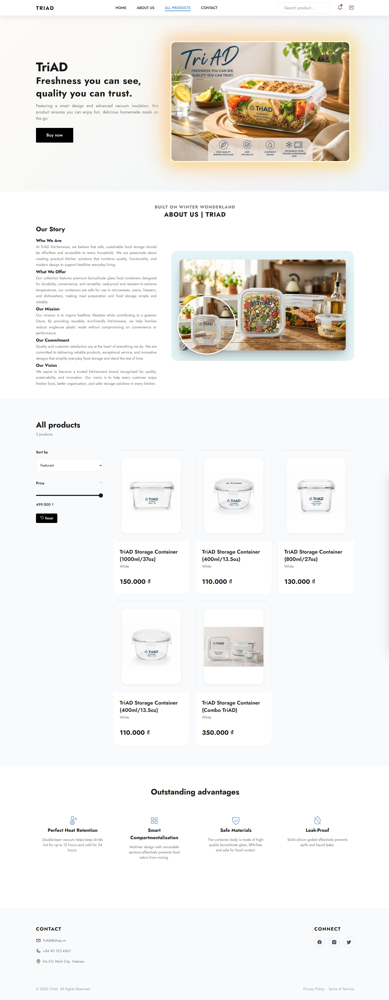
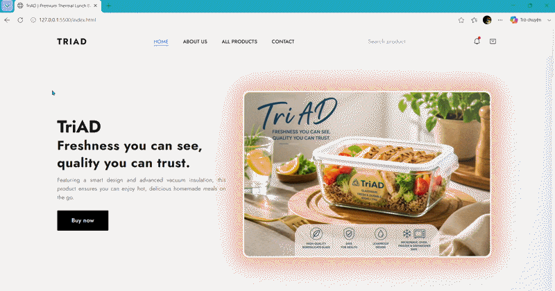
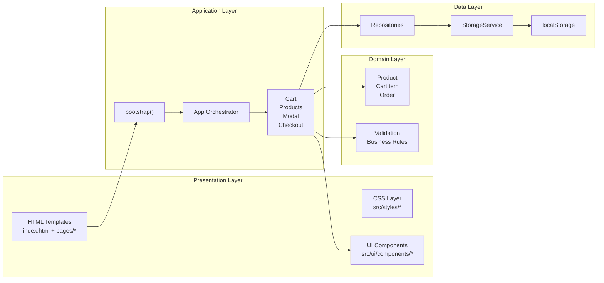
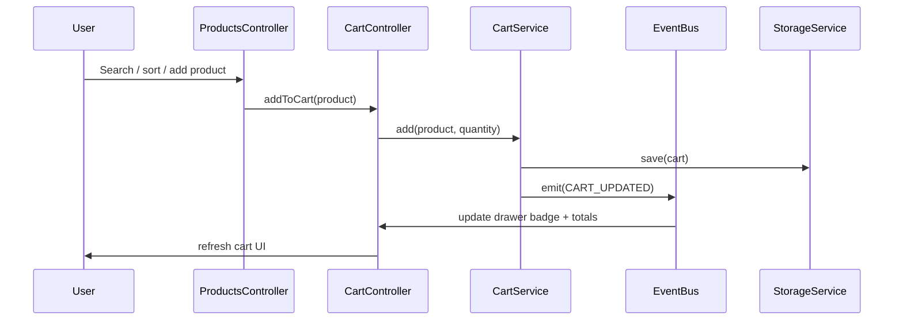
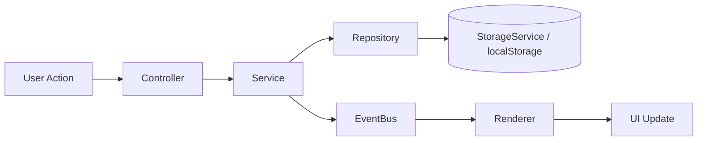

# TriAD

<p align="center">
  
</p>
<p align="center">
  
</p>

> Premium kitchenware e-commerce platform built as a modular client-side application.
>
> The current repository ships a static storefront with product catalog rendering, cart management, modal flows, checkout, toast notifications, and localStorage-backed persistence.

<p align="center">
  <a href="https://thang4869.github.io/TriAD-12/">
    
  </a>
  <a href="https://github.com/Thang4869/TriAD-12">
    
  </a>
</p>

<p align="center">
  
  
  
  
</p>

<p align="center">
  
  
  
  
  
  
</p>

<p align="center">
  
  
  
  
  
</p>

---

## Table of Contents

- [Introduction](#introduction)
- [Live Demo](#live-demo)
- [Repository](#repository)
- [Features](#features)
- [Screenshots](#screenshots)
- [GIF Demo](#gif-demo)
- [Tech Stack](#tech-stack)
- [System Architecture](#system-architecture)
- [Folder Structure](#folder-structure)
- [Module Overview](#module-overview)
- [Data Flow](#data-flow)
- [OOP](#oop)
- [SOLID](#solid)
- [Design Patterns](#design-patterns)
- [Component Structure](#component-structure)
- [Naming Convention](#naming-convention)
- [Coding Standards](#coding-standards)
- [Installation](#installation)
- [Environment](#environment)
- [Scripts](#scripts)
- [Development Workflow](#development-workflow)
- [Build](#build)
- [Production Build](#production-build)
- [Deployment](#deployment-github-pages)
- [Git Workflow](#git-workflow)
- [Branch Strategy](#branch-strategy)
- [Coding Convention](#coding-convention)
- [Lint](#lint)
- [Format](#format)
- [Troubleshooting](#troubleshooting)
- [Known Issues](#known-issues)
- [Roadmap](#roadmap)
- [Performance](#performance)
- [Optimization](#optimization)
- [Browser Support](#browser-support)
- [Accessibility](#accessibility)
- [Security](#security)
- [Testing](#testing)
- [Future Improvements](#future-improvements)
- [FAQ](#faq)
- [Changelog](#changelog)
- [Versioning](#versioning)
- [License](#license)
- [Author](#author)
- [Contact](#contact)
- [Contributing](#contributing)
- [Credits](#credits)
- [Acknowledgements](#acknowledgements)
- [Support](#support)
- [Star History](#star-history)
- [Footer](#footer)

---

## Introduction

### Giới thiệu

TriAD là một storefront thương mại điện tử dạng static, tập trung vào sản phẩm kitchenware của thương hiệu TriAD. Ứng dụng hiện được triển khai như một web app client-side, dùng native ES modules, HTML templates nạp động và localStorage để lưu trạng thái.

Trong mã nguồn hiện tại, ứng dụng khởi động từ [src/index.js](src/index.js) rồi bootstrap các component HTML từ thư mục `pages/` trước khi khởi tạo các controller trong [src/app/app.js](src/app/app.js).

### Mục tiêu

- Trình diễn một kiến trúc frontend có tổ chức, tách rõ controller, service, repository, renderer và model.
- Thể hiện khả năng xây dựng một trải nghiệm mua sắm đầy đủ từ khám phá sản phẩm đến checkout.
- Tạo một portfolio repository đủ rõ ràng để nhà tuyển dụng đọc nhanh cấu trúc, luồng dữ liệu và tư duy kỹ thuật.

### Bài toán giải quyết

- Giảm độ rối của một storefront frontend bằng cách chia chức năng thành các module độc lập.
- Duy trì trạng thái giỏ hàng, bộ lọc, và đơn hàng ngay trên trình duyệt mà không phụ thuộc backend.
- Tạo luồng tương tác liền mạch cho tìm kiếm, lọc, modal chi tiết, toast và checkout trong cùng một ứng dụng.

> [!NOTE]
> Tất cả mô tả trong README này chỉ dựa trên source code hiện có. Những phần chưa xác minh sẽ được ghi là `Placeholder` hoặc `> TODO` ở các phần tiếp theo.

## Live Demo

| Item | Link |
|---|---|
| Live Demo | [https://thang4869.github.io/TriAD-12/](https://thang4869.github.io/TriAD-12/) |
| Repository | [https://github.com/Thang4869/TriAD-12](https://github.com/Thang4869/TriAD-12) |

> [!TIP]
> Demo hiện có các luồng có thể kiểm chứng từ source: catalog sản phẩm, tìm kiếm có debounce, gợi ý tìm kiếm, cart drawer, product modal, checkout modal, success modal và toast.

## Repository

| Field | Value |
|---|---|
| Owner | `Thang4869` |
| Repository | `TriAD-12` |
| Live Site | [thang4869.github.io/TriAD-12](https://thang4869.github.io/TriAD-12/) |
| License | See the badge above |

## Features

### Core Features

| Feature | Evidence in source | Notes |
|---|---|---|
| Product catalog | [src/config/products.config.js](src/config/products.config.js) | 5 TriAD product entries are loaded into the storefront |
| Product rendering | [src/modules/products/index.js](src/modules/products/index.js) | Catalog is rendered by the products module |
| Search with debounce | [src/modules/products/products.controller.js](src/modules/products/products.controller.js) | Search input is debounced before updating filters |
| Search suggestions | [src/modules/products/products.controller.js](src/modules/products/products.controller.js) | Suggestions are rendered while typing |
| Sort and price filters | [src/modules/products/products.controller.js](src/modules/products/products.controller.js) | Sort select and price filter are wired into the service layer |
| Cart drawer | [src/modules/cart/index.js](src/modules/cart/index.js) | Drawer open/close behavior is controlled from the cart module |
| Add-to-cart flow | [src/modules/products/products.controller.js](src/modules/products/products.controller.js) | Product actions can add items to cart |
| Fly-to-cart animation | [src/modules/fly-to-cart/index.js](src/modules/fly-to-cart/index.js) | Separate animation module is imported at app start |
| Product detail modal | [src/modules/modal/index.js](src/modules/modal/index.js) | Modal opens from the product catalog |
| Checkout flow | [src/modules/checkout/index.js](src/modules/checkout/index.js) | Checkout modal, validation, processing, and success modal are implemented |
| Toast notifications | [src/modules/toast/index.js](src/modules/toast/index.js) | Toast service renders success, info, warning, and error messages |
| Persistence | [src/shared/services/storage.service.js](src/shared/services/storage.service.js) | Cart, products, filters, and orders use localStorage abstraction |

### Highlight Features

- Debounced search with suggestion list and keyboard focus shortcut `Ctrl/Cmd + K`.
- Modal-driven product detail flow with close-on-Escape behavior.
- Checkout validation before order processing.
- Success modal after order completion.
- Responsive navigation and cart interactions for mobile and desktop layouts.
- Event-driven updates through a shared event bus.
- Welcome and error toast feedback from the application bootstrap layer.

## Screenshots

> TODO
> Replace the placeholders below with real captures from the live demo.

| Desktop | Tablet | Mobile |
|---|---|---|
|  |  |  |

## GIF Demo



> Placeholder
> Add a short recorded demo showing product browsing, add-to-cart, modal opening, checkout, and success confirmation.

## Tech Stack

| Category | Technology | Notes |
|---|---|---|
| Frontend | HTML5, CSS3, JavaScript (ES Modules) | Core UI, styling, and application logic |
| Backend | None at runtime | The repository is a client-side application; source includes a simulated API service scaffold |
| Database | localStorage | Used through the storage abstraction for cart and order persistence |
| Tools | Git, GitHub, native browser APIs, Mermaid, Event Bus | Supporting workflow and application infrastructure |
| Design | Tailwind CSS CDN, Google Fonts (Jost), Phosphor Icons | Visual system and typography used by the UI |
| Deployment | GitHub Pages | Static hosting for the live demo |


## System Architecture



### Architecture Layers

| Layer | Responsibilities | Verified Components |
|---|---|---|
| Presentation | Render layout, sections, product cards, modal containers, styles | `index.html`, `pages/*.html`, `src/styles/*`, `src/ui/components/product-card.component.js` |
| Application | Bootstrap the app, initialize controllers, wire global behaviors | `src/index.js`, `src/app/bootstrap.js`, `src/app/app.js` |
| Domain | Encapsulate business entities and computed values | `src/shared/models/product.model.js`, `src/shared/models/cart-item.model.js`, `src/shared/models/order.model.js` |
| Business Logic | Apply filters, validation, checkout processing, modal state | `src/modules/products/*`, `src/modules/cart/*`, `src/modules/checkout/*`, `src/modules/modal/*` |
| Data Access | Persist and hydrate application state | `src/shared/repositories/base.repository.js`, `src/modules/*/*.repository.js`, `src/shared/services/storage.service.js` |

## Folder Structure

```text
TriAD-12/
├── index.html
├── README.md
├── images/
├── pages/
│   ├── about.html
│   ├── cart-drawer.html
│   ├── checkout-modal.html
│   ├── features.html
│   ├── footer.html
│   ├── header.html
│   ├── hero.html
│   ├── product-modal.html
│   ├── products.html
│   └── success-modal.html
└── src/
  ├── index.js
  ├── app/
  │   ├── app.js
  │   ├── bootstrap.js
  │   ├── header.service.js
  │   └── scroll-reveal.service.js
  ├── config/
  │   ├── products.config.js
  │   └── settings.config.js
  ├── modules/
  │   ├── cart/
  │   │   ├── cart.controller.js
  │   │   ├── cart.renderer.js
  │   │   ├── cart.repository.js
  │   │   ├── cart.service.js
  │   │   └── index.js
  │   ├── checkout/
  │   ├── fly-to-cart/
  │   ├── modal/
  │   ├── products/
  │   └── toast/
  ├── shared/
  │   ├── constants/
  │   ├── models/
  │   ├── repositories/
  │   ├── services/
  │   └── utils/
  ├── styles/
  │   ├── animations/
  │   ├── base/
  │   ├── components/
  │   └── utilities/
  └── ui/
    └── components/
      └── product-card.component.js
```

> TODO
> If the repository grows, consider generating this tree automatically in CI so the README stays synchronized with the codebase.

## Module Overview

| Module | Responsibility | Key Files |
|---|---|---|
| Cart | Add/remove items, quantity changes, drawer state, badge updates | `src/modules/cart/cart.controller.js`, `cart.service.js`, `cart.repository.js`, `cart.renderer.js` |
| Products | Load catalog, search, filter, sort, paginate, render cards and suggestions | `src/modules/products/products.controller.js`, `products.service.js`, `products.repository.js`, `products.renderer.js` |
| Checkout | Validate form data, calculate totals, create orders, show success flow | `src/modules/checkout/checkout.controller.js`, `checkout.service.js`, `checkout.validator.js` |
| Modal | Open/close product detail modal and coordinate quantity state | `src/modules/modal/modal.controller.js`, `modal.service.js` |
| Toast | Render transient notifications with auto-dismiss and limits | `src/modules/toast/toast.service.js`, `toast.renderer.js` |
| Fly-to-Cart | Animate product image toward the cart badge | `src/modules/fly-to-cart/index.js` |

## Data Flow



### Event Flow



## OOP

### Encapsulation

- `Product`, `CartItem`, and `Order` keep fields private via underscored properties and expose controlled getters.
- `StorageService` hides the storage backend behind a small API.
- Controller state such as drawer or modal visibility is owned by the corresponding controller or service.

### Inheritance

- `CartItem` extends `Product` to reuse product fields and computed price data.
- `CartRepository` and `ProductsRepository` extend `BaseRepository` to share repository conventions.

### Polymorphism

- `BaseRepository` defines the repository contract, while concrete repositories override `findAll`, `findById`, and `save` behavior where needed.
- `Product.fromJSON()`, `CartItem.fromJSON()`, and `Order.fromJSON()` provide uniform object hydration from stored JSON.

### Abstraction

- Business rules are split into services instead of being embedded in UI handlers.
- Validation is isolated in `CheckoutValidator`.
- Persistence is abstracted through repositories and `StorageService` rather than direct `localStorage` calls in controllers.

## SOLID

| Principle | Implementation Evidence |
|---|---|
| Single Responsibility | Controllers coordinate, services apply business rules, repositories persist data, renderers output UI |
| Open/Closed | Repositories and services can be extended without rewriting shared abstractions such as `BaseRepository` |
| Liskov Substitution | `CartRepository` and `ProductsRepository` can be used through `BaseRepository`-style behavior |
| Interface Segregation | Each module exposes a focused surface instead of a monolithic API |
| Dependency Inversion | Controllers depend on services and repositories, while storage details are hidden behind abstractions |

## Design Patterns

| Pattern | Status in repo | Evidence |
|---|---|---|
| Factory | Used | `fromJSON()` methods in `Product`, `CartItem`, `Order` |
| Strategy | Used | `ProductsService.applySort()` switches sort behavior by mode |
| Observer | Used | `EventBus` with `on`, `once`, `off`, `emit` |
| Singleton | Used | Exported shared instances such as `eventBus`, `storage`, and `toast` |
| Module | Used | Native ES modules across `src/` |
| MVC | Used | Controllers, services, repositories, and renderers are separated by responsibility |
| Repository | Used | `BaseRepository`, `CartRepository`, `ProductsRepository` |
| Adapter | Not used | No dedicated adapter layer was found in the current source tree |

## Component Structure

| Component Type | Examples | Role |
|---|---|---|
| HTML partials | `pages/header.html`, `pages/hero.html`, `pages/products.html` | Page sections loaded dynamically at bootstrap |
| UI components | `src/ui/components/product-card.component.js` | Reusable card markup for catalog items |
| Renderers | `cart.renderer.js`, `products.renderer.js`, `toast.renderer.js` | Convert application state into DOM output |
| Controllers | `cart.controller.js`, `products.controller.js`, `modal.controller.js`, `checkout.controller.js` | Bind DOM events and orchestrate flows |
| Services | `cart.service.js`, `products.service.js`, `modal.service.js`, `checkout.service.js` | Enforce business logic and state transitions |

## Naming Convention

- Files use kebab-case with role suffixes such as `.controller.js`, `.service.js`, `.repository.js`, `.renderer.js`, `.model.js`, and `.config.js`.
- Classes use PascalCase, for example `CartController`, `ProductsService`, `CheckoutValidator`, and `ProductCardComponent`.
- Constants use UPPER_SNAKE_CASE, such as `APP_CONFIG`, `EVENTS`, and storage keys.
- DOM identifiers are descriptive and semantic, for example `checkout-modal`, `cart-overlay`, `search-input`, and `toast-container`.

## Coding Standards

- Keep controllers thin and move data logic into services or repositories.
- Prefer explicit event names over implicit cross-module coupling.
- Use small, composable methods with a single responsibility.
- Preserve immutable-style updates when creating model instances or cart item changes.
- Use `debounce()` for high-frequency inputs to avoid unnecessary re-renders.
- Keep UI rendering inside renderer classes or reusable components.
- Avoid direct `localStorage` access outside the storage abstraction.

## Installation

The repository does not include a `package.json`, build tool, or dependency manager configuration. This is a static HTML/CSS/JavaScript project that runs directly in the browser.

### Quick Start

1. Clone the repository.
2. Open the project in VS Code or any local web server.
3. Serve the root folder through HTTP, then open `index.html` from that server.

```bash
# Example local server options
python -m http.server 8000
# or
npx serve .
```

> [!IMPORTANT]
> Do not open `index.html` directly with `file://`. The app loads HTML partials with `fetch()`, so a local HTTP server is required.

## Environment

| Item | Value |
|---|---|
| Runtime | Browser-native ES modules |
| Styling | Tailwind CSS CDN |
| Fonts | Google Fonts (`Jost`) |
| Icons | Phosphor Icons CDN |
| Data persistence | `localStorage` via `StorageService` |
| Demo hosting | GitHub Pages |

### Environment Notes

- No `.env` file, API keys, or backend credentials are required for the current codebase.
- The app reads product seed data from `src/config/products.config.js` and stores runtime state in browser storage.
- `src/shared/services/api.service.js` exists as a scaffold for future backend work, but the current UI does not depend on a live API.

## Scripts

There are no repository-defined npm scripts because the project does not ship a `package.json` file.

| Script | Status | Notes |
|---|---|---|
| `install` | Not available | No package manifest is present |
| `dev` | Not available | Use a local static server instead |
| `build` | Not available | The app is served as static files |
| `lint` | Not available | No lint configuration was found |
| `test` | Not available | No test runner is configured |

## Development Workflow

1. Edit HTML partials under `pages/` for layout and section content.
2. Edit module logic under `src/modules/` for feature behavior.
3. Update shared models, services, and utilities under `src/shared/` when behavior is reused.
4. Refresh the browser through the local server to verify UI changes.

### Suggested Local Flow

```text
Edit source -> Refresh browser -> Verify modal/cart/checkout flow -> Commit changes
```

## Build

No compile step is required for the current repository state.

### Production Output

The production artifact is the same static file set already in the repository:

- `index.html`
- `pages/*`
- `src/*`
- `images/*`
- `README.md`

## Production Build

> TODO
> If the project later adopts a bundler, document the output directory and asset pipeline here.

For the current version, production means:

1. Serving the static site over HTTPS or a local HTTP server.
2. Ensuring relative asset paths resolve correctly.
3. Verifying the live demo after deployment.

## Deployment (GitHub Pages)

The repository is already published at [https://thang4869.github.io/TriAD-12/](https://thang4869.github.io/TriAD-12/).

### Recommended Deployment Flow

1. Push the static site to the repository.
2. Configure GitHub Pages in repository settings.
3. Point Pages to the branch or folder that contains `index.html`.
4. Verify that the `/pages` and `/src` relative paths resolve on the published site.

> [!NOTE]
> Because the app uses `fetch()` to load partial HTML, the published Pages base path must preserve the repository-relative asset structure.

## Git Workflow

| Step | Practice |
|---|---|
| 1 | Make focused changes in a single feature area when possible |
| 2 | Verify the browser flow locally through the static server |
| 3 | Review the diff before pushing |
| 4 | Commit with a message that describes the behavior change |
| 5 | Push to the remote repository and re-check the GitHub Pages demo |

## Branch Strategy

> TODO
> The repository does not expose an explicit branching policy in code, so the safest documented strategy is:

- `main` for the deployable site.
- Short-lived feature branches for isolated work.
- A release branch only if the project later introduces staged approvals.

## Coding Convention

- Keep filenames aligned with responsibility suffixes, for example `*.controller.js`, `*.service.js`, `*.repository.js`, `*.renderer.js`, and `*.model.js`.
- Keep DOM selectors descriptive and stable because they are used across modules.
- Prefer `const` and `let` over `var`.
- Keep user-facing strings centralized where practical, especially in config and service layers.
- Avoid direct storage access outside the persistence abstraction.

## Lint

No lint configuration was found in the repository.

> TODO
> If linting is added later, document the exact command and rule set here.

## Format

No formatter configuration was found in the repository.

> TODO
> If formatting tools are added later, document the exact command here.

## Troubleshooting

### HTML Partials Do Not Load

- Confirm the site is opened through `http://localhost` or the GitHub Pages URL.
- Do not use `file://`.
- Verify that the `pages/` directory is present and the relative paths in `src/app/bootstrap.js` are unchanged.

### Product Images Do Not Appear

- Verify the image paths in `src/config/products.config.js` still point to existing files under `images/`.
- Confirm the server root preserves the repository directory structure.

### Cart Or Modal Actions Do Nothing

- Check that the relevant HTML partial has loaded before interacting with the page.
- Confirm the DOM IDs used by the controller match the HTML in `pages/*.html`.
- Inspect the browser console for runtime errors.

### Checkout Does Not Complete

- Verify all required fields pass `CheckoutValidator`.
- Check whether the cart is empty before opening checkout.
- Confirm the cart drawer and checkout modal elements are present in the loaded page.

### Search Or Filters Feel Stale

- Reload the page to reset the in-memory controller state.
- Clear browser storage if you want to reset saved filters and cart data.

## Known Issues

- There is no `package.json`, so npm-based scripts and toolchain commands are not available yet.
- No automated test suite is configured in the current repository.
- No lint or format config is present in the repository root.
- Placeholder images are still used in this README for screenshots and GIF demo until real assets are added.

## Roadmap

- [x] Static storefront structure
- [x] Product catalog rendering
- [x] Search, sort, and price filters
- [x] Cart drawer and cart state persistence
- [x] Product modal and checkout flow
- [x] Toast notifications
- [ ] Add real screenshot assets
- [ ] Add GIF demo asset
- [ ] Add automated tests
- [ ] Add lint and format tooling
- [ ] Add package manifest and npm scripts
- [ ] Introduce a backend API layer if the product scope expands

## Performance

The current codebase already uses several lightweight performance choices that are visible in source:

- `debounce()` for search input handling.
- `IntersectionObserver` for load-more behavior.
- Lazy-loaded product images in the product card component.
- Separate renderers so UI updates stay localized.
- Native browser APIs instead of a heavy client framework.

## Optimization

| Area | Current Approach | Potential Next Step |
|---|---|---|
| Search | Debounced input updates | Add cached suggestion rendering |
| Catalog | Pagination and load-more behavior | Virtualize very large lists |
| Images | Lazy loading on product cards | Preload critical hero assets |
| State | localStorage-backed persistence | Introduce server sync when backend exists |
| UI updates | Renderer classes per feature | Batch DOM writes where needed |

## Browser Support

This repository targets modern evergreen browsers because it uses:

- Native ES modules.
- `fetch()` for HTML partial loading.
- `IntersectionObserver`.
- `requestAnimationFrame`.
- Modern CSS classes and responsive layout behavior.

> TODO
> If you need legacy browser support, add a compatibility layer and document the supported matrix here.

## Accessibility

Verified accessibility-related implementation details:

- Toast elements use `role="alert"` and `aria-live="polite"` in the renderer.
- Button elements are used for interactive actions such as closing toasts and opening checkout.
- The app supports keyboard shortcuts for focus and modal dismissal.
- Images carry `alt` attributes in the product card component.

### Accessibility Improvements To Consider

- Add a documented focus trap for modal dialogs.
- Audit color contrast in the final visual design.
- Add skip links if the page layout grows.
- Ensure all dynamic sections have clear headings and landmarks.

## Security

The current project is a client-side storefront, so the security surface is intentionally small.

### Current Safety Characteristics

- No credentials or secrets are stored in the repository.
- No remote API calls are required for the current user flow.
- Form validation happens before checkout processing.
- State persistence is limited to browser storage.

### Security Notes

- Treat `localStorage` as user-controlled data.
- Never store sensitive payment data in the browser in a real production deployment.
- Escape or sanitize any future backend-supplied HTML before rendering it.

## Testing

No automated test suite is configured in the repository at the moment.

### Manual Test Checklist

- Open the site through a local HTTP server.
- Verify product cards render from `src/config/products.config.js`.
- Search for a product and confirm the suggestion list appears.
- Change sort and price filters and verify the catalog updates.
- Add and remove items from the cart.
- Open the product modal and checkout modal.
- Complete checkout with valid and invalid data.
- Refresh the page and confirm persisted cart or order state behaves as expected.

## Future Improvements

- Add a real screenshot set for desktop, tablet, and mobile.
- Record and embed a short product demo GIF.
- Add unit tests for services, validators, and repositories.
- Add end-to-end tests for the main shopping flow.
- Add a bundler and npm scripts if the project scope expands.
- Replace placeholder demo assets with branded production assets.
- Add a backend API if order storage or inventory management becomes server-side.

## FAQ

| # | Question | Answer |
|---|---|---|
| 1 | Is this project a frontend-only application? | Yes. The current repository is a static client-side storefront. |
| 2 | Does it require a backend to run? | No. The current user flow works without a backend. |
| 3 | Why must I use a local server? | Because HTML partials are loaded with `fetch()`. |
| 4 | Can I open `index.html` directly? | Not reliably. Use HTTP instead of `file://`. |
| 5 | Where do products come from? | From `src/config/products.config.js`, then from browser storage if already cached. |
| 6 | Is the cart persisted? | Yes, through `StorageService` and `localStorage`. |
| 7 | Are search and filters persisted? | Yes, filter state is stored in browser storage. |
| 8 | Is there a checkout validator? | Yes, `CheckoutValidator` checks required fields and formats. |
| 9 | Does the project support modal interactions? | Yes, product detail, checkout, and success modals are present. |
| 10 | Is there a toast system? | Yes, `ToastService` and `ToastRenderer` handle notifications. |
| 11 | Does the project include tests? | No automated tests are configured yet. |
| 12 | Does the project include linting? | No lint configuration was found in the repository. |
| 13 | Does the project include a package manager setup? | No `package.json` is present in the current repository. |
| 14 | Is there a backend API today? | No live backend is used by the current codebase. |
| 15 | Can I use this as a portfolio project? | Yes. The repository shows modular architecture, state management, and documented flows. |

## Changelog

> TODO
> Add a dedicated `CHANGELOG.md` if the project starts using semantic releases or tagged versions.

## Versioning

> TODO
> The repository does not currently expose a tagged release version in source control or project files.

## License

> TODO
> No `LICENSE` file was found in the repository root. Add one before treating the project as formally licensed.

## Author

- `Thang4869` — GitHub repository owner and project author visible from the repository metadata.

## Contact

- GitHub repository: [https://github.com/Thang4869/TriAD-12](https://github.com/Thang4869/TriAD-12)
- Live demo: [https://thang4869.github.io/TriAD-12/](https://thang4869.github.io/TriAD-12/)

## Contributing

If you want to contribute to this repository:

1. Fork the repository.
2. Create a short-lived feature branch.
3. Make a focused change.
4. Verify the result in the browser.
5. Open a pull request with a clear description.

> TODO
> Add contribution guidelines if the project adopts external contributors.

## Credits

- HTML5, CSS3, JavaScript, GitHub Pages, and GitHub Shields.io badges.
- Google Fonts for typography.
- Phosphor Icons for iconography.
- Tailwind CSS CDN for utility styling in the current page shell.

## Acknowledgements

- Inspiration from modern product-focused GitHub repositories that emphasize clarity and architectural documentation.
- Appreciation for static-site patterns that keep portfolio projects easy to deploy and review.

## Support

- Star the repository if you find the architecture and documentation useful.
- Open an issue if you find a mismatch between the README and the source.
- Share the live demo if you want to show the project in a portfolio review.

## Star History

![Star History Placeholder]

> Placeholder
> Replace this with a real star-history chart if the repository gets enough public traction.

## Footer

TriAD is a modular static storefront for premium kitchenware, documented to showcase product architecture, state management, and checkout flow.

This README is intentionally conservative about claims: if something is not verified in the source tree, it stays labeled as `TODO` or `Placeholder`.
